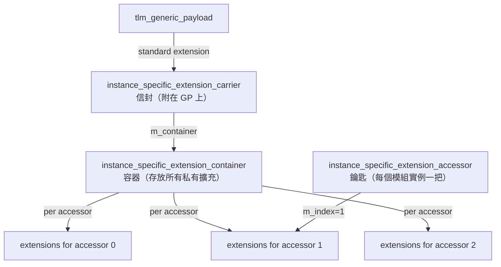
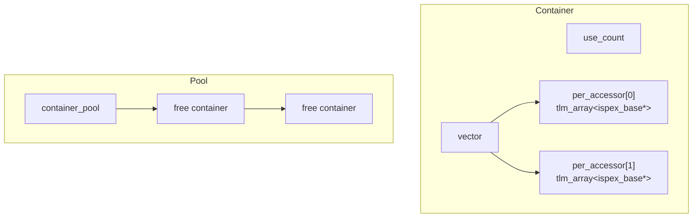

# instance_specific_extensions - 實例私有擴充

## 概述

Instance Specific Extensions（實例私有擴充）是 TLM 標準擴充機制的補充。標準擴充（`tlm_extension`）是全域可見的——任何能存取 GP 的模組都能看到擴充。而實例私有擴充只有擁有對應 `accessor` 的模組實例才能存取，對其他模組完全不可見。

檔案分佈：
- `instance_specific_extensions.h` - 公開 API
- `instance_specific_extensions_int.h` - 內部實作
- `instance_specific_extensions.cpp` - 實作

## 日常類比

想像一本共用的筆記本（`tlm_generic_payload`）在辦公室裡傳閱：
- **標準擴充**：在筆記本的空白頁上寫字，任何人翻到都能看到
- **實例私有擴充**：在筆記本上貼一張只有你能用特定密碼解鎖的便利貼——其他人看到便利貼但打不開，只有你用自己的鑰匙（accessor）才能讀寫

## 核心概念

### 三個關鍵角色



## 使用方式

### 定義私有擴充

```cpp
class my_private_ext : public tlm_utils::instance_specific_extension<my_private_ext> {
public:
  int private_data;
};
```

### 在模組中使用

```cpp
class MyModule : public sc_module {
  tlm_utils::instance_specific_extension_accessor m_accessor;

  void process(tlm::tlm_generic_payload& txn) {
    // Set private extension
    my_private_ext* ext = new my_private_ext;
    ext->private_data = 42;
    m_accessor(txn).set_extension(ext);

    // Get private extension
    my_private_ext* got_ext;
    m_accessor(txn).get_extension(got_ext);
    // got_ext->private_data == 42

    // Clear when done
    m_accessor(txn).clear_extension(ext);
    delete ext;
  }
};
```

重要：使用 `m_accessor(txn)` 語法來存取，會回傳一個 `instance_specific_extensions_per_accessor` 物件。

## 內部架構

### `ispex_base`

私有擴充的基礎類別（對應標準擴充的 `tlm_extension_base`）。

```cpp
class ispex_base {
protected:
  static unsigned int register_private_extension(const std::type_info&);
};
```

### `instance_specific_extension<T>`

```cpp
template <typename T>
class instance_specific_extension : public ispex_base {
  const static unsigned int priv_id;
};
```

使用 CRTP + 靜態初始化，為每個擴充類型分配唯一 ID。

### `instance_specific_extension_carrier`

一個標準的 `tlm_extension`，作為「容器的容器」附在 GP 上。

```cpp
class instance_specific_extension_carrier
  : public tlm::tlm_extension<instance_specific_extension_carrier> {
  instance_specific_extension_container* m_container;

  tlm_extension_base* clone() const { return NULL; }  // no clone
  void copy_from(...) {}  // no copy
  void free() {}  // no free
};
```

特別注意：`clone()` 回傳 `NULL`——私有擴充不會被深複製。如果 GP 被 deep_copy，新的 GP 不會有任何私有擴充。

### `instance_specific_extension_container`

管理所有 accessor 的擴充陣列，使用引用計數和物件池：



### 引用計數與生命週期

```
set_extension (non-NULL) -> use_count++
clear_extension          -> use_count--
use_count == 0           -> release carrier from GP, return container to pool
```

### Accessor 編號

```cpp
instance_specific_extension_accessor::instance_specific_extension_accessor()
  : m_index(max_num_ispex_accessors(true) - 1)
{}
```

每個 accessor 在建構時取得一個全域唯一的索引。這個索引用來在 container 中找到對應的擴充陣列。

## 設計重點

1. **隱私性**：沒有 accessor 就無法存取私有擴充，提供了模組間的資訊隔離
2. **生命週期管理**：使用者負責分配和釋放擴充物件
3. **不支援複製**：deep_copy 不會複製私有擴充
4. **物件池**：container 使用物件池減少記憶體分配開銷
5. **延遲建立**：container 在第一次 `set_extension` 時才建立

## 原始碼位置

- `ref/systemc/src/tlm_utils/instance_specific_extensions.h`
- `ref/systemc/src/tlm_utils/instance_specific_extensions_int.h`
- `ref/systemc/src/tlm_utils/instance_specific_extensions.cpp`

## 相關檔案

- [../tlm_core/tlm_2/tlm_generic_payload.md](../tlm_core/tlm_2/tlm_generic_payload.md) - 標準擴充機制
- [../tlm_core/tlm_2/tlm_array.md](../tlm_core/tlm_2/tlm_array.md) - 擴充陣列容器
