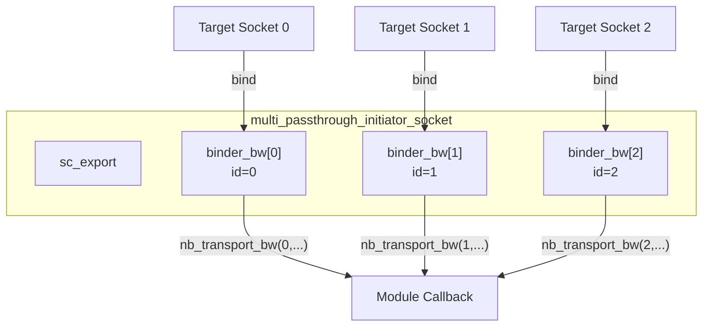

# multi_passthrough_initiator_socket - 多連接 Initiator Socket

## 概述

`multi_passthrough_initiator_socket` 允許一個 initiator 同時連接多個 target。每個 target 都有一個唯一的索引（index），回呼函式會攜帶這個索引來識別是哪個 target 觸發了回呼。典型應用場景是 interconnect 元件需要連接到多個 target。

## 日常類比

想像你是一個客服中心的主管，管理多條客服電話線：
- 每條線對應一個 target（客戶）
- 當某條線來電時，系統會顯示「第 3 號線來電」（index = 3）
- 你可以透過任何一條線打電話出去（透過索引存取特定 target）

## 基本用法

```cpp
class MyInterconnect : public sc_module {
  tlm_utils::multi_passthrough_initiator_socket<MyInterconnect> init_socket;

  SC_CTOR(MyInterconnect) : init_socket("init_socket") {
    init_socket.register_nb_transport_bw(this, &MyInterconnect::nb_transport_bw);
    init_socket.register_invalidate_direct_mem_ptr(this, &MyInterconnect::inv_dmi);
  }

  // Backward callback with index
  tlm::tlm_sync_enum nb_transport_bw(int id,
    tlm::tlm_generic_payload& txn, tlm::tlm_phase& phase, sc_time& t)
  {
    // id tells which target called back
    return tlm::TLM_ACCEPTED;
  }

  void inv_dmi(int id, uint64 start, uint64 end) {
    // forward to all initiators
  }

  // Forward call to specific target
  void forward(int target_id, tlm::tlm_generic_payload& txn, sc_time& delay) {
    init_socket[target_id]->b_transport(txn, delay);
  }
};
```

## 內部機制

### Callback Binder

每當一個新的 target socket 綁定到此 socket 時，會自動建立一個新的 `callback_binder_bw` 實例：



### `get_base_interface()` 覆寫

```cpp
virtual tlm::tlm_bw_transport_if<TYPES>& get_base_interface() {
  m_binders.push_back(new callback_binder_bw<TYPES>(this, m_binders.size()));
  return *m_binders[m_binders.size()-1];
}
```

每次有 target 來綁定時，會建立一個新的 binder 並回傳——每個 target 都綁定到不同的 binder，因此可以透過 binder 的 id 區分來源。

### 階層式綁定支援

支援階層式綁定（hierarchical binding），使用 `m_hierarch_bind` 追蹤階層關係。

## 模板參數

| 參數 | 預設值 | 說明 |
|------|--------|------|
| `MODULE` | (required) | 擁有者模組型別 |
| `BUSWIDTH` | 32 | 匯流排寬度 |
| `TYPES` | `tlm_base_protocol_types` | 協議型別 |
| `N` | 0 | 最大連接數（0 = 無限） |
| `POL` | `SC_ONE_OR_MORE_BOUND` | 綁定策略 |

## 原始碼位置

`ref/systemc/src/tlm_utils/multi_passthrough_initiator_socket.h`

## 相關檔案

- [multi_passthrough_target_socket.md](multi_passthrough_target_socket.md) - 對應的多連接 target socket
- [multi_socket_bases.md](multi_socket_bases.md) - 基礎類別和 callback binder
- [simple_initiator_socket.md](simple_initiator_socket.md) - 單連接的簡化版
