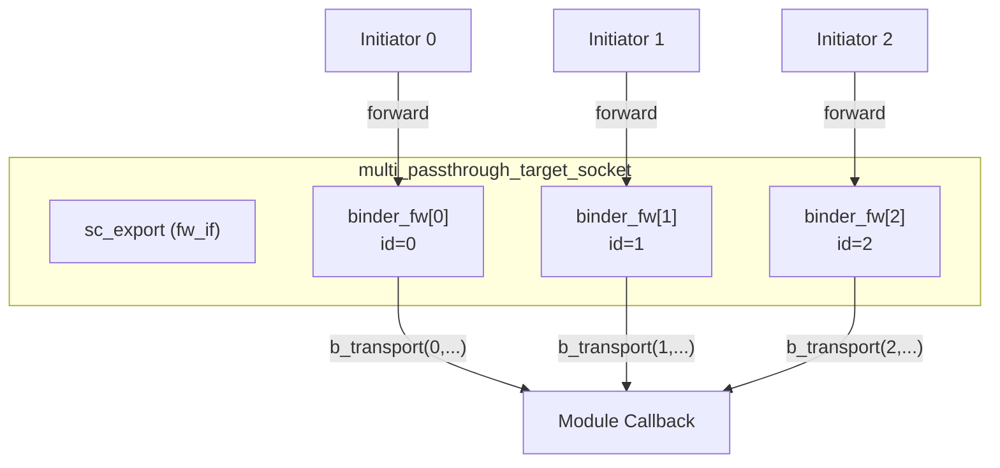

# multi_passthrough_target_socket - 多連接 Target Socket

## 概述

`multi_passthrough_target_socket` 允許多個 initiator 同時連接到一個 target。每個 initiator 都有一個唯一的索引，前向回呼函式會攜帶這個索引來識別是哪個 initiator 發起了呼叫。典型應用場景是共享記憶體或多主機匯流排上的 target。

## 日常類比

想像一家餐廳的廚房（target），同時接收多個服務生（initiator）的點單：
- 第 0 號服務生送來點單 -> `b_transport(id=0, ...)`
- 第 1 號服務生送來點單 -> `b_transport(id=1, ...)`
- 廚房可以透過服務生的編號來追蹤訂單來源

## 基本用法

```cpp
class SharedMemory : public sc_module {
  tlm_utils::multi_passthrough_target_socket<SharedMemory> target_socket;

  SC_CTOR(SharedMemory) : target_socket("target") {
    target_socket.register_b_transport(this, &SharedMemory::b_transport);
    target_socket.register_transport_dbg(this, &SharedMemory::transport_dbg);
  }

  void b_transport(int id, tlm::tlm_generic_payload& txn, sc_time& delay) {
    // id identifies which initiator sent this
    uint64 addr = txn.get_address();
    // process read/write...
    txn.set_response_status(tlm::TLM_OK_RESPONSE);
  }

  unsigned int transport_dbg(int id, tlm::tlm_generic_payload& txn) {
    // debug access
    return txn.get_data_length();
  }
};
```

## 回呼註冊

```cpp
void register_nb_transport_fw(MODULE* mod, nb_cb cb);
void register_b_transport(MODULE* mod, b_cb cb);
void register_transport_dbg(MODULE* mod, dbg_cb cb);
void register_get_direct_mem_ptr(MODULE* mod, dmi_cb cb);
```

所有回呼的第一個參數都是 `int id`：

```cpp
typedef sync_enum_type (MODULE::*nb_cb)(int, transaction_type&, phase_type&, sc_time&);
typedef void (MODULE::*b_cb)(int, transaction_type&, sc_time&);
typedef unsigned int (MODULE::*dbg_cb)(int, transaction_type&);
typedef bool (MODULE::*dmi_cb)(int, transaction_type&, tlm_dmi&);
```

## 內部機制

### Callback Binder



### Multi-to-Multi 綁定

`multi_passthrough_target_socket` 也實作了 `multi_to_multi_bind_base`，支援與 `multi_passthrough_initiator_socket` 之間的直接綁定。在這種情況下，兩個 multi-socket 之間的連接會建立正確的 binder 對應關係。

## 模板參數

| 參數 | 預設值 | 說明 |
|------|--------|------|
| `MODULE` | (required) | 擁有者模組型別 |
| `BUSWIDTH` | 32 | 匯流排寬度 |
| `TYPES` | `tlm_base_protocol_types` | 協議型別 |
| `N` | 0 | 最大連接數（0 = 無限） |
| `POL` | `SC_ONE_OR_MORE_BOUND` | 綁定策略 |

## 原始碼位置

`ref/systemc/src/tlm_utils/multi_passthrough_target_socket.h`

## 相關檔案

- [multi_passthrough_initiator_socket.md](multi_passthrough_initiator_socket.md) - 多連接 initiator socket
- [multi_socket_bases.md](multi_socket_bases.md) - 基礎類別
- [passthrough_target_socket.md](passthrough_target_socket.md) - 單連接版本
