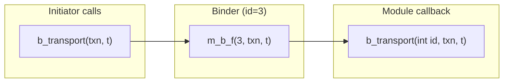
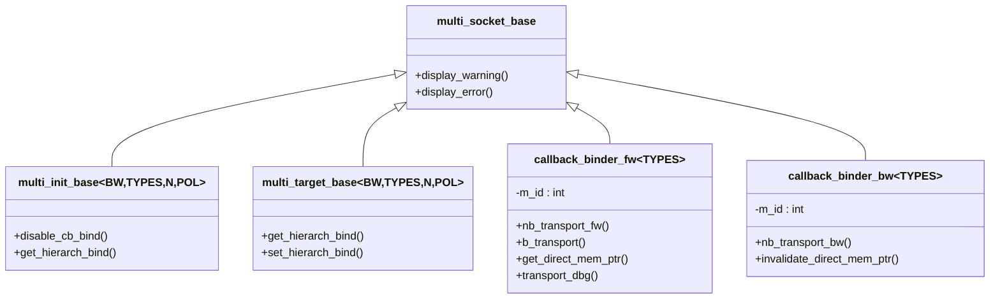

# multi_socket_bases.h - Multi-Socket 基礎設施

## 概述

`multi_socket_bases.h` 提供了 multi-socket（多連接 socket）所需的所有基礎設施，包括：
- **Callback binder**：為每個連接建立獨立的介面實作，自動附加連接索引
- **Functor**：型別安全的函式指標包裝器
- **Base classes**：multi-socket 的抽象基礎類別

## 日常類比

想像一個電話總機（switchboard）：
- **Callback binder** = 每條電話線的分機轉接器，自動在來電時顯示線路編號
- **Functor** = 接線員的工作手冊，記錄「這條線的來電要轉給誰」
- **Base classes** = 總機的硬體規格，定義「總機必須支援哪些功能」

## Callback Binder

### `callback_binder_fw<TYPES>`

前向介面的 binder，實作了 `tlm_fw_transport_if`：

```cpp
template <typename TYPES>
class callback_binder_fw : public tlm::tlm_fw_transport_if<TYPES> {
  int m_id;  // connection index
  nb_func_type* m_nb_f;
  b_func_type* m_b_f;
  debug_func_type* m_dbg_f;
  dmi_func_type* m_dmi_f;
  sc_port_base* m_caller_port;  // who is bound to me
};
```

當 initiator 呼叫 `b_transport(txn, t)` 時，binder 會將其轉換為 `(*m_b_f)(m_id, txn, t)`——自動插入連接索引。

### `callback_binder_bw<TYPES>`

後向介面的 binder，實作了 `tlm_bw_transport_if`：

```cpp
template <typename TYPES>
class callback_binder_bw : public tlm::tlm_bw_transport_if<TYPES> {
  int m_id;
  nb_func_type* m_nb_f;
  dmi_func_type* m_dmi_f;
};
```



## Functor 機制

使用巨集 `TLM_DEFINE_FUNCTOR` 為每種回呼型別生成對應的 functor 類別：

| Functor | 用於 | 簽名 |
|---------|------|------|
| `nb_transport_functor` | nb_transport_fw/bw | `sync_enum (MODULE::*)(int, txn&, phase&, time&)` |
| `b_transport_functor` | b_transport | `void (MODULE::*)(int, txn&, time&)` |
| `debug_transport_functor` | transport_dbg | `unsigned int (MODULE::*)(int, txn&)` |
| `get_dmi_ptr_functor` | get_direct_mem_ptr | `bool (MODULE::*)(int, txn&, dmi&)` |
| `invalidate_dmi_functor` | invalidate_direct_mem_ptr | `void (MODULE::*)(int, uint64, uint64)` |

每個 functor 透過 `void*` 進行型別擦除（type erasure），並使用靜態轉發函式來恢復型別安全。

## Base Classes

### `multi_init_base<BUSWIDTH, TYPES, N, POL>`

Multi initiator socket 的基礎類別：

```cpp
class multi_init_base
  : public tlm::tlm_initiator_socket<BUSWIDTH, TYPES, N, POL>
  , public multi_init_base_if<TYPES>
  , protected multi_socket_base
{
  virtual void disable_cb_bind() = 0;
  virtual multi_init_base* get_hierarch_bind() = 0;
  virtual std::vector<callback_binder_bw<TYPES>*>& get_binders() = 0;
  virtual std::vector<tlm::tlm_fw_transport_if<TYPES>*>& get_sockets() = 0;
};
```

### `multi_target_base<BUSWIDTH, TYPES, N, POL>`

Multi target socket 的基礎類別：

```cpp
class multi_target_base
  : public tlm::tlm_target_socket<BUSWIDTH, TYPES, N, POL>
  , public multi_target_base_if<TYPES>
  , protected multi_socket_base
{
  virtual multi_target_base* get_hierarch_bind() = 0;
  virtual void set_hierarch_bind(multi_target_base*) = 0;
  virtual std::vector<callback_binder_fw<TYPES>*>& get_binders() = 0;
  virtual std::map<unsigned int, tlm::tlm_bw_transport_if<TYPES>*>& get_multi_binds() = 0;
};
```

### `multi_to_multi_bind_base<TYPES>`

支援 multi-initiator 與 multi-target 之間直接綁定的輔助介面。

## 類別關係



## 原始碼位置

`ref/systemc/src/tlm_utils/multi_socket_bases.h`

## 相關檔案

- [multi_passthrough_initiator_socket.md](multi_passthrough_initiator_socket.md)
- [multi_passthrough_target_socket.md](multi_passthrough_target_socket.md)
- [convenience_socket_bases.md](convenience_socket_bases.md) - 錯誤報告基礎類別
