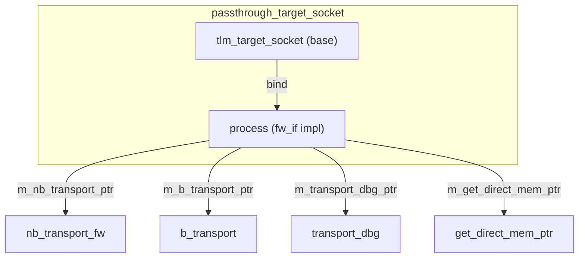

# passthrough_target_socket - 穿透式 Target Socket

## 概述

`passthrough_target_socket` 是一個輕量級的 target socket 包裝器，直接將前向介面的呼叫轉發給使用者註冊的回呼函式，**不做任何 blocking/non-blocking 轉換**。它主要用於 interconnect（匯流排、路由器、仲裁器）等中間元件。

## 日常類比

如果 `simple_target_socket` 是一個會幫你轉接和翻譯的祕書，那 `passthrough_target_socket` 就是一個**直通電話**——來電直接轉到你的分機，不做任何處理。

這在 interconnect 元件中很有用——路由器收到封包後不需要「翻譯」，只需要修改地址然後直接轉發。

## 基本用法

```cpp
class MyRouter : public sc_module {
  tlm_utils::passthrough_target_socket<MyRouter> target_socket;
  tlm::tlm_initiator_socket<32> init_socket;

  SC_CTOR(MyRouter) : target_socket("target") {
    target_socket.register_b_transport(this, &MyRouter::b_transport);
    target_socket.register_nb_transport_fw(this, &MyRouter::nb_transport_fw);
    target_socket.register_transport_dbg(this, &MyRouter::transport_dbg);
    target_socket.register_get_direct_mem_ptr(this, &MyRouter::get_direct_mem_ptr);
  }

  void b_transport(tlm::tlm_generic_payload& txn, sc_time& delay) {
    uint64 addr = txn.get_address();
    txn.set_address(addr & 0xFFF);  // mask address
    init_socket->b_transport(txn, delay);  // forward
    txn.set_address(addr);  // restore
  }

  // ... similar for other callbacks
};
```

## 回呼註冊

```cpp
void register_nb_transport_fw(MODULE* mod, sync_enum_type (MODULE::*cb)(...));
void register_b_transport(MODULE* mod, void (MODULE::*cb)(...));
void register_transport_dbg(MODULE* mod, unsigned int (MODULE::*cb)(...));
void register_get_direct_mem_ptr(MODULE* mod, bool (MODULE::*cb)(...));
```

### 未註冊回呼的預設行為

| 方法 | 未註冊時的行為 |
|------|----------------|
| `nb_transport_fw` | `display_error`（報錯） |
| `b_transport` | `display_error`（報錯） |
| `transport_dbg` | 回傳 0（不支援 debug） |
| `get_direct_mem_ptr` | 回傳 `false`，允許全部位址範圍 |

## 內部架構



與 `simple_target_socket` 相比：
- **沒有** PEQ（payload event queue）
- **沒有** blocking/non-blocking 自動轉換
- **沒有** 額外的 thread spawning
- 完全是同步的函式指標轉發

## 變體

| 變體 | 說明 |
|------|------|
| `passthrough_target_socket` | 標準版 |
| `passthrough_target_socket_optional` | 可以不綁定 |
| `passthrough_target_socket_tagged` | 回呼帶 `int id` 參數 |
| `passthrough_target_socket_tagged_optional` | tagged + optional |

## Tagged 版本

tagged 版本的回呼函式多一個 `int id` 參數：

```cpp
socket.register_b_transport(this, &MyModule::b_transport, 0);

void b_transport(int id, tlm::tlm_generic_payload& txn, sc_time& delay) {
  // id identifies which socket triggered this callback
}
```

## 原始碼位置

`ref/systemc/src/tlm_utils/passthrough_target_socket.h`

## 相關檔案

- [simple_target_socket.md](simple_target_socket.md) - 有自動轉換功能的替代方案
- [multi_passthrough_target_socket.md](multi_passthrough_target_socket.md) - 多連接版本
- [convenience_socket_bases.md](convenience_socket_bases.md) - 基礎類別
