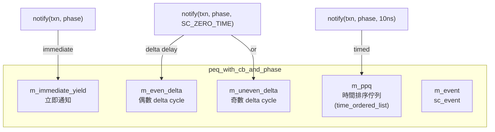
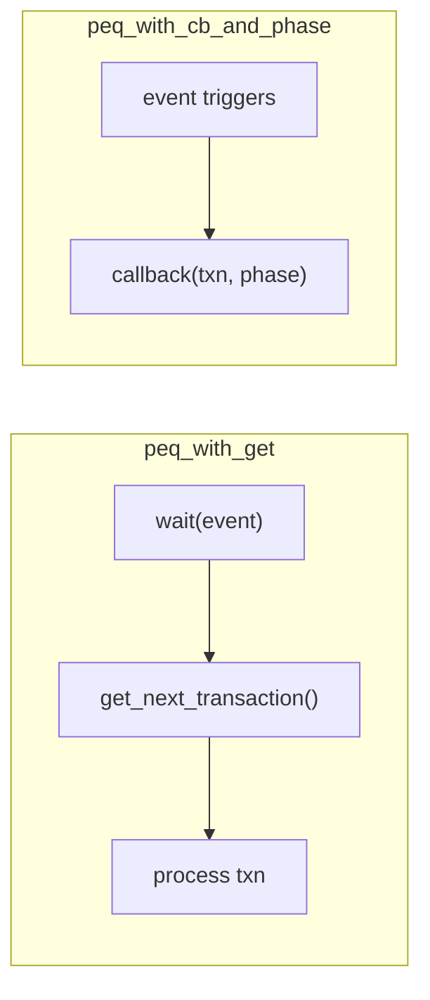

# peq_with_cb_and_phase - 回呼式 Payload Event Queue

## 概述

`peq_with_cb_and_phase` 是一個更精密的事件佇列，它不需要使用者手動輪詢，而是在交易到期時自動呼叫註冊的回呼函式，並攜帶交易的 phase 資訊。這是實作約略時序（Approximately-Timed, AT）模型的關鍵工具。

## 日常類比

如果 `peq_with_get` 是一個需要你不斷檢查的待辦清單，那 `peq_with_cb_and_phase` 就像一個智慧助理——你告訴它「10 分鐘後提醒我處理這件事，目前進度是 BEGIN_REQ」，10 分鐘到了助理就會主動來通知你，並告訴你當時記錄的進度。

## 基本用法

```cpp
class MyModule : public sc_module {
  tlm_utils::peq_with_cb_and_phase<MyModule> m_peq;

  SC_CTOR(MyModule) : m_peq(this, &MyModule::peq_cb) {}

  // This gets called automatically when a transaction is due
  void peq_cb(tlm::tlm_generic_payload& txn, const tlm::tlm_phase& phase) {
    switch (phase) {
      case tlm::BEGIN_REQ:  handle_begin_req(txn);  break;
      case tlm::END_REQ:    handle_end_req(txn);    break;
      case tlm::BEGIN_RESP: handle_begin_resp(txn); break;
      case tlm::END_RESP:   handle_end_resp(txn);   break;
    }
  }

  // Schedule a transaction
  void some_method() {
    tlm::tlm_phase phase = tlm::BEGIN_RESP;
    m_peq.notify(txn, phase, sc_time(10, SC_NS));  // timed
    m_peq.notify(txn, phase);                       // immediate
  }
};
```

## 類別詳情

### 建構子

```cpp
peq_with_cb_and_phase(OWNER* owner, cb callback);
peq_with_cb_and_phase(const char* name, OWNER* owner, cb callback);
```

### 方法

| 方法 | 說明 |
|------|------|
| `notify(txn, phase, time)` | 在 `time` 之後觸發回呼 |
| `notify(txn, phase)` | 立即觸發回呼 |
| `cancel_all()` | 取消所有排程的事件 |

## 內部實作

### 三層排程

PEQ 使用三個獨立的佇列來處理不同的通知時序：



### Delta Cycle 處理

SC_ZERO_TIME 的通知會在下一個 delta cycle 處理。為了正確處理，PEQ 區分了奇數和偶數 delta cycle：

- 在偶數 delta cycle 設定的 zero-time 通知 -> 放入 `m_uneven_delta`（下個是奇數）
- 在奇數 delta cycle 設定的 zero-time 通知 -> 放入 `m_even_delta`（下個是偶數）

### `fec()` 方法（Fire Event Callback）

使用 `sc_spawn` 以 SC_METHOD 方式執行，敏感於 `m_event`：

```
1. 處理所有立即通知 (m_immediate_yield)
2. 根據當前 delta cycle 的奇偶性，處理對應的 delta 通知
3. 處理所有到期的時間通知 (m_ppq)
4. 如果 m_ppq 還有未到期的項目，重新排程 m_event
```

### `time_ordered_list<PAYLOAD>`

一個自訂的有序鏈結串列，支援：
- `insert(payload, time)` - 按時間順序插入
- `top()` / `top_time()` - 存取最早到期的項目
- `delete_top()` - 移除最早的項目
- 使用空閒節點串列（empties）來減少記憶體分配

## 與 `peq_with_get` 的比較



## 原始碼位置

`ref/systemc/src/tlm_utils/peq_with_cb_and_phase.h`

## 相關檔案

- [peq_with_get.md](peq_with_get.md) - 較簡單的輪詢式事件佇列
- [../tlm_core/tlm_2/tlm_phase.md](../tlm_core/tlm_2/tlm_phase.md) - 交易相位定義
