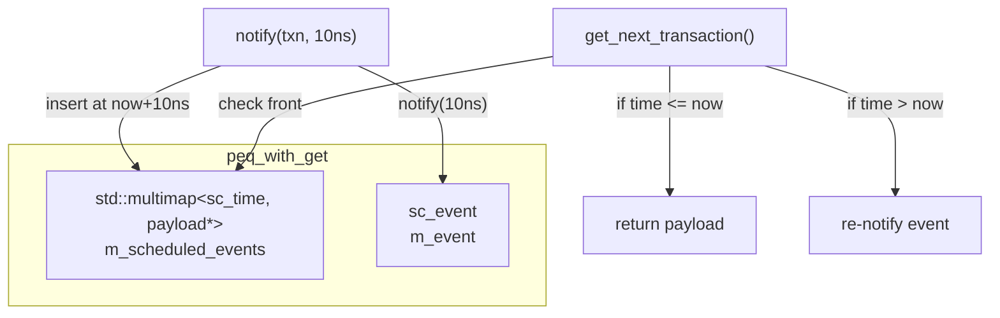

# peq_with_get - 輪詢式 Payload Event Queue

## 概述

`peq_with_get`（Payload Event Queue with Get）是一個時間排序的事件佇列，用於在非阻塞傳輸中排程交易。使用者透過 `notify()` 將交易放入佇列，然後在 SC_THREAD 或 SC_METHOD 中用 `get_next_transaction()` 取出到期的交易。

## 日常類比

想像一個有時間表的待辦事項清單：
- `notify(task, 10ns)` = 「10ns 後提醒我做這件事」
- `get_event()` = 鬧鐘響了
- `get_next_transaction()` = 「現在有什麼到期的事要做？」

你設定多個提醒，當鬧鐘響時就去檢查清單，把所有到期的事情一一取出來處理。

## 類別詳情

### `peq_with_get<PAYLOAD>`

```cpp
template <class PAYLOAD>
class peq_with_get : public sc_core::sc_object {
public:
  peq_with_get(const char* name);

  void notify(transaction_type& trans, const sc_time& t);  // timed
  void notify(transaction_type& trans);                     // immediate

  transaction_type* get_next_transaction();  // returns null when empty
  sc_event& get_event();
  void cancel_all();
};
```

### 使用流程

```cpp
// In SC_THREAD:
void my_thread() {
  while (true) {
    wait(m_peq.get_event());  // wait for something in queue

    tlm::tlm_generic_payload* txn;
    while ((txn = m_peq.get_next_transaction()) != nullptr) {
      // process txn
    }
  }
}

// Elsewhere:
m_peq.notify(txn, sc_time(10, SC_NS));  // schedule for 10ns from now
m_peq.notify(txn);                       // schedule for now (immediate)
```

### 內部實作



`m_scheduled_events` 是一個 `std::multimap`，以絕對時間為 key 排序：
- `notify()` 插入一筆 `(now + delay, payload*)` 紀錄
- `get_next_transaction()` 檢查最前面的紀錄是否到期，是則取出並回傳
- 如果最前面的紀錄還沒到期，重新排程 `m_event` 到該時間點
- 如果佇列空了，回傳 `nullptr`

### 重要注意事項

`get_next_transaction()` 必須重複呼叫直到回傳 `nullptr`，因為同一時間點可能有多筆到期的交易。

## 與 `peq_with_cb_and_phase` 的差異

| 特性 | `peq_with_get` | `peq_with_cb_and_phase` |
|------|----------------|------------------------|
| 通知方式 | 輪詢（get） | 回呼（callback） |
| 使用方式 | SC_THREAD + wait + get | 自動呼叫回呼 |
| Phase 支援 | 無 | 有 |
| 複雜度 | 簡單 | 較複雜 |
| 適用場景 | simple_target_socket 內部 | 精確的 phase 管理 |

## 原始碼位置

`ref/systemc/src/tlm_utils/peq_with_get.h`

## 相關檔案

- [peq_with_cb_and_phase.md](peq_with_cb_and_phase.md) - 回呼式事件佇列
- [simple_target_socket.md](simple_target_socket.md) - 內部使用 PEQ 的 socket
