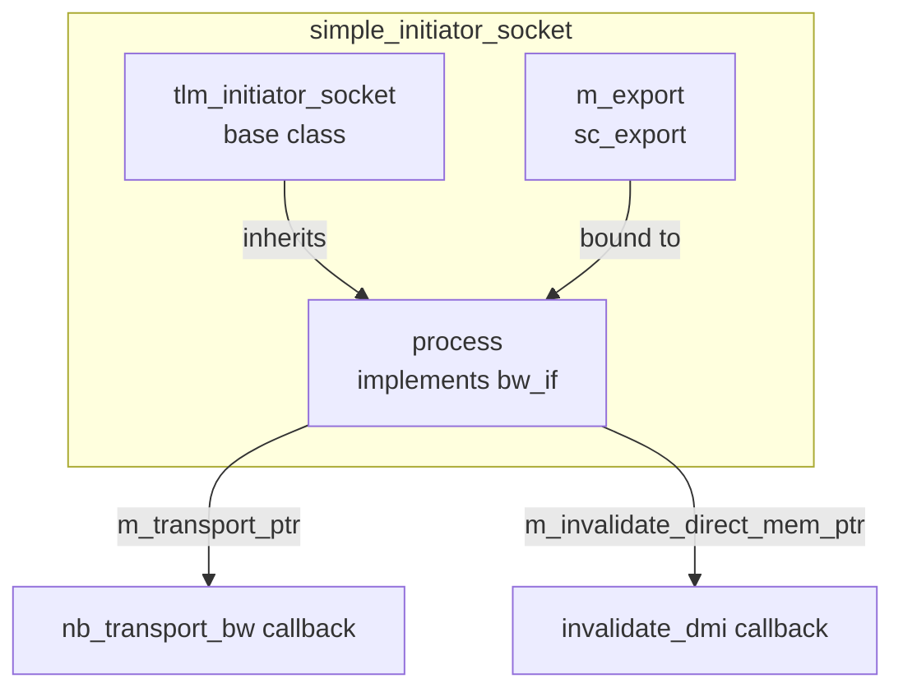

# simple_initiator_socket - 簡化 Initiator Socket

## 概述

`simple_initiator_socket` 是最常用的 initiator socket 包裝器。它繼承自 `tlm_initiator_socket`，自動管理 backward 介面的回呼註冊。使用者只需要註冊 `nb_transport_bw` 和/或 `invalidate_direct_mem_ptr` 的回呼函式即可。

## 日常類比

標準的 `tlm_initiator_socket` 要求你完整實作 `tlm_bw_transport_if`（nb_transport_bw + invalidate_direct_mem_ptr）。就像買一台電腦，標準版要求你自己組裝主機板、CPU、記憶體。

`simple_initiator_socket` 就像品牌組裝電腦——主機板和基本零件已經裝好，你只需要告訴它「用這個 CPU」「裝這條記憶體」就好。內部的 `process` 類別就是那塊已經組好的主機板。

## 基本用法

```cpp
class MyInitiator : public sc_module {
  tlm_utils::simple_initiator_socket<MyInitiator> socket;

  SC_CTOR(MyInitiator) : socket("socket") {
    // Register backward callbacks
    socket.register_nb_transport_bw(this, &MyInitiator::nb_transport_bw);
    socket.register_invalidate_direct_mem_ptr(this, &MyInitiator::invalidate_dmi);
  }

  // Forward call
  void thread() {
    tlm::tlm_generic_payload txn;
    sc_time delay = SC_ZERO_TIME;
    socket->b_transport(txn, delay);
  }

  // Backward callback
  tlm::tlm_sync_enum nb_transport_bw(
    tlm::tlm_generic_payload& txn,
    tlm::tlm_phase& phase,
    sc_time& t)
  {
    // handle backward transport
    return tlm::TLM_ACCEPTED;
  }

  void invalidate_dmi(uint64 start, uint64 end) {
    // handle DMI invalidation
  }
};
```

## 內部架構



### `process` 內部類別

```cpp
class process : public tlm::tlm_bw_transport_if<TYPES>,
                protected convenience_socket_cb_holder {
  MODULE* m_mod;
  TransportPtr m_transport_ptr;
  InvalidateDirectMemPtr m_invalidate_direct_mem_ptr;
};
```

`process` 實作了完整的 `tlm_bw_transport_if`：
- 當 target 呼叫 `nb_transport_bw` 時，`process` 將呼叫轉發給使用者註冊的回呼
- 如果沒有註冊回呼就被呼叫，會報告錯誤（`display_error`）
- `invalidate_direct_mem_ptr` 如果沒有註冊回呼則靜默忽略

## 變體

### `simple_initiator_socket_optional`

```cpp
template<typename MODULE, unsigned int BUSWIDTH = 32, typename TYPES = ...>
class simple_initiator_socket_optional
```

使用 `SC_ZERO_OR_MORE_BOUND` 綁定策略——socket 可以不綁定任何 target。

### `simple_initiator_socket_tagged`

```cpp
socket.register_nb_transport_bw(this, &MyModule::nb_transport_bw, id);
```

回呼函式多一個 `int id` 參數，用於區分哪個 socket 觸發了回呼。適合一個模組擁有多個 socket 的情境。

### `simple_initiator_socket_tagged_optional`

結合 tagged 和 optional 的特性。

## 模板參數

| 參數 | 預設值 | 說明 |
|------|--------|------|
| `MODULE` | (required) | 擁有此 socket 的模組型別 |
| `BUSWIDTH` | 32 | 匯流排寬度 |
| `TYPES` | `tlm_base_protocol_types` | 協議型別 |

## 原始碼位置

`ref/systemc/src/tlm_utils/simple_initiator_socket.h`

## 相關檔案

- [simple_target_socket.md](simple_target_socket.md) - 對應的 target socket
- [convenience_socket_bases.md](convenience_socket_bases.md) - 基礎類別
- [../tlm_core/tlm_2/tlm_initiator_socket.md](../tlm_core/tlm_2/tlm_initiator_socket.md) - 底層 socket
