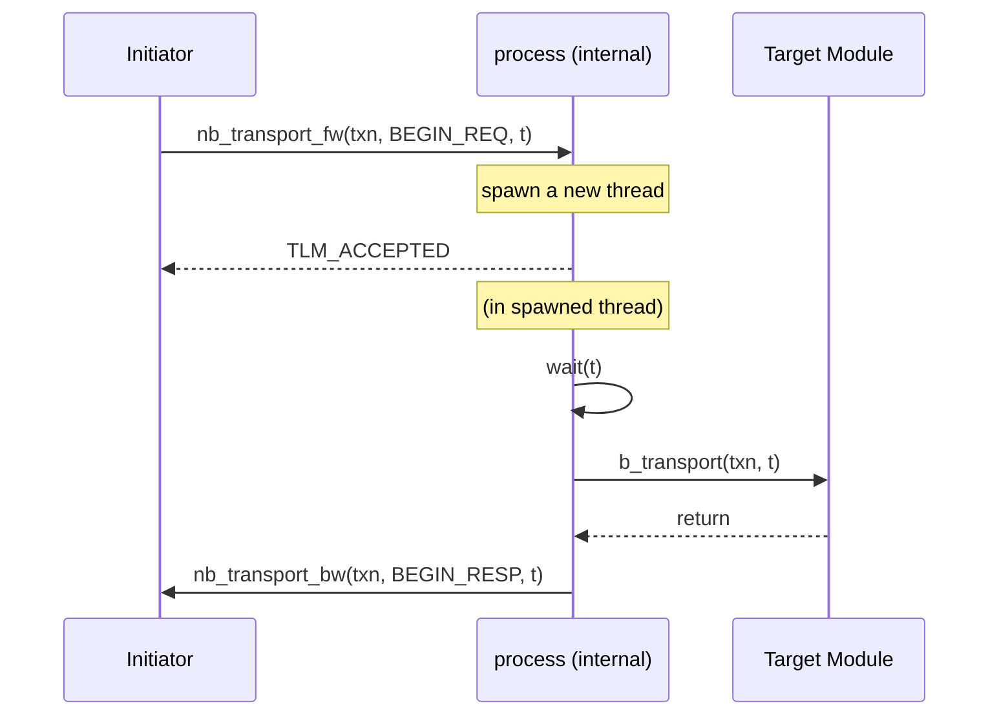
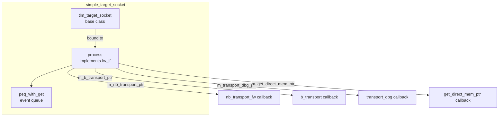

# simple_target_socket - 簡化 Target Socket

## 概述

`simple_target_socket` 是最常用的 target socket 包裝器。它不僅自動管理前向介面（`tlm_fw_transport_if`）的回呼註冊，還提供了 **blocking 到 non-blocking 的自動轉換**——如果使用者只註冊了 `b_transport`，socket 會自動將 `nb_transport_fw` 轉換為阻塞式呼叫。

## 日常類比

普通的 target socket 要求你實作所有四個介面方法（b_transport、nb_transport_fw、get_direct_mem_ptr、transport_dbg）。就像開一家餐廳，要同時處理「堂食」（blocking）和「外帶」（non-blocking）。

`simple_target_socket` 就像一個智慧前台：
- 你只需要教它怎麼做菜（註冊 `b_transport`）
- 如果有人要求外帶（`nb_transport_fw`），前台會自動把外帶訂單轉成堂食訂單去廚房處理
- DMI 和 debug 如果沒有特別設定，就禮貌地說「不支援」

## 基本用法

```cpp
class MyTarget : public sc_module {
  tlm_utils::simple_target_socket<MyTarget> socket;

  SC_CTOR(MyTarget) : socket("socket") {
    socket.register_b_transport(this, &MyTarget::b_transport);
    // nb_transport_fw will be auto-converted to b_transport
  }

  void b_transport(tlm::tlm_generic_payload& txn, sc_time& delay) {
    // process transaction
    unsigned char* data = txn.get_data_ptr();
    uint64 addr = txn.get_address();
    // ...
    txn.set_response_status(tlm::TLM_OK_RESPONSE);
  }
};
```

## 回呼註冊

```cpp
void register_nb_transport_fw(MODULE* mod,
    sync_enum_type (MODULE::*cb)(transaction_type&, phase_type&, sc_time&));

void register_b_transport(MODULE* mod,
    void (MODULE::*cb)(transaction_type&, sc_time&));

void register_transport_dbg(MODULE* mod,
    unsigned int (MODULE::*cb)(transaction_type&));

void register_get_direct_mem_ptr(MODULE* mod,
    bool (MODULE::*cb)(transaction_type&, tlm_dmi&));
```

## Blocking/Non-blocking 自動轉換

當只註冊了 `b_transport` 而收到 `nb_transport_fw` 呼叫時：



內部流程：
1. 收到 `nb_transport_fw` 時，將交易放入 PEQ（Payload Event Queue）
2. 使用 `sc_spawn` 產生新 thread
3. 新 thread 中呼叫使用者的 `b_transport`
4. 完成後透過 backward path 回呼 initiator

### PEQ（Payload Event Queue）

simple_target_socket 內部使用 `peq_with_get` 來排程交易。PEQ 確保交易按正確的模擬時間被處理。

## 內部架構



## 變體

| 變體 | 說明 |
|------|------|
| `simple_target_socket` | 標準版，必須綁定至少一個 initiator |
| `simple_target_socket_optional` | 可以不綁定 |
| `simple_target_socket_tagged` | 回呼帶 `int id` 參數 |
| `simple_target_socket_tagged_optional` | tagged + optional |

## 與 passthrough_target_socket 的差異

| 特性 | simple_target_socket | passthrough_target_socket |
|------|---------------------|--------------------------|
| blocking/nb 自動轉換 | 支援 | 不支援 |
| 未註冊回呼時的行為 | 自動轉換或報錯 | 報錯 |
| 使用場景 | 終端模組（target） | 中間元件（interconnect） |
| 是否用 PEQ | 是 | 否 |
| 額外的 thread 開銷 | 可能有 | 無 |

## 原始碼位置

`ref/systemc/src/tlm_utils/simple_target_socket.h`

## 相關檔案

- [simple_initiator_socket.md](simple_initiator_socket.md) - 對應的 initiator socket
- [passthrough_target_socket.md](passthrough_target_socket.md) - 穿透式替代方案
- [peq_with_get.md](peq_with_get.md) - 內部使用的事件佇列
- [convenience_socket_bases.md](convenience_socket_bases.md) - 基礎類別
