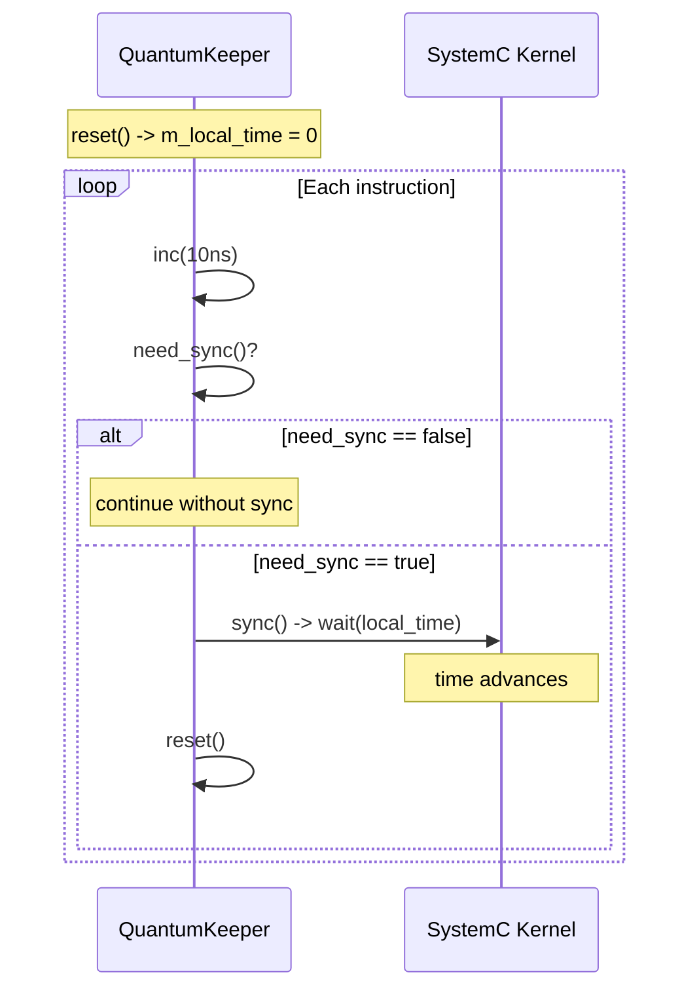

# tlm_quantumkeeper - 量子時間管理器

## 概述

`tlm_quantumkeeper` 幫助 initiator 管理本地時間（local time）——即 initiator 領先 SystemC 時間多遠。它追蹤本地時間的累積，判斷是否需要同步，並在必要時執行同步（wait）。這是實作 Loosely-Timed（LT）模型時間解耦的關鍵工具。

## 日常類比

想像你在玩一個回合制策略遊戲，但你是個心急的玩家：
- **本地時間** = 你偷跑了多少步
- **全域量子** = 最多可以偷跑幾步
- **`inc()`** = 你又偷跑了一步
- **`need_sync()`** = 「我是不是偷跑太多了，該等其他玩家了？」
- **`sync()`** = 停下來，等所有玩家追上來
- **`reset()`** = 回到起跑線，重新開始計算

## 類別詳情

### 靜態方法（全域量子管理）

```cpp
static void set_global_quantum(const sc_time& t);
static const sc_time& get_global_quantum();
```

包裝了 `tlm_global_quantum::instance()` 的存取。

### 實例方法

```cpp
class tlm_quantumkeeper {
public:
  virtual void inc(const sc_time& t);         // local_time += t
  virtual void set(const sc_time& t);         // local_time = t
  virtual bool need_sync() const;             // should we sync?
  virtual void sync();                        // wait(local_time) + reset
  void set_and_sync(const sc_time& t);        // set + conditional sync

  virtual void reset();                       // local_time = 0, recalculate next sync point
  virtual sc_time get_current_time() const;   // sc_time_stamp() + local_time
  virtual sc_time get_local_time() const;     // just local_time
protected:
  virtual sc_time compute_local_quantum();    // overridable
};
```

### 同步判斷邏輯

```cpp
bool need_sync() const {
  return sc_time_stamp() + m_local_time >= m_next_sync_point;
}
```

`m_next_sync_point` 是下一個量子邊界的時間，在 `reset()` 時計算。

## 典型使用流程



### 使用範例

```cpp
class CPU : public sc_module {
  tlm_utils::tlm_quantumkeeper m_qk;

  void run() {
    m_qk.reset();  // initialize

    while (true) {
      // Execute one instruction
      execute_instruction();
      m_qk.inc(sc_time(10, SC_NS));  // instruction takes 10ns

      // Memory access
      tlm::tlm_generic_payload txn;
      sc_time delay = m_qk.get_local_time();
      socket->b_transport(txn, delay);
      m_qk.set(delay);  // target may have changed delay

      // Sync if needed
      if (m_qk.need_sync()) {
        m_qk.sync();
      }
    }
  }
};
```

## 時間軸示意

```
Global Quantum = 100ns

SystemC time:  0     100    200    300    400
               |------|------|------|------|
                 ^sync  ^sync  ^sync  ^sync

Initiator:
  inc(10) -> local=10
  inc(10) -> local=20
  ...
  inc(10) -> local=100 -> need_sync()! -> sync() -> wait(100ns)
  reset() -> local=0
  inc(10) -> local=10
  ...
```

## 自訂量子

透過覆寫 `compute_local_quantum()` 可以讓特定 initiator 使用比全域量子更小的本地量子：

```cpp
class PreciseCPU : public sc_module {
  class my_qk : public tlm_utils::tlm_quantumkeeper {
  protected:
    sc_time compute_local_quantum() override {
      // Use half of global quantum for finer granularity
      sc_time gq = tlm::tlm_global_quantum::instance().compute_local_quantum();
      return gq / 2;
    }
  };
  my_qk m_qk;
};
```

## 原始碼位置

`ref/systemc/src/tlm_utils/tlm_quantumkeeper.h`

## 相關檔案

- [../tlm_core/tlm_2/tlm_global_quantum.md](../tlm_core/tlm_2/tlm_global_quantum.md) - 全域量子管理
- [simple_initiator_socket.md](simple_initiator_socket.md) - 常與 quantum keeper 搭配使用
