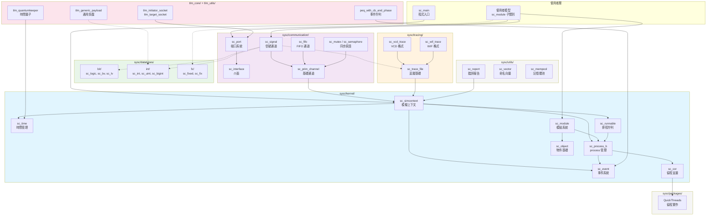
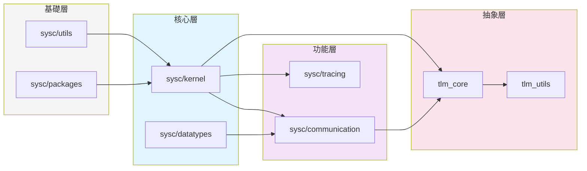

# SystemC 架構總覽圖

> 本頁面提供 SystemC 框架各子系統之間的全局關聯圖。

## 子系統關聯圖

## 依賴方向總覽

## 文件統計

| 子系統 | 文件數 | 說明 |
|--------|--------|------|
| sysc/kernel | 42 | 模擬核心引擎 |
| sysc/communication | 28 | 通訊元件 |
| sysc/datatypes | 52 | 資料型別（bit + fx + int + misc） |
| sysc/tracing | 5 | 波形追蹤 |
| sysc/utils | 16 | 工具函式庫 |
| sysc/packages | 2 | QuickThreads 協程 |
| tlm_core | 18 | TLM 1.0 + 2.0 核心 |
| tlm_utils | 11 | TLM 工具套件 |
| topdown | 10 | Top-down 概念文件 |
| **合計** | **~195** | **含索引頁面** |
