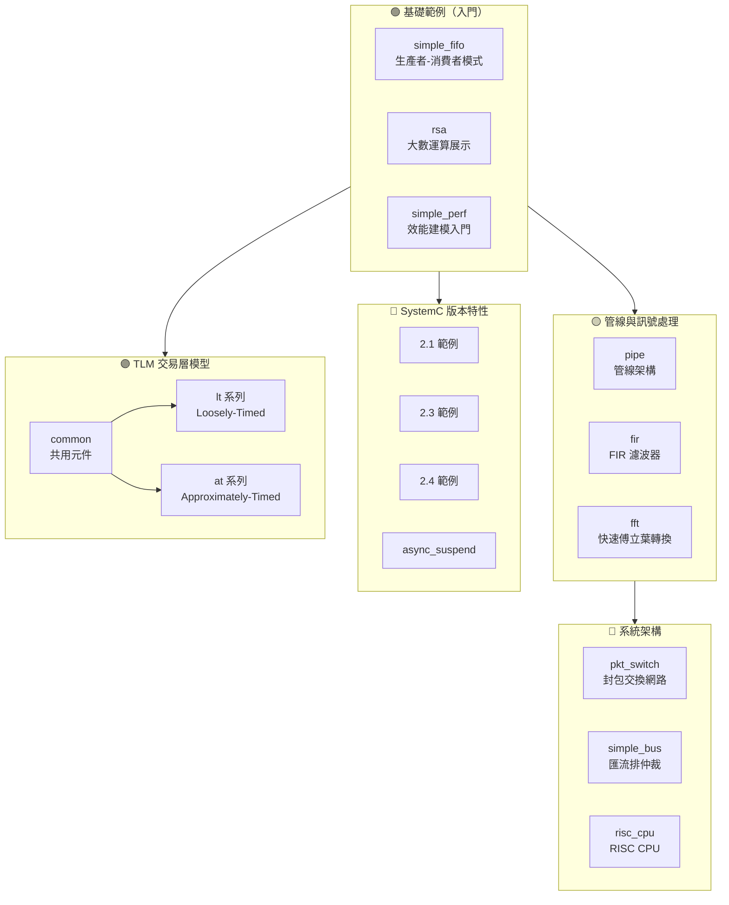

# SystemC 官方範例文件

> 本文件涵蓋 SystemC 官方範例程式碼的完整解析，適合**沒有硬體背景的軟體工程師**閱讀。
> 每個範例都會用軟體世界的類比來解釋硬體概念。

## 導覽地圖

## 範例總覽

### SystemC 核心範例 (`sysc/`)

| 範例 | 難度 | 一句話說明 | 軟體類比 |
| --- | --- | --- | --- |
| [simple_fifo](code/sysc/simple_fifo/_index.md) | 🟢 入門 | 生產者-消費者透過 FIFO 通訊 | Python queue.Queue |
| [rsa](code/sysc/rsa/_index.md) | 🟢 入門 | RSA 加密演算法，展示大數型別 | Python native big int 運算 |
| [simple_perf](code/sysc/simple_perf/_index.md) | 🟢 入門 | 帶時間模型的效能分析 | 效能壓測 + 瓶頸分析 |
| [pipe](code/sysc/pipe/_index.md) | 🟡 中級 | 多級管線處理 | Unix pipe / 責任鏈模式 |
| [fir](code/sysc/fir/_index.md) | 🟡 中級 | FIR 有限脈衝響應濾波器 | 滑動視窗加權平均 |
| [fft](code/sysc/fft/_index.md) | 🟡 中級 | 快速傅立葉轉換（浮點+定點） | 頻譜分析器 |
| [pkt_switch](code/sysc/pkt_switch/_index.md) | 🔴 進階 | 封包交換網路 | 網路路由器模擬 |
| [simple_bus](code/sysc/simple_bus/_index.md) | 🔴 進階 | 共享匯流排與仲裁 | 多執行緒共享資源 + 鎖 |
| [risc_cpu](code/sysc/risc_cpu/_index.md) | 🔴 進階 | 完整 RISC CPU 模型 | 指令解譯器 + 快取系統 |
| [2.1](code/sysc/2.1/_index.md) | 🟡 中級 | SystemC 2.1 版新功能 | API 版本升級範例 |
| [2.3](code/sysc/2.3/_index.md) | 🟡 中級 | SystemC 2.3 版新功能 | 非同步事件處理 |
| [2.4](code/sysc/2.4/_index.md) | 🟡 中級 | SystemC 2.4 版新功能 | 類別內初始化 |
| [async_suspend](code/sysc/async_suspend/_index.md) | 🔴 進階 | 非同步暫停與外部事件 | 外部中斷 / async callback |

### TLM 交易層模型範例 (`tlm/`)

| 範例 | 難度 | 一句話說明 | 軟體類比 |
| --- | --- | --- | --- |
| [common](code/tlm/common/_index.md) | 🟡 中級 | 共用 initiator/target/memory | 共用 client/server 元件庫 |
| [lt](code/tlm/lt/_index.md) | 🟡 中級 | Loosely-Timed 基本範例 | 同步 HTTP 請求 |
| [lt_dmi](code/tlm/lt_dmi/_index.md) | 🟡 中級 | LT + Direct Memory Interface | 記憶體映射 / mmap |
| [lt_temporal_decouple](code/tlm/lt_temporal_decouple/_index.md) | 🔴 進階 | LT + 時間解耦 | 批次處理加速 |
| [lt_mixed_endian](code/tlm/lt_mixed_endian/_index.md) | 🟡 中級 | LT + 混合位元組序 | Big/Little Endian 轉換 |
| [lt_extension_mandatory](code/tlm/lt_extension_mandatory/_index.md) | 🟡 中級 | LT + 必要擴展 | 自訂 HTTP Header |
| [at_1_phase](code/tlm/at_1_phase/_index.md) | 🔴 進階 | AT 單階段協議 | 單次 ACK 的 RPC |
| [at_2_phase](code/tlm/at_2_phase/_index.md) | 🔴 進階 | AT 雙階段協議 | 請求-回應 RPC |
| [at_4_phase](code/tlm/at_4_phase/_index.md) | 🔴 進階 | AT 四階段協議 | 完整握手 TCP |
| [at_extension_optional](code/tlm/at_extension_optional/_index.md) | 🔴 進階 | AT + 可選擴展 | 可選 HTTP Header |
| [at_mixed_targets](code/tlm/at_mixed_targets/_index.md) | 🔴 進階 | AT 混合目標 | 異質微服務 |
| [at_ooo](code/tlm/at_ooo/_index.md) | 🔴 進階 | AT 亂序完成 | 非同步 asyncio.gather() |

## 命名對應規則

| 來源 | 文件 |
| --- | --- |
| `ref/systemc/examples/<case>/*.cpp` | `doc_v2/examples/code/<case>/*.md` |
| 每個範例的硬體規格說明 | `doc_v2/examples/code/<case>/spec.md` |
| 概念性文件 | `doc_v2/examples/topdown/*.md` |

## 統計

- 總原始碼檔案數: **226**
- SystemC 核心範例: **123** 檔案 / **13** 個範例
- TLM 範例: **103** 檔案 / **12** 個範例
