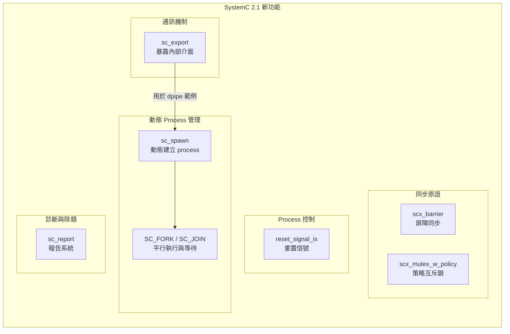

# SystemC 2.1 -- 新功能範例集

> **難度**: 中級 | **前置知識**: 基本 SystemC module, port, channel 概念 | **原始碼**: `ref/systemc/examples/sysc/2.1/`

## 概述

SystemC 2.1 版本引入了數項重要的語言擴充，讓模擬框架更接近現代軟體工程師熟悉的並行程式設計模型。這個目錄包含 7 個範例，每個展示一項 2.1 版新功能。

如果你是軟體工程師，可以把 SystemC 2.1 想像成一次重大的**框架升級** -- 就像 Python 從 2 升級到 3 時新增了 asyncio、type hints 一樣，SystemC 2.1 新增了動態 process、fork-join、export 機制等等。

## 軟體類比總覽

| SystemC 2.1 功能 | 軟體類比 | 解決的問題 |
| --- | --- | --- |
| `sc_export` | Dependency Injection / 暴露內部服務 API | 讓子模組的 channel 介面對外可見，無需額外 port 轉接 |
| `sc_spawn` (動態 process) | 動態建立 thread (`threading.Thread()` / Python coroutine (asyncio)) | 在模擬執行期間動態建立新的執行單元 |
| `SC_FORK` / `SC_JOIN` | `Python asyncio.gather()` / `Python asyncio.Future` | 平行派發多個任務，等待全部完成再繼續 |
| `reset_signal_is` | Graceful restart / Circuit breaker pattern | 當 reset 信號觸發時，thread 自動回到起始狀態 |
| `sc_report` | Logging framework (Python logging) | 統一的訊息報告機制，可依嚴重等級和 ID 過濾 |
| `scx_barrier` | `Python threading.Barrier` | 多個 thread 在同一個同步點等待，全到齊後一起放行 |
| `scx_mutex_w_policy` | Mutex with fairness policy (`Python threading.Lock`) | 支援 FIFO 或 RANDOM 仲裁策略的互斥鎖 |

## 架構概念圖

## 檔案列表

| 範例目錄 | 說明 | 軟體類比 | 文件連結 |
| --- | --- | --- | --- |
| `dpipe/` | 動態延遲管線，使用 `sc_export` 暴露 FIFO 介面 | 動態 thread pool | [dpipe.md](dpipe.md) |
| `forkjoin/` | Fork-join 平行執行與動態 process 建立 | `Python asyncio.gather()` | [forkjoin.md](forkjoin.md) |
| `reset_signal_is/` | Reset 信號控制 clocked thread 的重置行為 | Graceful restart | [reset-signal-is.md](reset-signal-is.md) |
| `sc_export/` | `sc_export` 機制：將子模組的 channel 介面暴露給外部 | Dependency Injection | [sc-export.md](sc-export.md) |
| `sc_report/` | 報告與訊息系統，支援嚴重等級和自訂 handler | Logging framework | [sc-report.md](sc-report.md) |
| `scx_barrier/` | Barrier 同步原語，多 thread 等待全到齊 | `Python threading.Barrier` | [scx-barrier.md](scx-barrier.md) |
| `scx_mutex_w_policy/` | 支援 FIFO / RANDOM 仲裁策略的互斥鎖 | `Python threading.Lock` with fairness | [scx-mutex-w-policy.md](scx-mutex-w-policy.md) |

## 核心概念速查

| SystemC 概念 | 軟體對應 | 說明 |
| --- | --- | --- |
| `sc_export<IF>` | 暴露內部 service 的 API endpoint | 讓外部 port 直接綁定到子模組內部的 channel，不需要在父模組建立轉接 port |
| `sc_spawn()` | Python coroutine (asyncio) / `threading.Thread(target=runnable)` | 在模擬執行期間動態建立 SC_THREAD 或 SC_METHOD |
| `SC_FORK` / `SC_JOIN` | `Python asyncio.gather(p1, p2, p3)` | 用 macro 包裝多個 `sc_spawn`，等待所有 process 結束 |
| `reset_signal_is()` | 註冊 shutdown hook / circuit breaker trigger | 當指定信號為特定值時，thread 自動重新從頭執行 |
| `sc_report_handler` | `logging.Logger` (Python logging) | 設定不同 message ID 和嚴重等級的處理動作 |
| `scx_barrier` | `Python threading.Barrier` | 計數器歸零時，所有等待的 thread 同時釋放 |
| `sc_mutex` + policy | `Python threading.Lock` | 在多 process 競爭時，依策略決定誰先取得鎖 |

## 學習路徑建議

1. **入門**: 先讀 [sc-export.md](sc-export.md) -- `sc_export` 是 2.1 版最基礎的新概念
2. **進階通訊**: 讀 [dpipe.md](dpipe.md) -- 結合 `sc_export` 與 `SC_METHOD` 實作管線
3. **動態 process**: 讀 [forkjoin.md](forkjoin.md) -- 學習 `sc_spawn` 和 `SC_FORK/SC_JOIN`
4. **同步原語**: 讀 [scx-barrier.md](scx-barrier.md) 和 [scx-mutex-w-policy.md](scx-mutex-w-policy.md)
5. **Process 控制**: 讀 [reset-signal-is.md](reset-signal-is.md) -- 理解硬體 reset 的軟體對應
6. **診斷工具**: 讀 [sc-report.md](sc-report.md) -- 了解 SystemC 的 logging 框架
