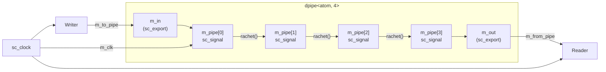
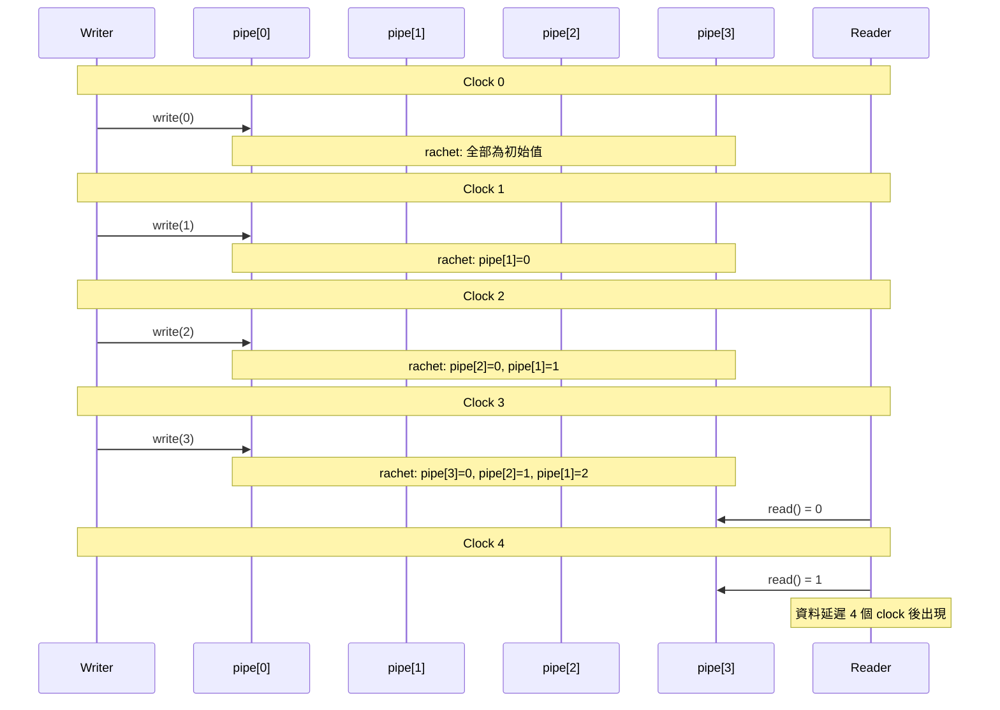

# dpipe -- 動態延遲管線

> **難度**: 中級 | **軟體類比**: 固定深度的資料延遲佇列 / 多級 buffer pipeline | **原始碼**: `ref/systemc/examples/sysc/2.1/dpipe/main.cpp`

## 概述

`dpipe` 範例實作了一個**延遲管線（delay pipeline）**：資料從一端寫入，經過 N 個 clock cycle 後從另一端出現。這是硬體設計中極為常見的模式 -- 用來匹配不同模組之間的時序延遲。

### 軟體類比：固定延遲的資料佇列

想像你在設計一個**訊息處理系統**，需要讓每條訊息延遲固定時間後才送出（例如模擬網路延遲）：

```python
# Python 類比：固定延遲管線
class DelayPipeline:
    def __init__(self, stages=4):
        self.pipe = [None] * stages  # N 級暫存器

    def tick(self):
        """每個 clock 呼叫一次"""
        for i in range(len(self.pipe)-1, 0, -1):
            self.pipe[i] = self.pipe[i-1]  # 往後推一格

    def write(self, value):
        self.pipe[0] = value

    def read(self):
        return self.pipe[-1]  # 經過 N 個 tick 後才出現
```

SystemC 版本做的事情完全一樣，只是使用了 `sc_export` 來暴露寫入和讀取介面。

## 架構圖

### 模組連接圖



### 類別關係圖

```mermaid
classDiagram
    class dpipe~T_N~ {
        +sc_in_clk m_clk
        +sc_export~sc_signal_inout_if~ m_in
        +sc_export~sc_signal_in_if~ m_out
        -sc_signal~T~ m_pipe[N]
        -rachet() void
    }

    class Writer {
        +sc_in_clk m_clk
        +sc_inout~atom~ m_to_pipe
        -atom m_counter
        -insert() void
    }

    class Reader {
        +sc_in_clk m_clk
        +sc_in~atom~ m_from_pipe
        -extract() void
    }

    Writer -->|"透過 sc_export"| dpipe : 寫入
    dpipe -->|"透過 sc_export"| Reader : 讀取
```

## 程式碼解析

### `dpipe` -- 延遲管線模組

```cpp
template<class T, int N>
SC_MODULE(dpipe) {
    typedef sc_export<sc_signal_inout_if<T> > in;   // 寫入端 export 型別
    typedef sc_export<sc_signal_in_if<T> >    out;  // 讀取端 export 型別

    SC_CTOR(dpipe)
    {
        m_in(m_pipe[0]);       // export 綁定到第一級 signal
        m_out(m_pipe[N-1]);    // export 綁定到最後一級 signal
        SC_METHOD(rachet);
        sensitive << m_clk.pos();  // 每個 clock 上升沿觸發
    }

    void rachet()
    {
        for ( int i = N-1; i > 0; i-- )
        {
            m_pipe[i].write(m_pipe[i-1].read());  // 資料往後推一格
        }
    }

    sc_in_clk    m_clk;
    in           m_in;       // 外部透過這個 export 寫入
    out          m_out;      // 外部透過這個 export 讀取
    sc_signal<T> m_pipe[N];  // N 級管線暫存器
};
```

**關鍵設計**:

1. **`sc_export` 的用途**: `m_in` 是一個 `sc_export<sc_signal_inout_if<T>>`，它把內部的 `m_pipe[0]`（一個 `sc_signal`）的**寫入介面**暴露給外部。外部的 `Writer` 可以直接透過這個 export 寫入 `m_pipe[0]`，就好像直接連接到那個 signal 一樣。

   軟體類比：這就像在微服務架構中，一個服務把內部 database 的 API 透過 gateway 暴露出來，外部不需要知道內部實作細節。

2. **`SC_METHOD(rachet)`**: 每個 clock 觸發一次 `rachet()`，它不會 `wait()`，只是做一次資料搬移。這就像一個定時觸發的 callback。

3. **Template 參數**: `T` 是資料型別，`N` 是管線深度。在本範例中使用 `dpipe<atom, 4>`，其中 `atom` 是 `sc_biguint<121>`（121-bit 的無號整數）。

### `Writer` -- 寫入端

```cpp
SC_MODULE(Writer)
{
    SC_CTOR(Writer)
    {
        SC_METHOD(insert);
        sensitive << m_clk.pos();
        m_counter = 0;
    }

    void insert()
    {
        m_to_pipe.write(m_counter);
        m_counter++;
    }

    sc_in_clk       m_clk;
    atom            m_counter;
    sc_inout<atom > m_to_pipe;  // 連接到 dpipe 的 m_in export
};
```

每個 clock 寫入一個遞增的數字。`m_to_pipe` 是一個 `sc_inout` port，透過 `sc_export` 直接寫入 `dpipe` 內部的 `m_pipe[0]`。

### `Reader` -- 讀取端

```cpp
void extract()
{
    cout << sc_time_stamp().to_double() << ": " << m_from_pipe.read() << endl;
}
```

每個 clock 讀取一次管線輸出。由於管線深度為 4，寫入的數字會在 4 個 clock 後出現在讀取端。

### 連接方式

```cpp
dpipe<atom,4> delay("pipe");
Reader        reader("reader");
Writer        writer("writer");

reader.m_from_pipe(delay.m_out);  // port 綁定到 sc_export
writer.m_to_pipe(delay.m_in);    // port 綁定到 sc_export
```

這裡的精妙之處在於：`delay.m_out` 是一個 `sc_export`，但 `reader.m_from_pipe` 是一個普通的 `sc_in` port。`sc_export` 可以直接綁定到 `sc_port`，因為 export 本質上就是把底層 channel 的介面「暴露」出來。

## 執行時序



## 設計理念

### 為什麼用 `sc_export` 而不是直接暴露 signal？

如果直接把 `m_pipe[0]` 設為 public，外部就能存取到所有 `sc_signal` 的方法（包括不該被外部使用的方法）。`sc_export<sc_signal_inout_if<T>>` 只暴露了 `sc_signal_inout_if` 介面定義的方法，實現了**介面隔離**。

這等同於軟體中的**封裝（encapsulation）**：不是把整個物件丟出去，而是只暴露一個受限的介面。

### 為什麼 `rachet()` 要從後往前寫？

```cpp
for ( int i = N-1; i > 0; i-- )
    m_pipe[i].write(m_pipe[i-1].read());
```

如果從前往後寫（`i = 0` 到 `N-1`），所有 signal 會在同一次迭代中被覆蓋成 `m_pipe[0]` 的值。從後往前寫確保每個值都被正確地推移一格。這是 shift register 的經典實作模式。
