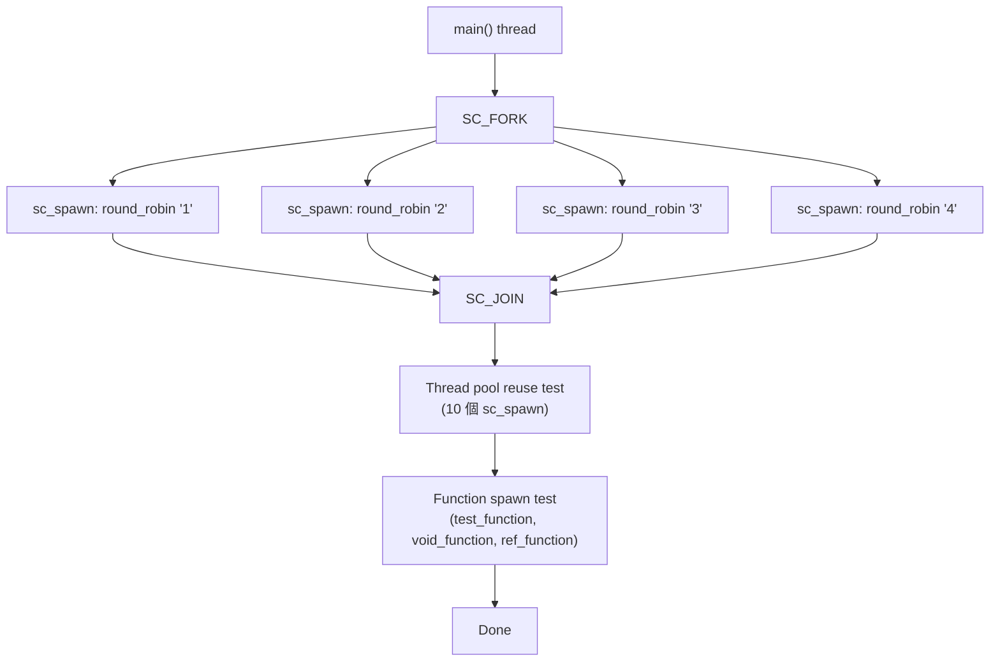
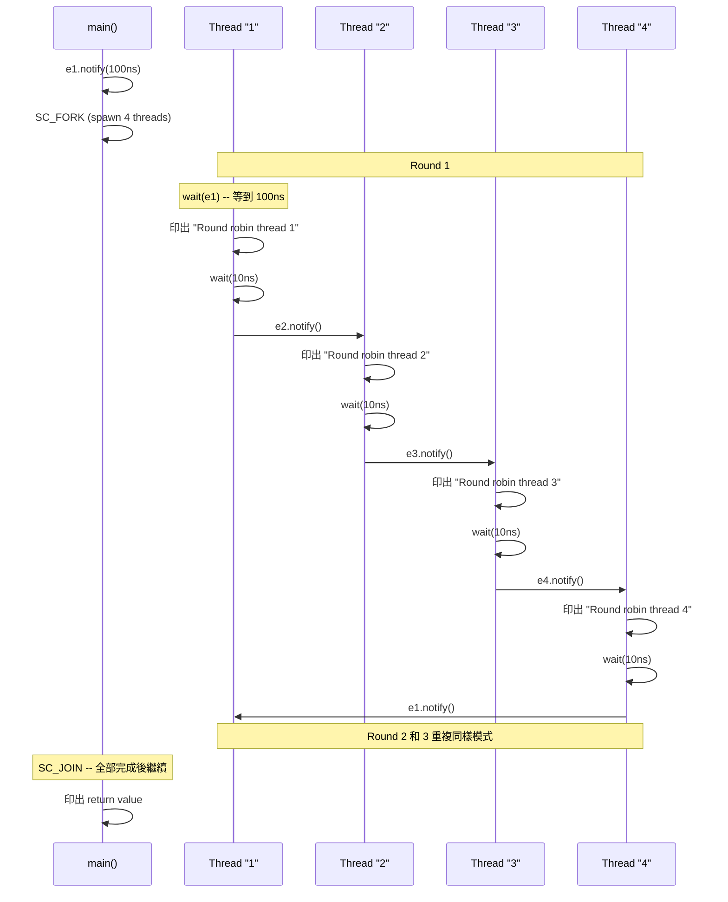

# forkjoin -- Fork-Join 平行執行

> **難度**: 中級 | **軟體類比**: `Python asyncio.gather()` / `Python asyncio.Future` / Python coroutine group | **原始碼**: `ref/systemc/examples/sysc/2.1/forkjoin/forkjoin.cpp`

## 概述

`forkjoin` 範例展示了 SystemC 2.1 的**動態 process 建立**（`sc_spawn`）和 **fork-join 平行執行模式**（`SC_FORK` / `SC_JOIN`）。這讓你可以在模擬執行期間動態建立多個 thread，並等待它們全部完成。

### 軟體類比：Python asyncio.gather()

在 Python 中，當你需要平行發出多個非同步任務並等待全部完成：

```python
# Python asyncio 類比
import asyncio

async def main():
    results = await asyncio.gather(
        fetch('/api/task1'),
        fetch('/api/task2'),
        fetch('/api/task3'),
        fetch('/api/task4'),
    )
    print("All tasks completed")
```

或者使用 threading：

```python
# Python threading 類比
import threading

barrier = threading.Barrier(4)
threads = []
for i in range(4):
    t = threading.Thread(target=do_work, args=(i,))
    threads.append(t)
    t.start()
for t in threads:
    t.join()  # 等待全部 thread 完成
```

SystemC 的 `SC_FORK` / `SC_JOIN` 做的是完全一樣的事情。

## 架構圖

### 執行流程圖



### Round-Robin 事件鏈



## 程式碼解析

### 第一部分：SC_FORK / SC_JOIN

```cpp
SC_FORK
    sc_spawn(&r,
        sc_bind(&top::round_robin, this, "1", sc_ref(e1), sc_ref(e2), 3), "1") ,
    sc_spawn(&r,
        sc_bind(&top::round_robin, this, "2", sc_ref(e2), sc_ref(e3), 3), "2") ,
    sc_spawn(&r,
        sc_bind(&top::round_robin, this, "3", sc_ref(e3), sc_ref(e4), 3), "3") ,
    sc_spawn(&r,
        sc_bind(&top::round_robin, this, "4", sc_ref(e4), sc_ref(e1), 3), "4") ,
SC_JOIN
```

**逐層拆解**:

| 元素 | 說明 | 軟體類比 |
| --- | --- | --- |
| `SC_FORK` / `SC_JOIN` | 派發多個 process，等全部結束 | `Python asyncio.gather(...)` |
| `sc_spawn(&r, func, "name")` | 動態建立一個 process，`&r` 接收回傳值 | `threading.Thread(target=func)` 帶回傳值 |
| `sc_bind(&top::round_robin, this, ...)` | 綁定成員函式和參數為一個 callable | `std::bind` / lambda capture |
| `sc_ref(e1)` | 以參考方式傳遞 `sc_event` | C++ `std::ref` |

**`sc_spawn` 的意義**: 在 SystemC 2.0 及之前，所有 process 必須在建構階段（elaboration phase）靜態註冊。2.1 版的 `sc_spawn` 允許在模擬執行期間動態建立 process -- 就像 Python 可以隨時 `asyncio.create_task()` 一樣。

### 第二部分：Round-Robin 函式

```cpp
int round_robin(const char *str, sc_event& receive, sc_event& send, int cnt)
{
    while (--cnt >= 0)
    {
        wait(receive);   // 等待前一個 thread 通知我
        cout << "Round robin thread " << str
             << " at time " << sc_time_stamp() << endl;
        wait(10, SC_NS); // 做一些工作（模擬延遲）
        send.notify();   // 通知下一個 thread
    }
    return 0;
}
```

這是一個**事件鏈（event chain）**模式：每個 thread 等待自己的事件，處理完後觸發下一個 thread 的事件。形成一個環形的輪流執行模式。

軟體類比：這類似於多個 Python coroutine 透過 queue 形成 pipeline：

```python
# Python asyncio 類比
import asyncio

async def round_robin(name: str, receive: asyncio.Queue, send: asyncio.Queue, cnt: int):
    for i in range(cnt):
        await receive.get()           # 等待前一個
        print(f"Thread {name}")
        await asyncio.sleep(0.01)
        await send.put(None)          # 通知下一個
```

### 第三部分：Thread Pool 重用

```cpp
for (int i = 0 ; i < 10; i++)
    sc_spawn(&r, sc_bind(&top::wait_and_end, this, i));

wait(20, SC_NS);
```

連續 spawn 10 個 thread，每個等待不同時間後結束。這測試了 SystemC 內部的 thread pool 是否能正確地重用已結束的 thread -- 就像 Python `concurrent.futures.ThreadPoolExecutor` 會重用 worker thread 一樣。

### 第四部分：Spawn 一般函式

```cpp
// spawn 一個自由函式（非成員函式），並取得回傳值
wait( sc_spawn(&r, sc_bind(&test_function, 3.14159)).terminated_event() );
cout << "Returned int is " << r << endl;

// spawn 一個 void 函式
sc_process_handle handle1 = sc_spawn(sc_bind(&void_function, 1.2345));
wait(handle1.terminated_event());

// spawn 帶 const reference 參數的函式
double d = 9.8765;
wait( sc_spawn(&r, sc_bind(&ref_function, sc_cref(d))).terminated_event() );
```

**重要觀念**:
- `sc_spawn` 回傳 `sc_process_handle`，可以用來等待 process 結束
- `.terminated_event()` 回傳一個 `sc_event`，在 process 結束時觸發
- `wait(handle.terminated_event())` 等同於 Python 的 `thread.join()`
- `sc_cref(d)` 以 const reference 傳遞參數

## 核心 API 整理

| API | 說明 | 軟體類比 |
| --- | --- | --- |
| `sc_spawn(&ret, func, "name")` | 動態建立 process | `asyncio.create_task()` / `threading.Thread()` |
| `sc_bind(func, args...)` | 綁定函式與參數 | `std::bind` / lambda |
| `sc_ref(x)` / `sc_cref(x)` | 參考 / const 參考傳遞 | `std::ref` / `std::cref` |
| `SC_FORK ... SC_JOIN` | 平行派發，等待全部完成 | `Python asyncio.gather()` |
| `handle.terminated_event()` | process 結束時觸發的事件 | `thread.join()` |
| `sc_spawn_options` | spawn 選項（如 stack size） | `threading.Thread` 設定 |

## 設計理念

### 為什麼需要動態 process？

在硬體模擬中，很多情境需要動態建立執行單元：
- **Transaction-level modeling (TLM)**: 每個交易（transaction）可能需要一個獨立的 thread 來追蹤
- **Testbench**: 測試時需要動態產生不同的刺激（stimulus）
- **Protocol modeling**: 協定中的訊息處理可能需要平行追蹤多個狀態機

這就像 web server 為每個 request 建立一個 Python coroutine (asyncio) / thread 一樣 -- 你無法在編譯時就知道會有多少 request。

### SC_FORK/SC_JOIN vs 手動 spawn + wait

```cpp
// 手動方式（繁瑣）
auto h1 = sc_spawn(...);
auto h2 = sc_spawn(...);
wait(h1.terminated_event() & h2.terminated_event());

// SC_FORK/SC_JOIN（簡潔）
SC_FORK
    sc_spawn(...) ,
    sc_spawn(...) ,
SC_JOIN
```

`SC_FORK` / `SC_JOIN` 是語法糖（macro），讓平行派發的程式碼更清晰。注意逗號分隔（不是分號），這是 macro 的語法要求。
