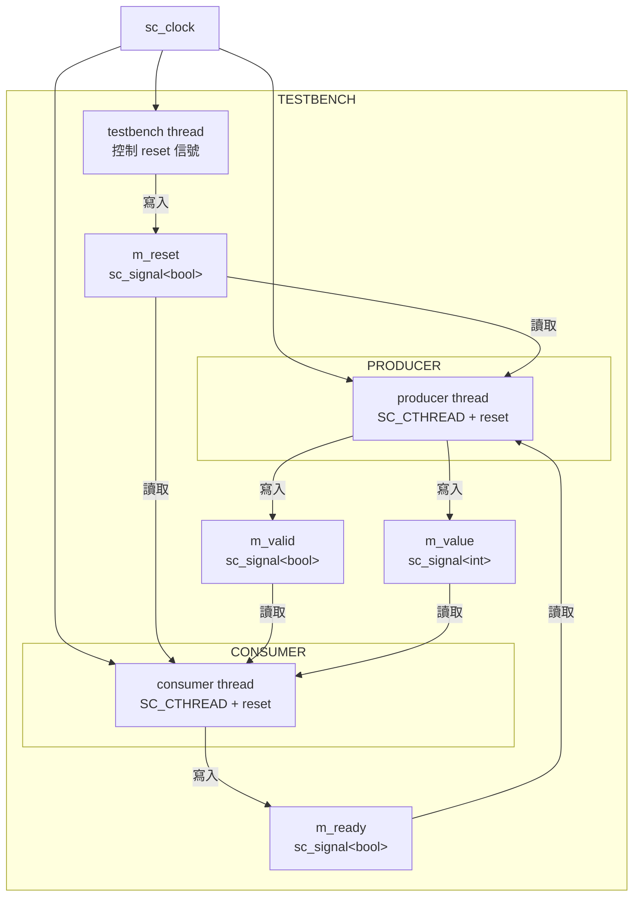
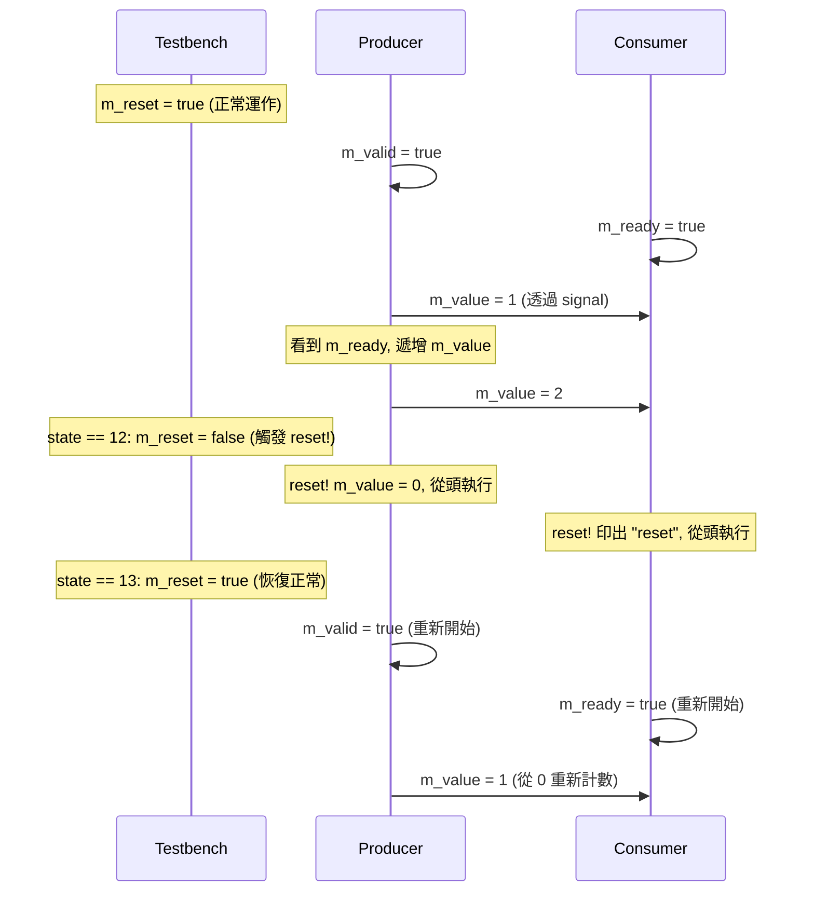
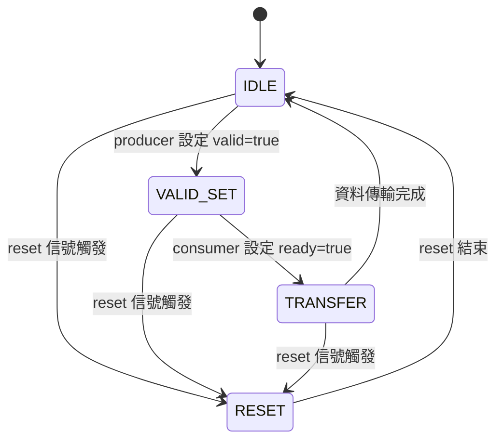

# reset_signal_is -- 重置信號機制

> **難度**: 中級 | **軟體類比**: Graceful restart / Circuit breaker pattern | **原始碼**: `ref/systemc/examples/sysc/2.1/reset_signal_is/reset_signal_is.cpp`

## 概述

`reset_signal_is` 範例展示了如何為 `SC_CTHREAD`（clocked thread）設定**重置信號（reset signal）**。當 reset 信號觸發時，thread 會自動回到函式的起始點重新執行，就像被「重新啟動」一樣。

### 軟體類比：Graceful Restart / Circuit Breaker

想像你有一個長時間運行的 worker thread，當系統偵測到異常時需要重新啟動它：

```python
# Python 類比
class Worker:
    def run(self):
        while True:
            if self.reset_signal:
                self.cleanup()
                continue  # 回到 while 開頭，重新初始化

            # 正常工作邏輯
            self.do_work()
```

或者類似 microservice 架構中的 **circuit breaker pattern**：當某個服務出錯次數過多，breaker 會跳開（reset），服務回到初始狀態等待恢復。

在硬體世界中，reset 是一個非常基本的概念 -- 每個晶片都有 reset pin，按下後所有暫存器回到初始值。`reset_signal_is` 讓你在 SystemC 中用程式碼表達這個行為。

## 架構圖

### 模組連接圖



### 資料流與握手協定



## 程式碼解析

### CONSUMER -- 消費者（帶 reset）

```cpp
SC_MODULE(CONSUMER)
{
    SC_CTOR(CONSUMER)
    {
        SC_CTHREAD(consumer, m_clk.pos());
        reset_signal_is(m_reset, false);  // 當 m_reset 為 false 時觸發 reset
    }
    void consumer()
    {
        cout << sc_time_stamp() << ": reset" << endl;  // reset 後從這裡開始
        while (1)
        {
            m_ready = true;
            do { wait(); } while ( !m_valid );  // 等到 valid 為 true
            cout << sc_time_stamp() << ": " << m_value.read() << endl;
        }
    }
};
```

**關鍵觀念**:

1. **`SC_CTHREAD(consumer, m_clk.pos())`**: `SC_CTHREAD` 是 clocked thread -- 它只在 clock 上升沿被喚醒。這跟 `SC_THREAD` 不同，`SC_THREAD` 可以等待任意事件。

2. **`reset_signal_is(m_reset, false)`**: 當 `m_reset` 的值為 `false` 時，這個 thread 會被 reset。Reset 的效果是：**thread 會從函式的第一行重新開始執行**。

   軟體類比：這就像 `try-catch` 包住整個函式，reset 時拋出一個特殊的 exception，被外層 catch 住後重新呼叫函式：

   ```python
   # Python 類比
   while True:
       try:
           consumer()  # 正常執行
       except ResetException:
           # reset 觸發，重新開始
           continue
   ```

3. **`do { wait(); } while (!m_valid)`**: 這是硬體設計中的經典**握手（handshake）**模式 -- 等到對方準備好才繼續。每次 `wait()` 等待一個 clock cycle。

### PRODUCER -- 生產者（帶 reset）

```cpp
void producer()
{
    m_value = 0;       // reset 時 m_value 歸零
    while (1)
    {
        m_valid = true;
        do { wait(); } while (!m_ready);  // 等到 consumer 準備好
        m_value = m_value + 1;            // 遞增計數
    }
}
```

Producer 和 Consumer 形成一個**握手協定（handshake protocol）**：
- Producer 設定 `m_valid = true`，表示資料已準備好
- Consumer 設定 `m_ready = true`，表示可以接收資料
- 雙方都看到對方的信號後，才進行下一步

這是硬體中 valid/ready handshake 的標準模式，在軟體中類似 TCP 的三次握手或 CSP（Communicating Sequential Processes）模型。

### TESTBENCH -- 測試台

```cpp
void testbench()
{
    for ( int state = 0; state < 100; state++ )
    {
        m_reset = ( state%20 == 12 ) ? false : true;
        wait();
    }
    sc_stop();
}
```

Testbench 是控制者 -- 它在第 12、32、52、72、92 個 clock cycle 時把 `m_reset` 設為 `false`（觸發 reset），其他時間設為 `true`（正常運作）。

```mermaid
gantt
    title Reset 信號時序
    dateFormat X
    axisFormat %s

    section m_reset
    true (正常)     :0, 12
    false (RESET)   :12, 13
    true (正常)     :13, 32
    false (RESET)   :32, 33
    true (正常)     :33, 52
```



## 核心概念

### `SC_CTHREAD` vs `SC_THREAD`

| 特性 | `SC_CTHREAD` | `SC_THREAD` |
| --- | --- | --- |
| 觸發方式 | 只在指定 clock edge | 任意 event |
| 支援 reset | 透過 `reset_signal_is()` | 不直接支援 |
| `wait()` 語義 | 等待下一個 clock edge | 等待指定 event 或時間 |
| 軟體類比 | 定時器觸發的 worker | 一般 thread |
| 適用場景 | 同步邏輯（暫存器行為） | 異步邏輯、testbench |

### Reset 的語義

當 reset 觸發時：
1. Thread 的執行被中斷
2. Thread 從函式的**第一行**重新開始（不是從 `wait()` 的位置繼續）
3. 所有 local 變數回到未初始化狀態
4. 但 signal 和 port 的值**不會**自動重置 -- 你需要在函式開頭手動設定初始值

這就是為什麼 `producer()` 一開始就寫 `m_value = 0` -- 這行既是正常的初始化，也是 reset 後的重新初始化。

## 設計理念

### 為什麼硬體需要 Reset？

在軟體世界中，程式啟動時記憶體會被初始化（或至少有明確的初始化流程）。但在硬體中：
- 暫存器上電後的值是**不確定的**（可能是 0 也可能是 1）
- 需要一個 reset 信號把所有暫存器設為已知的初始值
- Reset 也用於錯誤恢復 -- 當硬體進入異常狀態時，reset 可以讓它回到正常

`reset_signal_is` 讓你在 SystemC 模型中精確地模擬這個行為，確保模擬結果與真實硬體一致。

### Valid/Ready 握手模式



這個握手模式保證了資料傳輸的可靠性：只有在雙方都準備好的時候才會進行傳輸。在任何時刻觸發 reset 都不會導致資料錯誤。
