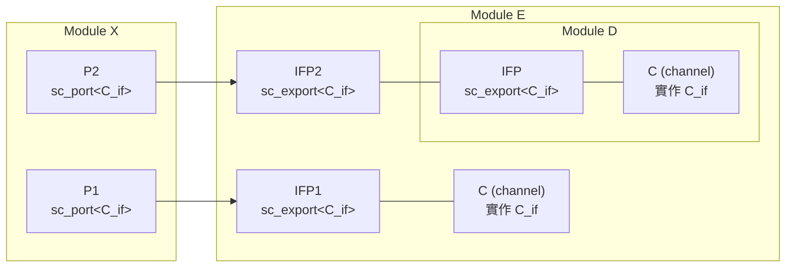
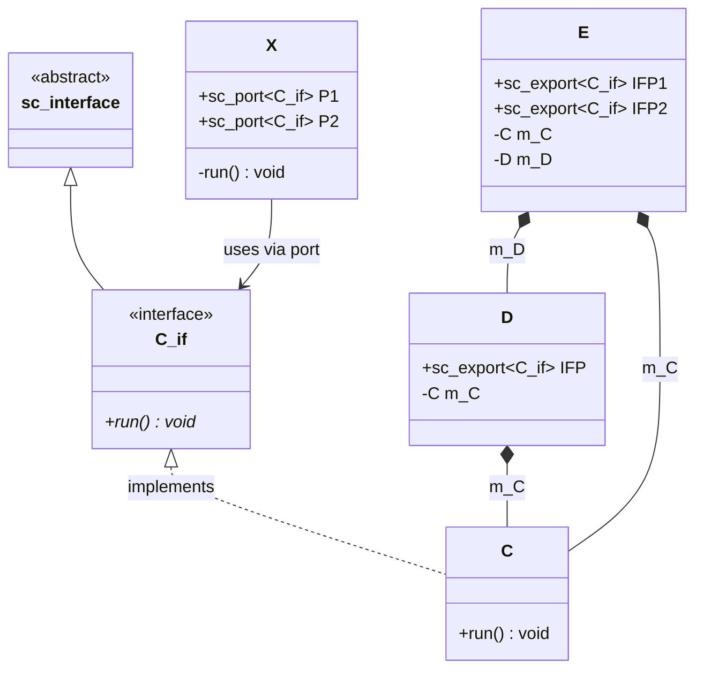
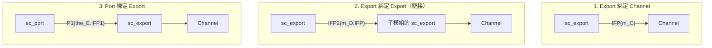

# sc_export -- 介面匯出機制

> **難度**: 中級 | **軟體類比**: Dependency Injection / 暴露內部服務 API | **原始碼**: `ref/systemc/examples/sysc/2.1/sc_export/main.cpp`

## 概述

`sc_export` 範例展示了 SystemC 2.1 新增的 `sc_export` 機制。`sc_export` 讓一個模組可以把**內部 channel 的介面**暴露給外部，而不需要在每一層都建立轉接 port。

### 軟體類比：暴露內部服務的 API

想像你有一個微服務 `E`，它內部包含兩個資料庫服務 `C1` 和 `C2`（其中 `C2` 又被包在子服務 `D` 裡面）。外部的客戶端 `X` 需要存取這兩個資料庫：

```
不用 sc_export 的做法（傳統方式）：
  X --> E.proxy1 --> C1
  X --> E.proxy2 --> D.proxy --> C2
  （每一層都要寫轉接 proxy）

用 sc_export 的做法：
  X --> E.IFP1 --> C1       （直接暴露）
  X --> E.IFP2 --> D.IFP --> C2  （鏈式暴露）
```

這就像在 API Gateway 中，你不需要在每一層都寫 proxy endpoint，而是直接把底層服務的 API 「export」出去。

## 架構圖

### 原始碼中的 ASCII 架構圖（翻譯）

```
          +-------------+             +------------------+
          |     X       |             |    E    +----+   |
          |             |P1       IFP1|         | C  |   |
          |            [ ]------------O---------@    |   |
          |             |             |         |    |   |
          |             |             |         +----+   |
          |             |             |                  |
          |             |             |     +----------+ |
          |             |             |     | D        | |
          |             |             |     |   +----+ | |
          |             |P2       IFP2|  IFP|   | C  | | |
          |            [ ]------------O-----O---@    | | |
          |             |             |     |   |    | | |
          |             |             |     |   +----+ | |
          |             |             |     |          | |
          |             |             |     +----------+ |
          +-------------+             +------------------+

 [ ] = port    O = sc_export    @ = channel (interface implementation)
```

### Mermaid 版架構圖



### 類別關係圖



## 程式碼解析

### 介面與 Channel 定義

```cpp
// 介面：定義 run() 方法
class C_if : virtual public sc_interface
{
public:
    virtual void run() = 0;
};

// Channel：實作 C_if 介面
class C : public C_if, public sc_channel
{
public:
    SC_CTOR(C) { }
    virtual void run()
    {
        cout << sc_time_stamp() << " In Channel run() " << endl;
    }
};
```

`C_if` 是一個純虛擬介面，`C` 是實作這個介面的 channel。在軟體中，這就是 interface + implementation 的標準模式。

### Module D：單層 Export

```cpp
SC_MODULE( D )
{
    sc_export<C_if> IFP;   // 暴露 C_if 介面給外部

    SC_CTOR( D )
        : IFP("IFP"), m_C("C")
    {
        IFP( m_C );   // 綁定：sc_export 指向內部的 channel
    }
 private:
    C m_C;             // 內部的 channel 實例
};
```

**`IFP( m_C )`** -- 這行是核心。它告訴 `sc_export`：「把 `m_C` 的 `C_if` 介面暴露出去」。之後任何綁定到 `IFP` 的 port，呼叫 `->run()` 時，實際上是呼叫 `m_C.run()`。

軟體類比：

```python
# Python 類比 (using ABC)
from abc import ABC, abstractmethod

class C_if(ABC):
    @abstractmethod
    def run(self) -> None: ...

class C(C_if):
    def run(self) -> None:
        print("In Channel run()")

class D:
    def __init__(self):
        self._channel = C()

    # 不是暴露整個 C 物件，而是只暴露 C_if 介面
    def get_interface(self) -> C_if:
        return self._channel
```

### Module E：多層 Export 與 Export 鏈接

```cpp
SC_MODULE( E )
{
    sc_export<C_if> IFP1;
    sc_export<C_if> IFP2;

    SC_CTOR( E )
        : m_C("C"), m_D("D"), IFP1("IFP1")
    {
        IFP1( m_C );         // export 綁定到自己的 channel
        IFP2( m_D.IFP );     // export 綁定到子模組的 export（鏈接！）
    }

 private:
    C m_C;                    // 自己的 channel
    D m_D;                    // 子模組（內含另一個 channel）
};
```

**`IFP2( m_D.IFP )`** -- 這裡展示了 `sc_export` 的**鏈接**能力。`E` 的 `IFP2` 不是綁定到一個 channel，而是綁定到 `D` 的 `IFP`（另一個 `sc_export`）。最終，透過 `IFP2` 呼叫 `run()` 會一路追溯到 `D` 內部的 `m_C.run()`。

軟體類比：這就像 API Gateway 的層層轉發：

```
Client -> Gateway.IFP2 -> SubService.IFP -> Internal.Channel.run()
```

### Module X：使用 Port 連接 Export

```cpp
SC_MODULE( X )
{
    sc_port<C_if> P1;
    sc_port<C_if> P2;

    void run() {
        wait(10, SC_NS);
        P1->run();       // 透過 P1 -> E.IFP1 -> E.m_C.run()
        wait(10, SC_NS);
        P2->run();       // 透過 P2 -> E.IFP2 -> D.IFP -> D.m_C.run()
    }
};
```

`X` 完全不知道 `P1` 和 `P2` 背後連接的是什麼 -- 可能是一個直接的 channel，也可能是經過多層 export 轉接的 channel。這就是**多型（polymorphism）**和**封裝（encapsulation）**的威力。

### 連接與執行

```cpp
int sc_main(int , char** ) {
    E the_E("E");
    X the_X("X");

    the_X.P1( the_E.IFP1 );    // port 綁定到 export
    the_X.P2( the_E.IFP2 );    // port 綁定到 export

    sc_start(17, SC_NS);
    the_E.IFP1->run();          // 也可以直接透過 export 呼叫
    sc_start(50, SC_NS);
}
```

**注意**: `the_E.IFP1->run()` 展示了 `sc_export` 的 `operator->`，讓你可以直接透過 export 呼叫介面方法，不需要透過 port。

## 三種綁定方式比較



| 綁定方式 | 程式碼 | 用途 |
| --- | --- | --- |
| Export -> Channel | `IFP(m_C)` | 最基本：暴露內部 channel |
| Export -> Export | `IFP2(m_D.IFP)` | 鏈接：暴露子模組的 export |
| Port -> Export | `P1(the_E.IFP1)` | 使用端：port 連接到 export |

## 設計理念

### `sc_export` vs 傳統 port 轉接

假設沒有 `sc_export`，你需要在每一層模組都建立 port 來「轉接」內部 channel 的介面：

```
傳統方式：
  X.P1 -> E.port_in -> E 內部用 SC_METHOD 轉接 -> E.m_C

sc_export 方式：
  X.P1 -> E.IFP1 -> E.m_C（直接穿透，無需轉接）
```

`sc_export` 省去了中間的轉接程式碼，讓模組的層次結構更乾淨。

### `sc_port` vs `sc_export` 的方向性

| 元素 | 方向 | 說明 |
| --- | --- | --- |
| `sc_port<IF>` | 向外要求 | 「我需要一個實作了 IF 的東西」-- 由外部提供 |
| `sc_export<IF>` | 向外提供 | 「我提供一個 IF 的實作」-- 內部已經有了 |

軟體類比：
- `sc_port` 像是 constructor 中的依賴參數：`class X { X(Database db) {...} }` -- 「給我一個 Database」
- `sc_export` 像是對外的 API endpoint：`class E { Database getDB() {...} }` -- 「我提供一個 Database」
