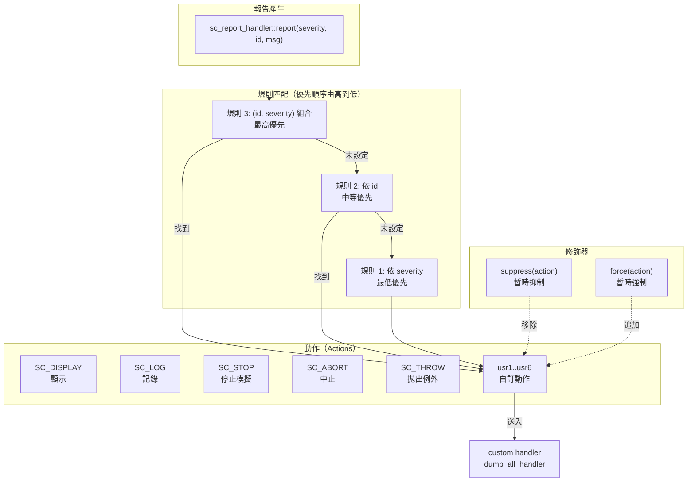
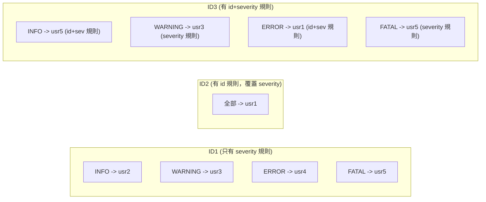

# sc_report -- 報告與訊息系統

> **難度**: 中級 | **軟體類比**: Logging framework (Python logging, C++ spdlog) | **原始碼**: `ref/systemc/examples/sysc/2.1/sc_report/main.cpp`

## 概述

`sc_report` 範例展示了 SystemC 的**報告系統（reporting system）**，它是一個功能完整的 logging framework。你可以依據**訊息 ID** 和**嚴重等級（severity）**來設定不同的處理動作（action），例如顯示、記錄、中斷模擬或呼叫自訂 handler。

### 軟體類比：Python logging

如果你用過 Python 的 logging 模組，SystemC 的 `sc_report` 做的是完全一樣的事情：

```python
# Python logging 類比
import logging

# 設定不同 logger 的等級和 handler
logging.getLogger("DB").setLevel(logging.WARNING)     # 依 ID 設定
logging.getLogger("HTTP").setLevel(logging.DEBUG)

# 設定不同嚴重等級的處理方式
handler = logging.StreamHandler()
handler.addFilter(SeverityFilter(logging.ERROR))      # 依 severity 設定
```

```python
# C++ spdlog 概念類比（用 Python logging 表達）
logging.getLogger("ID1").setLevel(logging.WARNING)
logging.getLogger("ID2").setLevel(logging.DEBUG)

# 自訂 handler
logging.getLogger("ID3").addHandler(CustomHandler())
```

## 架構圖

### 報告系統概念圖



### 規則優先順序矩陣

範例中設定的規則：



## 程式碼解析

### 自訂動作（User-Defined Actions）

```cpp
const unsigned num_usr_actions = 6;
sc_actions usr_actions[num_usr_actions];

void allocate_user_actions()
{
    for (unsigned int n = 0; n < 1000; n++) {
        sc_actions usr = sc_report_handler::get_new_action_id();
        if (usr == SC_UNSPECIFIED) {
            cout << "We got " << n << " user-defined actions\n";
            break;
        }
        if (n < num_usr_actions)
            usr_actions[n] = usr;
    }
}
```

`sc_actions` 是一個 bitmask，每個 action 佔一個 bit。SystemC 預定義了幾個 action：

| 預定義 Action | 說明 | 軟體類比 |
| --- | --- | --- |
| `SC_DO_NOTHING` | 不做任何事 | `logging.NOTSET` |
| `SC_DISPLAY` | 顯示到 console | `StreamHandler` |
| `SC_LOG` | 寫入日誌 | `FileHandler` |
| `SC_CACHE_REPORT` | 快取報告物件 | 保留在記憶體中 |
| `SC_THROW` | 拋出 C++ exception | `throw` |
| `SC_STOP` | 停止模擬 | `sys.exit()` |
| `SC_ABORT` | 立即中止（`abort()`） | `os._exit(1)` |

`get_new_action_id()` 讓你可以分配額外的自訂 action（用在自訂 handler 中辨識）。

### 自訂 Handler

```cpp
void dump_all_handler(const sc_report& report, const sc_actions& actions)
{
    cout << "report: " << report.get_msg_type()
         << " " << severity2str[report.get_severity()];
    cout << " --> ";
    // 印出所有被觸發的 action
    for (int n = 0; n < 32; n++) {
        sc_actions action = actions & 1 << n;
        if (action) {
            // 印出 action 名稱
        }
    }
    cout << " msg=" << report.get_msg()
         << " file=" << report.get_file_name()
         << " line " << report.get_line_number()
         << " time=" << report.get_time()
         << " process=" << report.get_process_name();
}
```

Handler 的簽名是 `void handler(const sc_report&, const sc_actions&)`。`sc_report` 物件包含了完整的報告資訊：

| 方法 | 回傳 | 軟體類比 |
| --- | --- | --- |
| `get_msg_type()` | 訊息 ID (如 "ID1") | Logger name |
| `get_severity()` | 嚴重等級 | Log level |
| `get_msg()` | 額外訊息 | Log message |
| `get_file_name()` | 原始碼檔名 | `__FILE__` |
| `get_line_number()` | 原始碼行號 | `__LINE__` |
| `get_time()` | 模擬時間 | Timestamp |
| `get_process_name()` | 目前 process 名稱 | Thread name |

### 三層規則設定

```cpp
void set_rules()
{
    // 規則 1: 依 severity（最低優先）
    sc_report_handler::set_actions(SC_INFO,    usr2);
    sc_report_handler::set_actions(SC_WARNING, usr3);
    sc_report_handler::set_actions(SC_ERROR,   usr4);
    sc_report_handler::set_actions(SC_FATAL,   usr5);

    // 規則 2: 依 id（中等優先）
    sc_report_handler::set_actions(id2, usr1);

    // 規則 3: 依 (id, severity) 組合（最高優先）
    sc_report_handler::set_actions(id3, SC_INFO,  usr5);
    sc_report_handler::set_actions(id3, SC_ERROR, usr1);
}
```

**優先順序**（從高到低）：
1. **(id, severity) 組合規則** -- 最精確，最高優先
2. **id 規則** -- 對某個 id 的所有 severity
3. **severity 規則** -- 全域的嚴重等級設定

這跟 Python logging 的 Logger 繼承階層類似：具體的 logger 設定覆蓋父層級的設定。

### Suppress 和 Force

```cpp
// 暫時抑制 usr4 action
sc_report_handler::suppress(usr4);
query_rules(id1);  // 此時 ERROR (原本 usr4) 不會產生 usr4 action
sc_report_handler::suppress();  // 清除抑制

// 暫時強制 usr1 action
sc_report_handler::force(usr1);
query_rules(id1);  // 所有報告都會額外加上 usr1 action
sc_report_handler::force();  // 清除強制
```

| 修飾器 | 說明 | 軟體類比 |
| --- | --- | --- |
| `suppress(action)` | 暫時移除指定 action | 暫時關閉某個 log handler |
| `force(action)` | 暫時加入指定 action | 暫時啟用 verbose logging |
| `suppress()` / `force()` | 清除修飾器，回復原設定 | 恢復預設設定 |

**組合使用 suppress 和 force**：

```cpp
sc_report_handler::force(usr1 | usr3);     // 強制加入 usr1 和 usr3
sc_report_handler::suppress(usr3 | usr4);  // 抑制 usr3 和 usr4
// 結果：usr3 被 force 加入又被 suppress 移除 -> 不執行
//       usr1 被 force 加入 -> 執行
//       usr4 被 suppress -> 不執行
```

## 完整規則解析表

| ID | Severity | 匹配規則 | 結果 Action |
| --- | --- | --- | --- |
| ID1 | INFO | severity 規則 | usr2 |
| ID1 | WARNING | severity 規則 | usr3 |
| ID1 | ERROR | severity 規則 | usr4 |
| ID1 | FATAL | severity 規則 | usr5 |
| ID2 | INFO | id 規則 (覆蓋 severity) | usr1 |
| ID2 | WARNING | id 規則 | usr1 |
| ID2 | ERROR | id 規則 | usr1 |
| ID2 | FATAL | id 規則 | usr1 |
| ID3 | INFO | (id,severity) 規則 | usr5 |
| ID3 | WARNING | severity 規則 (無特定組合規則) | usr3 |
| ID3 | ERROR | (id,severity) 規則 | usr1 |
| ID3 | FATAL | severity 規則 | usr5 |

## 設計理念

### 為什麼 SystemC 需要自己的 Logging 框架？

1. **模擬時間**: 一般的 logging 只有 wall-clock time，但 SystemC 報告包含**模擬時間**（`get_time()`），這對除錯時序問題至關重要
2. **Process 識別**: 報告自動附帶目前 process 的名稱，方便追蹤是哪個模組產生的訊息
3. **模擬控制**: `SC_STOP` 和 `SC_ABORT` 可以直接影響模擬器的執行，這是一般 logging framework 做不到的
4. **Bitmask actions**: 每個報告可以觸發多個 action 的組合，比一般 logging 的「一個 level 對應一個行為」更靈活
