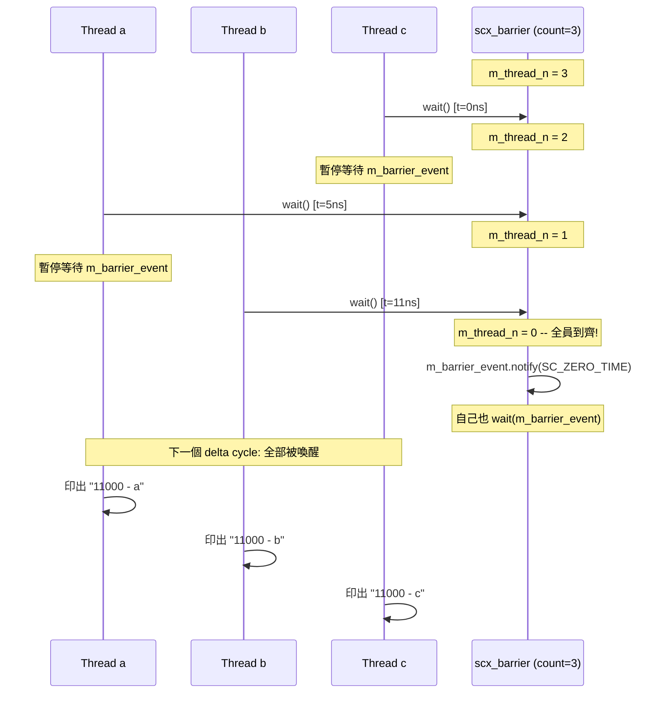
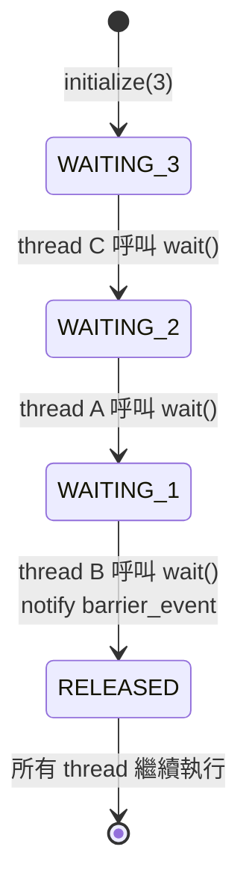

# scx_barrier -- 屏障同步

> **難度**: 入門 | **軟體類比**: `Python threading.Barrier` / `pthread_barrier` | **原始碼**: `ref/systemc/examples/sysc/2.1/scx_barrier/scx_barrier.h`, `ref/systemc/examples/sysc/2.1/scx_barrier/main.cpp`

## 概述

`scx_barrier` 範例實作了一個**屏障同步（barrier synchronization）**原語。多個 thread 各自執行到 barrier 的 `wait()` 點後暫停，當**所有** thread 都到達 barrier 時，它們會被同時釋放繼續執行。

### 軟體類比：集合點

想像你和三個朋友約好在餐廳碰面。每個人從不同地方出發，到達時間不同。**規則是：全員到齊才能進去吃飯**。

- 朋友 C 最先到（0 ns），等待
- 朋友 A 第二個到（5 ns），等待
- 朋友 B 最後到（11 ns），全員到齊，大家一起進去

在程式中：

```python
# Python threading.Barrier 類比
import threading

barrier = threading.Barrier(3)

# Thread A
def thread_a():
    time.sleep(0.005)
    barrier.wait()  # 到達，等待
    print("A proceeds")

# Thread B
def thread_b():
    time.sleep(0.011)
    barrier.wait()  # 到達，等待
    print("B proceeds")

# Thread C（最快到達）
def thread_c():
    barrier.wait()  # 到達，等待
    print("C proceeds")

# 全部在最慢的 thread 到達後同時印出
```

## 架構圖

### 執行時序



### 狀態變化圖



## 程式碼解析

### scx_barrier 類別（scx_barrier.h）

```cpp
class scx_barrier {
  public:
    void initialize(int thread_n)
    {
        m_thread_n = thread_n;  // 設定需要等待的 thread 數量
    }

    void wait()
    {
        m_thread_n--;
        if (m_thread_n)
        {
            // 還沒全到齊 -> 等待
            ::sc_core::wait(m_barrier_event);
        }
        else
        {
            // 最後一個到達 -> 通知所有人
            m_barrier_event.notify(SC_ZERO_TIME);
            ::sc_core::wait(m_barrier_event);  // 自己也等待（在下個 delta cycle 被喚醒）
        }
    }

  protected:
    sc_event m_barrier_event;   // 同步事件
    int      m_thread_n;        // 剩餘等待的 thread 數
};
```

**逐步解析**:

1. **`initialize(3)`**: 告訴 barrier 需要 3 個 thread 才能全數放行
2. **每個 thread 呼叫 `wait()`**: 計數器減 1
3. **計數器 > 0**: 還沒全到齊，呼叫 `::sc_core::wait(m_barrier_event)` 暫停
4. **計數器 = 0**: 最後一個 thread 到達，呼叫 `m_barrier_event.notify(SC_ZERO_TIME)` 喚醒所有等待中的 thread
5. **`SC_ZERO_TIME`**: 事件在下一個 delta cycle 觸發（不是立即），確保所有等待的 thread 在同一個 delta cycle 被喚醒

**為什麼最後一個 thread 也要 `wait(m_barrier_event)`？**

因為 `notify(SC_ZERO_TIME)` 是在下一個 delta cycle 才觸發。最後一個 thread 呼叫 `wait()` 後，在下一個 delta cycle 所有 thread（包括最後一個）都會被喚醒，確保所有 thread 在**同一時間點**繼續執行。

### 使用範例（main.cpp）

```cpp
SC_MODULE(X)
{
    SC_CTOR(X)
    {
        SC_THREAD(a);
        SC_THREAD(b);
        SC_THREAD(c);
        m_barrier.initialize(3);  // 3 個 thread 同步
    }
    void a()
    {
        wait(5.0, SC_NS);        // 模擬不同的到達時間
        m_barrier.wait();         // 在 barrier 等待
        printf("%f - a\n", sc_time_stamp().to_double());
    }
    void b()
    {
        wait(11.0, SC_NS);       // 最慢的
        m_barrier.wait();
        printf("%f - b\n", sc_time_stamp().to_double());
    }
    void c()
    {
        m_barrier.wait();         // 最快的（立即到達）
        printf("%f - c\n", sc_time_stamp().to_double());
    }
    scx_barrier m_barrier;
};
```

**預期輸出**:
```
11000 - c
11000 - a
11000 - b
```

所有 thread 都在 11 ns（最慢的 thread b 到達的時間）後印出訊息，驗證了 barrier 的同步效果。

## 與軟體同步原語的比較

| 特性 | `scx_barrier` | Python `threading.Barrier` | `pthread_barrier` |
| --- | --- | --- | --- |
| 初始化 | `initialize(n)` | `threading.Barrier(n)` | `pthread_barrier_init(&b, n)` |
| 等待 | `wait()` | `barrier.wait()` | `pthread_barrier_wait()` |
| 可重用 | 否（一次性） | 是（自動重置） | 是 |
| 到達通知 | 隱含在 `wait()` | 隱含在 `wait()` | 隱含在 `wait()` |
| 超時支援 | 透過 SystemC `wait(event, time)` | `barrier.wait(timeout)` | 無 |

## 設計理念

### 為什麼用 `SC_ZERO_TIME` 而不是立即 `notify()`？

如果用 `m_barrier_event.notify()`（立即通知），那麼最後一個 thread 不會被暫停，而其他 thread 會在同一個 delta cycle 被喚醒。這可能導致時序上的微妙差異。

使用 `SC_ZERO_TIME`（下一個 delta cycle）確保：
1. 所有 thread（包括最後一個）都在同一個時間點被喚醒
2. 語義上更清晰 -- barrier release 是一個原子操作

### 這個實作的限制

- **一次性使用**: 計數器歸零後不會自動重置，不像 Python 的 `threading.Barrier`
- **非 channel**: `scx_barrier` 不是 `sc_channel`，不能透過 port 連接
- **非正式標準**: `scx_` 前綴表示這是一個擴充（extension），不是 SystemC 標準的一部分
