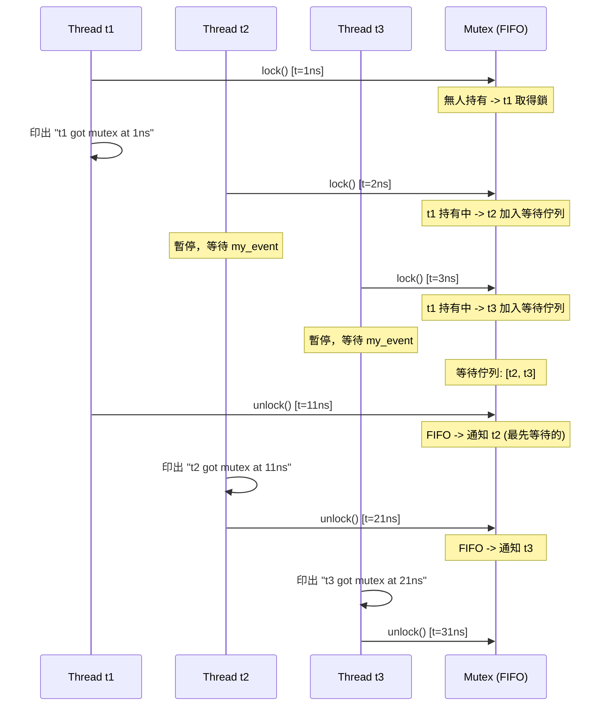
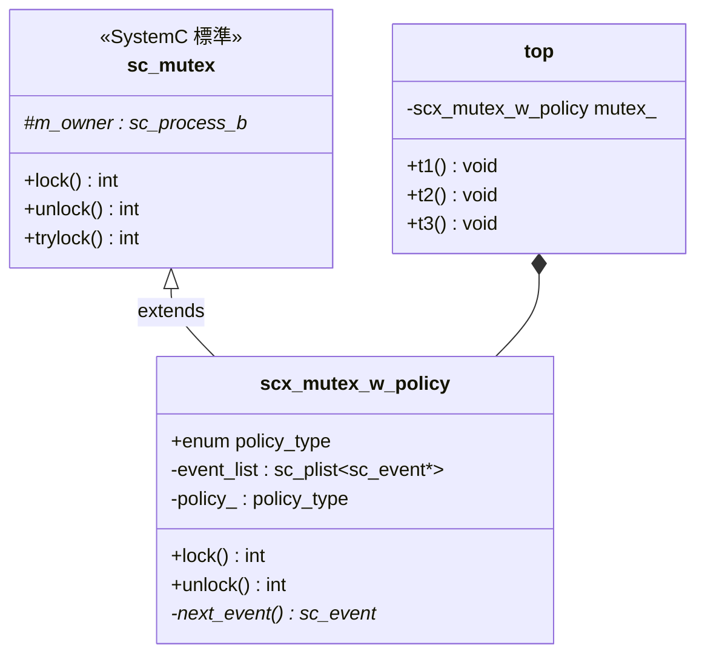
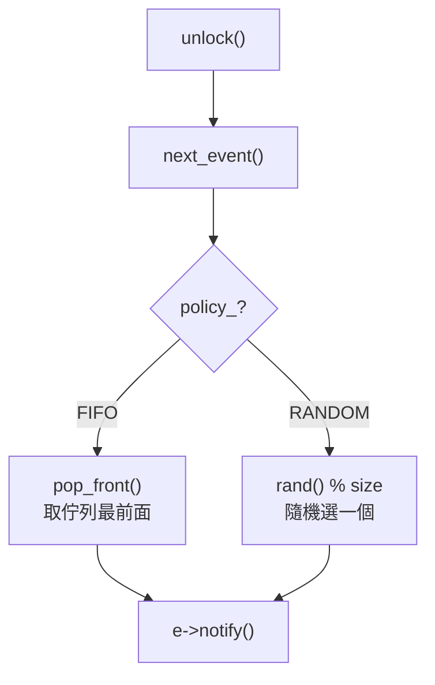

# scx_mutex_w_policy -- 帶策略的互斥鎖

> **難度**: 中級 | **軟體類比**: `Python threading.Lock` with fairness policy | **原始碼**: `ref/systemc/examples/sysc/2.1/scx_mutex_w_policy/scx_mutex_w_policy.cpp`

## 概述

`scx_mutex_w_policy` 範例實作了一個**帶仲裁策略的互斥鎖**。當多個 thread 同時競爭一個 mutex 時，標準的 `sc_mutex` 無法保證誰先取得鎖。這個擴充版本提供兩種策略：
- **FIFO**: 先來先得（公平鎖）
- **RANDOM**: 隨機選擇一個等待中的 thread

### 軟體類比：公平鎖 vs 非公平鎖

```python
# Python 類比
import threading

# Python 的 threading.Lock 不提供公平性保證
lock = threading.Lock()

# 若需要公平鎖（FIFO），需要自行實作（例如用 queue.Queue 搭配 Lock）
# scx_mutex_w_policy 讓你明確選擇 FIFO 或 RANDOM 策略
```

## 架構圖

### FIFO 策略執行時序



### 類別關係圖



## 程式碼解析

### scx_mutex_w_policy 類別

```cpp
class scx_mutex_w_policy : public sc_mutex
{
public:
    enum policy_type { FIFO, RANDOM };

    explicit scx_mutex_w_policy(policy_type policy) : policy_(policy) {}
```

繼承自標準的 `sc_mutex`，新增了 `policy_type` 列舉。建構時指定策略。

### lock() -- 加鎖

```cpp
virtual int lock()
{
    if (in_use()) {             // mutex 已被其他 thread 持有？
        sc_event my_event;      // 建立一個私有的事件
        event_list.push_back(&my_event);  // 加入等待佇列
        wait(my_event);         // 等待被通知
    }

    m_owner = sc_get_current_process_b();  // 記錄新的持有者
    return 0;
}
```

**與標準 `sc_mutex` 的差異**:

標準 `sc_mutex` 的 `lock()` 大致是：
```cpp
// 標準 sc_mutex（簡化版）
while (in_use())
    wait(m_free);  // 所有等待者都等同一個事件
// 被喚醒後可能還需要競爭
```

`scx_mutex_w_policy` 的關鍵改進：**每個等待者有自己的 `sc_event`**。解鎖時只通知**一個**特定的等待者，而不是喚醒所有人再讓他們競爭。這就像：

| 方式 | 行為 | 效率 |
| --- | --- | --- |
| 標準 `sc_mutex` | 喚醒所有等待者，再競爭 | 低（thundering herd） |
| `scx_mutex_w_policy` | 只喚醒選定的一個等待者 | 高（精準通知） |

### unlock() -- 解鎖

```cpp
virtual int unlock()
{
    if (m_owner != sc_get_current_process_b()) return -1;  // 只有持有者能解鎖

    m_owner = 0;                // 清除持有者
    sc_event* e = next_event(); // 依策略選擇下一個等待者
    if (e) e->notify();         // 通知被選中的等待者

    return 0;
}
```

### next_event() -- 策略選擇

```cpp
sc_event* next_event()
{
    if (event_list.empty())
        return 0;

    if (policy_ == FIFO)
    {
        return event_list.pop_front();  // FIFO: 取佇列最前面的
    }
    else
    { // RANDOM
        sc_plist_iter<sc_event*> ev_itr(&event_list);
        int index = rand() % event_list.size();  // 隨機選一個
        for (int i = 0; i < index; i++)
            ev_itr++;

        sc_event* e = ev_itr.get();
        ev_itr.remove();
        return e;
    }
}
```

這是整個範例最核心的函式。**策略模式（Strategy Pattern）** 的體現：



### 使用範例

```cpp
top(sc_module_name name) : sc_module(name), mutex_(scx_mutex_w_policy::FIFO)
{
    SC_THREAD(t1);
    SC_THREAD(t2);
    SC_THREAD(t3);
}

void t1() {
    wait(1, SC_NS);
    mutex_.lock();
    cout << "t1 got mutex at " << sc_time_stamp() << endl;
    wait(10, SC_NS);
    mutex_.unlock();
}
// t2, t3 類似，但分別在 2ns 和 3ns 時嘗試 lock
```

**FIFO 策略下的執行結果**:
```
t1 got mutex at 1 ns    // t1 先到，直接取得
t2 got mutex at 11 ns   // t1 解鎖後，t2 是佇列中最先等的
t3 got mutex at 21 ns   // t2 解鎖後，t3 是佇列中唯一等的
```

**RANDOM 策略下**：t2 和 t3 的順序可能交換。

## FIFO vs RANDOM 策略比較

| 特性 | FIFO | RANDOM |
| --- | --- | --- |
| 公平性 | 完全公平（先來先得） | 不保證公平 |
| Starvation | 不會發生 | 理論上可能（但機率低） |
| 適用場景 | 需要保證順序的協定 | 模擬真實硬體的不確定仲裁 |
| 效能考量 | 可預測，方便除錯 | 更接近真實硬體行為 |
| 軟體類比 | `Python threading.Lock` (FIFO wrapper) | `Python threading.Lock` (default) |

## 設計理念

### 為什麼硬體仲裁需要策略？

在真實的硬體設計中，多個模組競爭同一個資源（如 bus、memory controller）時，**仲裁器（arbiter）**決定誰先存取。常見的仲裁策略包括：

- **Round-robin**: 輪流分配（類似 FIFO）
- **Priority-based**: 依優先順序
- **Random**: 隨機選擇（某些 bus 協定使用）

`scx_mutex_w_policy` 讓模擬器可以準確地模擬不同的仲裁策略對系統效能的影響。

### 為什麼「只喚醒一個」比「喚醒全部」好？

標準 `sc_mutex` 在解鎖時喚醒所有等待者，然後它們再競爭。在 SystemC 的 cooperative scheduling 模型中，這意味著：
1. 所有等待者被排入就緒佇列
2. 每個都執行到 `lock()` 的 `in_use()` 檢查
3. 只有一個成功，其他人又回去 `wait()`

這就是**驚群問題（thundering herd problem）** -- 喚醒了 N 個 thread，但只有 1 個能繼續。`scx_mutex_w_policy` 透過私有 event 精準通知，避免了這個問題。

### `sc_plist` 的使用

`sc_plist` 是 SystemC 內部提供的 linked list 容器，支援 iterator 操作。在現代 C++ 中你可能會用 `std::list` 或 `std::deque`，但這個範例使用了 SystemC 自帶的容器。
