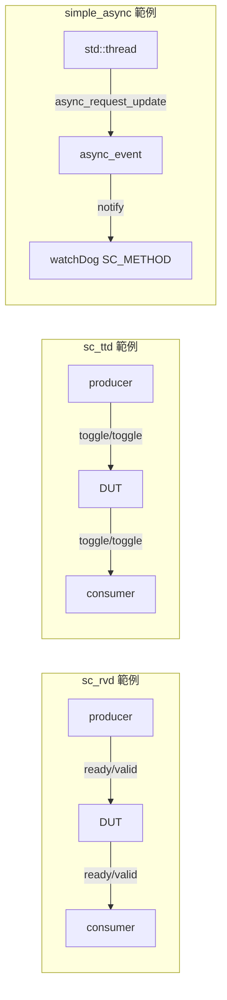

# SystemC 2.3 範例集

> **版本**: SystemC 2.3 | **主題**: 通訊協定與非同步事件 | **難度**: 中級

## 概述

SystemC 2.3 引入了數項重要的通訊與非同步機制改進。本目錄下的三個範例分別展示：

1. **sc_rvd** -- Ready-Valid Data 協定：一種透過「準備好（ready）」和「有效（valid）」兩個訊號來控制資料傳輸的握手協定
2. **sc_ttd** -- Toggle-Toggle Data 協定：一種透過切換位元（toggle bits）來協調讀寫的握手協定
3. **simple_async** -- 簡易非同步事件：展示如何從外部執行緒安全地通知 SystemC 模擬引擎中的事件

### 軟體工程師的快速對照

| 範例 | 軟體類比 | 核心概念 |
| --- | --- | --- |
| sc_rvd | gRPC 雙向串流 / TCP flow control | 生產者與消費者透過 ready/valid 訊號協調資料流 |
| sc_ttd | 交替式 ACK 協定 / ping-pong buffer | 用 toggle 位元取代 ready/valid，簡化握手邏輯 |
| simple_async | Python `asyncio loop.call_soon_threadsafe()` / Python `queue.Queue` 從 coroutine 送訊號 | 從 OS 原生執行緒觸發 SystemC 事件 |

## 檔案列表

### sc_rvd (Ready-Valid Data)

| 檔案 | 路徑 | 說明 |
| --- | --- | --- |
| `sc_rvd.h` | `include/sc_rvd.h` | Ready-Valid 通道、輸入埠、輸出埠的 template 定義 |
| `main.cpp` | `sc_rvd/main.cpp` | DUT 與 TB 模組，示範 ready-valid 握手的完整流程 |

### sc_ttd (Toggle-Toggle Data)

| 檔案 | 路徑 | 說明 |
| --- | --- | --- |
| `sc_ttd.h` | `include/sc_ttd.h` | Toggle-Toggle 通道、輸入埠、輸出埠的 template 定義 |
| `main.cpp` | `sc_ttd/main.cpp` | DUT 與 TB 模組，示範 toggle-toggle 握手的完整流程 |

### simple_async

| 檔案 | 路徑 | 說明 |
| --- | --- | --- |
| `async_event.h` | `simple_async/async_event.h` | 執行緒安全的非同步事件類別 |
| `main.cpp` | `simple_async/main.cpp` | watchDog 與 activity 模組，示範外部執行緒觸發 SystemC 事件 |

## 架構總覽

## 學習路徑建議

1. 先讀 [sc-rvd.md](sc-rvd.md) -- Ready-Valid 是硬體通訊中最常見的握手協定
2. 再讀 [sc-ttd.md](sc-ttd.md) -- 與 sc_rvd 對比，理解不同握手策略的取捨
3. 最後讀 [simple-async.md](simple-async.md) -- 了解 SystemC 如何與外部世界互動
