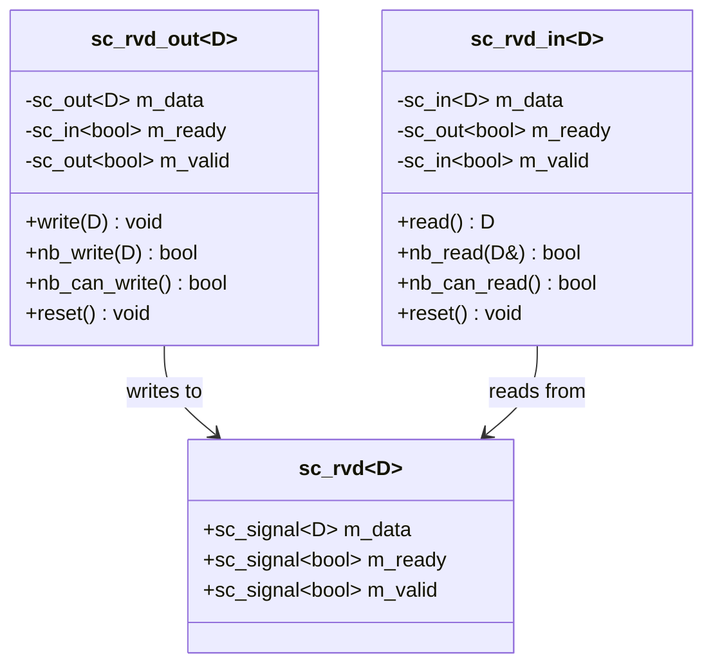
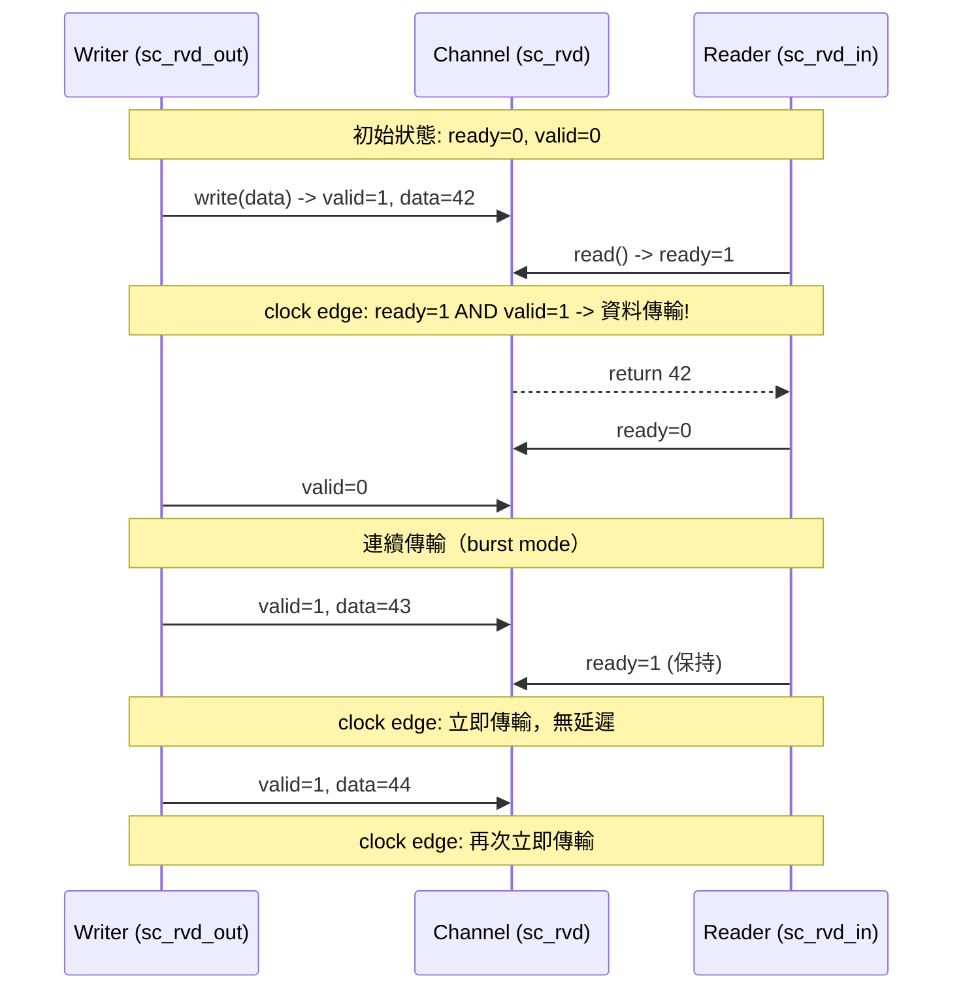

# sc_rvd -- Ready-Valid Data 協定

> **原始碼**: `ref/systemc/examples/sysc/2.3/include/sc_rvd.h`, `ref/systemc/examples/sysc/2.3/sc_rvd/main.cpp`
> **難度**: 中級 | **軟體類比**: gRPC 雙向串流 / TCP flow control

## 概述

`sc_rvd` 實作了一種 **Ready-Valid 握手協定**，用於在兩個模組之間安全地傳輸資料。這是硬體設計中最常見的通訊模式之一。

### 對軟體工程師的解釋

想像你在寫一個 gRPC 雙向串流（bidirectional streaming）服務：

```
用戶端 (producer)  <---->  伺服器 (DUT)  <---->  回應處理器 (consumer)
```

- **valid** 就像「我這邊有資料可以送」（server 端呼叫 `stream.Send()`）
- **ready** 就像「我準備好接收了」（client 端呼叫 `stream.Recv()`）
- 資料只在**雙方都同意**時才會真正傳輸（ready AND valid 同時為 true）

這和 TCP 的 flow control 概念一模一樣：
- TCP 的 window size 告訴對方「我還有多少空間可以接收」
- Ready-Valid 用一個 bit 簡化成「可以/不可以」

## 協定規則

Ready-Valid 協定有以下關鍵規則：

| 規則 | 說明 | 軟體類比 |
| --- | --- | --- |
| valid=1 表示有資料 | 寫入端已經將資料放在通道上 | `stream.Send()` 已呼叫 |
| ready=1 表示可接收 | 讀取端準備好接收資料 | `stream.Recv()` 正在等待 |
| 傳輸在 ready AND valid 時發生 | 雙方握手成功 | 一次成功的 request-response |
| 第一次傳輸有一個時脈的延遲 | 建立握手需要時間 | TCP 三次握手的第一個 RTT |
| 連續傳輸可以每個時脈一筆 | 保持 ready 和 valid 為高 | TCP 持續串流，無需重新握手 |

## 架構圖



## 時序圖



## 核心類別解析

### `sc_rvd<D>` -- 通道（Channel）

這是最簡單的部分：就是三條訊號線綁在一起。

```cpp
template<typename D>
class sc_rvd {
    sc_signal<D>    m_data;   // 資料線
    sc_signal<bool> m_ready;  // 讀取端 -> 寫入端：「我準備好了」
    sc_signal<bool> m_valid;  // 寫入端 -> 讀取端：「資料有效」
};
```

**軟體類比**: 這就像一個 struct，把 request channel 和 response channel 包在一起：

```go
type RVD struct {
    data  chan T     // 資料通道
    ready chan bool  // 背壓（backpressure）通道
    valid chan bool  // 資料有效通知
}
```

### `sc_rvd_out<D>` -- 寫入埠

`write()` 方法是阻塞式的：把資料放上去，等到對方 ready 才返回。

```cpp
inline void write(const D& data) {
    m_data = data;        // 把資料放到線上
    m_valid = true;       // 告訴對方「資料有效」
    do { ::wait(); }      // 等一個時脈
    while (m_ready.read() == false);  // 直到對方說「我準備好了」
    m_valid = false;      // 傳完了，撤掉有效訊號
}
```

`nb_write()` 是非阻塞版本（nb = non-blocking），如果對方還沒 ready 就回傳 false：

```cpp
inline bool nb_write(const D& data) {
    if (m_ready.read() == true) {
        m_data = data;
        m_valid = true;
        return true;     // 成功
    }
    return false;        // 對方沒準備好
}
```

**軟體類比**:
- `write()` 像 Go 的 `ch <- data`（阻塞式寫入）
- `nb_write()` 像 Go 的 `select { case ch <- data: ... default: ... }`（非阻塞嘗試）

### `sc_rvd_in<D>` -- 讀取埠

`read()` 方法同樣是阻塞式的：先告訴對方「我準備好了」，然後等資料到來。

```cpp
inline D read() {
    m_ready = true;       // 告訴對方「我準備好接收了」
    do { ::wait(); }      // 等一個時脈
    while (m_valid.read() == false);  // 直到對方送來有效資料
    m_ready = false;      // 收到了，撤掉準備訊號
    return m_data.read(); // 讀取資料
}
```

## main.cpp 解析

`main.cpp` 建構了一個測試環境，包含三個角色：

| 角色 | 類別 | 功能 |
| --- | --- | --- |
| producer | `TB::producer()` | 持續產生遞增的數字（0, 1, 2, ...），每 6 次插入等待 |
| DUT | `DUT::thread()` | 先讀入 N 筆資料，再寫出 N 筆（N 從 0 遞增到 9） |
| consumer | `TB::consumer()` | 讀取 40 筆資料後呼叫 `sc_stop()` 結束模擬 |


### 重點觀察

1. **SC_CTHREAD**: 使用 clocked thread（與時脈同步的執行緒），每次 `wait()` 等待一個時脈正緣
2. **reset_signal_is**: 指定重置訊號，當 `m_reset` 為 false 時進入重置狀態
3. **burst 與 bubble**: producer 每隔 6 次會插入一段等待（`wait(i)`），模擬真實世界中資料來源不穩定的情況

## 與軟體模式的對比總結

| 概念 | Ready-Valid (sc_rvd) | 軟體等價物 |
| --- | --- | --- |
| 阻塞式寫入 | `write()` -- 等 ready | `channel <- data` (Go) |
| 非阻塞式寫入 | `nb_write()` -- 立即返回 | `select + default` (Go) |
| 阻塞式讀取 | `read()` -- 等 valid | `data := <-channel` (Go) |
| 非阻塞式讀取 | `nb_read()` -- 立即返回 | `select + default` (Go) |
| 背壓控制 | ready 訊號 | TCP window / gRPC flow control |
| 連續傳輸 | ready+valid 保持為高 | HTTP/2 multiplexed stream |
| 重置 | `reset()` -- 清除狀態 | `channel.close()` + 重建 |
