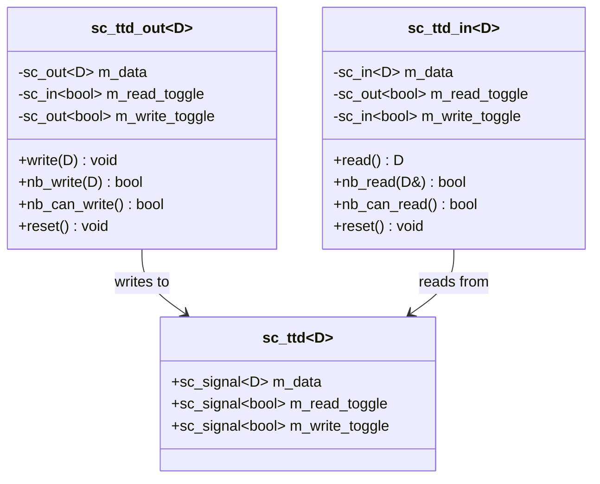

# sc_ttd -- Toggle-Toggle Data 協定

> **原始碼**: `ref/systemc/examples/sysc/2.3/include/sc_ttd.h`, `ref/systemc/examples/sysc/2.3/sc_ttd/main.cpp`
> **難度**: 中級 | **軟體類比**: 交替位元協定（Alternating Bit Protocol）

## 概述

`sc_ttd` 實作了一種 **Toggle-Toggle 握手協定**，用於兩個模組之間的資料傳輸。它與 [sc_rvd](sc-rvd.md) 解決的是同一個問題（安全的資料傳遞），但使用了截然不同的握手策略。

### 對軟體工程師的解釋

想像你在實作一個**定時事件串流（timed event stream）**系統。和 Ready-Valid 不同，Toggle-Toggle 的核心思想是：

> 「我翻一次牌代表我做完了，你看到我翻了牌就知道可以動了。」

**網路協定類比**: 這就是經典的 **Alternating Bit Protocol (ABP)**：
- 發送端每送一筆資料，就翻轉（toggle）自己的 sequence bit（0->1 或 1->0）
- 接收端看到 sequence bit 改變了，就知道有新資料
- 接收端處理完後，也翻轉自己的 bit 作為確認

```
寫入端: toggle=0 -> 寫資料 -> toggle=1 -> 寫資料 -> toggle=0 ...
讀取端: toggle=0 ------> 讀資料 -> toggle=1 ------> 讀資料 -> toggle=0 ...
```

## sc_rvd vs sc_ttd 比較

| 特性 | sc_rvd (Ready-Valid) | sc_ttd (Toggle-Toggle) |
| --- | --- | --- |
| 握手訊號 | ready + valid（兩個獨立狀態） | read_toggle + write_toggle（兩個切換位元） |
| 資料可用判斷 | `valid == true` | `write_toggle != read_toggle` |
| 通道空閒判斷 | `ready == true` | `write_toggle == read_toggle` |
| Burst 模式 | 支援（保持 ready+valid 為高） | **不支援**（每筆必須 toggle，造成一個時脈的 bubble） |
| 軟體類比 | TCP 串流（持續傳輸） | 定時心跳/ACK（每次都要交替確認） |
| 適用場景 | 高吞吐量資料流 | 低頻率、簡單的控制訊號 |

### 關鍵差異的視覺化

```mermaid
gantt
    title sc_rvd vs sc_ttd 傳輸時序比較
    dateFormat X
    axisFormat %s

    section sc_rvd (Burst)
    Setup          :0, 1
    Data 1         :1, 2
    Data 2         :2, 3
    Data 3         :3, 4

    section sc_ttd (每筆有 Bubble)
    Data 1         :0, 1
    Bubble         :1, 2
    Data 2         :2, 3
    Bubble         :3, 4
```



## 協定規則

| 規則 | 說明 |
| --- | --- |
| `write_toggle != read_toggle` | 通道中有資料可讀 |
| `write_toggle == read_toggle` | 通道空閒，可以寫入 |
| 寫入時翻轉 `write_toggle` | 告訴讀取端「有新資料了」 |
| 讀取時翻轉 `read_toggle` | 告訴寫入端「我讀完了」 |
| 不需要等對方確認就能操作 | 單方面翻轉即可，下一個時脈對方就看得到 |

## 架構圖



## 核心類別解析

### `sc_ttd<D>` -- 通道

和 `sc_rvd` 一樣簡單，就是三條訊號線：

```cpp
template<typename D>
class sc_ttd {
    sc_signal<D>    m_data;          // 資料線
    sc_signal<bool> m_read_toggle;   // 讀取端的切換位元
    sc_signal<bool> m_write_toggle;  // 寫入端的切換位元
};
```

### `sc_ttd_out<D>::write()` -- 阻塞式寫入

```cpp
inline void write(const D& data) {
    // 等到 toggle 值相同（表示通道空閒）
    do { ::wait(); }
    while (m_write_toggle.read() != m_read_toggle.read());
    m_data = data;                        // 放上資料
    m_write_toggle = !m_write_toggle;     // 翻轉我的 toggle
}
```

**注意**: 寫入後不需要等對方確認。翻轉 `write_toggle` 後，讀取端在下一個時脈就會看到 `write_toggle != read_toggle`，知道有新資料了。

### `sc_ttd_in<D>::read()` -- 阻塞式讀取

```cpp
inline D read() {
    // 等到 toggle 值不同（表示有資料）
    do { ::wait(); }
    while (m_write_toggle.read() == m_read_toggle.read());
    m_read_toggle = !m_read_toggle;   // 翻轉我的 toggle（表示已讀取）
    return m_data.read();             // 回傳資料
}
```

### 為什麼沒有 burst 模式？

在 sc_rvd 中，只要 ready 和 valid 同時保持為高，每個時脈都能傳一筆資料。但在 sc_ttd 中：

1. 寫入端翻轉 `write_toggle` 表示「有新資料」
2. 讀取端翻轉 `read_toggle` 表示「已讀取」
3. 此時 `write_toggle == read_toggle`，寫入端才能再次寫入
4. 但這個狀態變化需要**一個時脈**才能傳播

所以每兩筆資料之間必然有一個時脈的空隙（bubble）。

**軟體類比**: 這就像用 `threading.Barrier` 每次只允許一個 thread 執行：
```python
# sc_ttd 的效果類似於每次都要等 ACK
import queue
q = queue.Queue(maxsize=1)
q.put(data)       # 送資料
ack_event.wait()   # 等對方確認
# 下一筆...
```

而 sc_rvd 則像帶有 buffer 的 `queue.Queue`，只要 buffer 沒滿就能持續送。

## main.cpp 解析

`main.cpp` 的結構與 sc_rvd 範例幾乎完全相同（DUT、TB、producer、consumer），唯一的差別是把 `sc_rvd` 換成了 `sc_ttd`。這是刻意設計的，讓你可以直接比較兩種協定在相同負載下的行為差異。

| 角色 | 功能 |
| --- | --- |
| `TB::producer` | 產生遞增數字，每 6 次插入等待 |
| `DUT::thread` | 讀入 N 筆後寫出 N 筆 |
| `TB::consumer` | 讀取 40 筆後結束 |

## 適用場景對照

| 場景 | 推薦協定 | 原因 |
| --- | --- | --- |
| 高速資料串流 | sc_rvd | 支援 burst，吞吐量高 |
| 低速控制命令 | sc_ttd | 邏輯簡單，不需要 burst |
| FIFO 介面 | sc_rvd | FIFO 天然需要 burst 模式 |
| 暫存器讀寫 | sc_ttd | 單次操作，不需要連續傳輸 |
