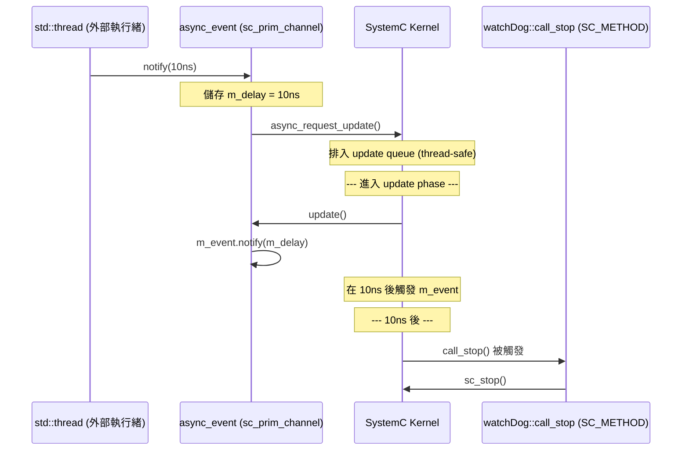
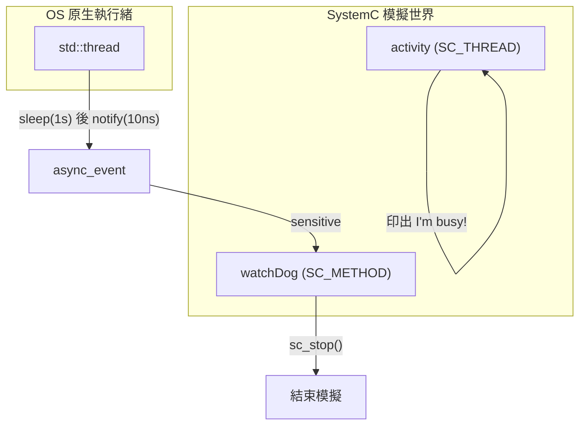

# simple_async -- 簡易非同步事件

> **原始碼**: `ref/systemc/examples/sysc/2.3/simple_async/async_event.h`, `ref/systemc/examples/sysc/2.3/simple_async/main.cpp`
> **難度**: 中級 | **軟體類比**: async/await 跨執行緒通知 / Python `asyncio loop.call_soon_threadsafe()` 從 worker thread

## 概述

`simple_async` 展示了如何從一個 **OS 原生執行緒（std::thread）** 安全地通知 SystemC 模擬引擎中的事件。這解決了一個核心問題：SystemC 的模擬是**單執行緒**的，但真實系統經常需要和外部世界互動。

### 對軟體工程師的解釋

SystemC 的模擬引擎就像 **Python asyncio event loop**：
- 它是單執行緒的
- 所有模組的 `SC_THREAD`/`SC_METHOD` 都在同一個執行緒中協作執行
- 你不能從外部直接修改它的狀態（就像你不能從 worker thread 直接操作 event loop 的狀態）

`async_event` 解決的問題就是：**如何從 worker thread 安全地往 event loop 投遞一個事件？**

| 框架 | 等價機制 |
| --- | --- |
| Python asyncio | `loop.call_soon_threadsafe()` |
| Qt | `QMetaObject::invokeMethod()` with `Qt::QueuedConnection` |
| C++ (Boost.Asio) | `io_context::post()` 從外部執行緒投遞 handler |

## async_event 類別解析

```cpp
class async_event : public sc_core::sc_prim_channel {
    sc_core::sc_time  m_delay;    // 延遲通知的時間
    sc_core::sc_event m_event;    // 內部的 SystemC 事件

public:
    async_event(const char* name = ...);

    // 執行緒安全的方法 -- 可以從任何執行緒呼叫
    void notify(sc_core::sc_time delay = SC_ZERO_TIME);

    // 允許用 wait(async_event_instance) 的語法
    operator const sc_event&() const;

protected:
    // 在 SystemC update phase 中被呼叫（安全的）
    void update(void);
};
```

### 運作機制



### 三個關鍵機制

#### 1. `async_request_update()` -- 跨執行緒投遞

這是 `sc_prim_channel` 提供的方法，是 SystemC 中唯一**可以從外部執行緒安全呼叫**的 API。它的作用就是在 SystemC kernel 的 update queue 中排入一個回呼。

**軟體類比**: `loop.call_soon_threadsafe(callback)` (Python asyncio)

#### 2. `update()` -- 在安全時機執行

`update()` 會在 SystemC 的 **update phase** 被呼叫。此時我們已經回到 SystemC 的單執行緒環境中，可以安全地呼叫 `m_event.notify()`。

**軟體類比**: 就像 React 的 `setState()` 不會立即更新 DOM，而是在下一次 render cycle 中才生效。

#### 3. `async_attach_suspending()` -- 防止模擬過早結束

建構子中呼叫了 `async_attach_suspending()`。這告訴 SystemC kernel：「即使目前沒有排定的事件，也不要結束模擬，因為可能還有外部事件會進來。」

**軟體類比**: Python asyncio 中，只要有活躍的 task 或 future，event loop 就不會退出。`async_attach_suspending()` 就像建立一個未完成的 `asyncio.Future` 讓 event loop 保持活躍。

## main.cpp 解析

### 模組架構



### watchDog 模組

`watchDog` 扮演一個「看門狗計時器」的角色：

1. **建構時**: 建立一個 `async_event`，並註冊一個 `SC_METHOD(call_stop)` 對它敏感
2. **模擬開始時**: 啟動一個 `std::thread`，該執行緒會 sleep 1 秒
3. **1 秒後**: 外部執行緒呼叫 `when.notify(sc_time(10, SC_NS))`
4. **模擬時間推進 10ns 後**: `call_stop()` 被觸發，呼叫 `sc_stop()` 結束模擬

```cpp
// 外部執行緒（非 SystemC）
void process() {
    std::this_thread::sleep_for(std::chrono::seconds(1));  // 真實時間等 1 秒
    when.notify(sc_time(10, SC_NS));  // 通知 SystemC，延遲 10ns
}

// SystemC 內部（安全的）
void call_stop() {
    cout << "Asked to stop at time " << sc_time_stamp() << endl;
    barked = true;
    sc_stop();
}
```

### activity 模組

`activity` 只是一個簡單的 `SC_THREAD`，印出一行字後就結束。它的存在是為了展示：即使 SystemC 內部的所有 thread 都結束了（沒有事件可以排程），模擬也不會結束，因為 `async_event` 已經呼叫了 `async_attach_suspending()`。

### 執行時序

```
t=0 (真實時間):
  - SystemC 啟動
  - activity: "I'm busy!" (然後結束)
  - std::thread 啟動，開始 sleep

t=0 (模擬時間):
  - SystemC 沒有更多事件，但因為 async_attach_suspending 不會結束
  - 模擬器等待外部事件

t=1s (真實時間):
  - std::thread 醒來
  - 呼叫 when.notify(10ns)
  - async_request_update() 將回呼排入 kernel

t=10ns (模擬時間):
  - call_stop() 被觸發
  - "Asked to stop at time 10 ns"
  - sc_stop() 結束模擬
```

## 關鍵學習重點

| 重點 | 說明 |
| --- | --- |
| SystemC 是單執行緒的 | 所有 `SC_THREAD`/`SC_METHOD` 都在同一個執行緒中排程執行 |
| 不能從外部直接觸發事件 | `sc_event::notify()` 不是 thread-safe 的 |
| `async_request_update()` 是橋樑 | 唯一可以從外部執行緒安全呼叫的 kernel API |
| `async_attach_suspending()` 防止提早結束 | 告訴 kernel「還有外部事件可能進來」 |
| 真實時間和模擬時間是分開的 | 外部執行緒 sleep 1 秒，但 SystemC 中只推進了 10ns |
