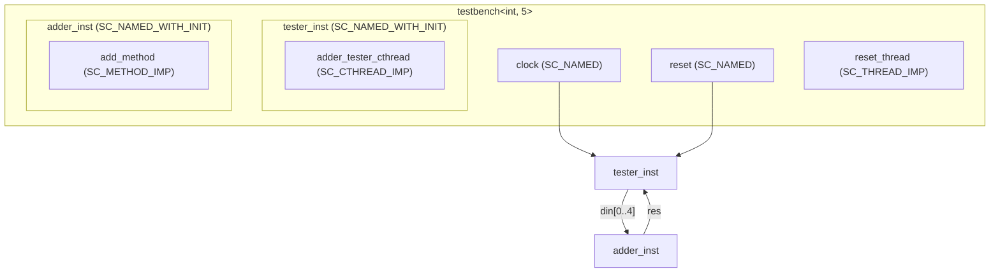

# SystemC 2.4 範例集

> **版本**: SystemC 2.4 | **主題**: In-Class Initialization 巨集 | **難度**: 中級

## 概述

SystemC 2.4 引入了一系列便捷巨集，讓模組的埠宣告、process 註冊和子模組初始化可以在**類別定義內部**完成，不再需要把所有東西塞進建構子（constructor）。

### 對軟體工程師的解釋

如果你用過**依賴注入（像 Python 的 inject library）**，你會發現 SystemC 2.4 之前的寫法就像是「所有依賴注入都寫在建構子裡」：

```python
# 舊寫法（所有初始化在建構子）
class Service:
    def __init__(self, repo: Repository, logger: Logger):
        self.repo = repo
        self.logger = logger
        # 還要設定很多東西...
```

而 SystemC 2.4 的新巨集讓你可以用「field injection」的風格：

```python
# 新寫法（宣告時直接初始化）
import inject

class Service:
    repo: Repository = inject.attr(Repository)
    logger: Logger = inject.attr(Logger)
    # 乾淨多了！
```

## 新增巨集總覽

| 巨集 | 用途 | 軟體類比 |
| --- | --- | --- |
| `SC_NAMED(name, ...)` | 用變數名自動命名 sc_object，可帶額外參數 | Python `dataclasses.field()` 自動命名 |
| `SC_NAMED_WITH_INIT(name)` | 宣告並附帶初始化程式碼區塊 | Python `__post_init__()` 初始化 |
| `SC_METHOD_IMP(func, init)` | 在類別內宣告 SC_METHOD 並指定初始化（sensitivity 等） | Python decorator 註冊 |
| `SC_THREAD_IMP(func, init)` | 在類別內宣告 SC_THREAD 並指定初始化 | Python `@asyncio.coroutine` 風格 |
| `SC_CTHREAD_IMP(func, edge, init)` | 在類別內宣告 SC_CTHREAD 並指定時脈邊緣和初始化 | Python `@sched.scheduled(interval=...)` |

## 檔案列表

| 檔案 | 路徑 | 說明 | 文件連結 |
| --- | --- | --- | --- |
| `adder.h` | `in_class_initialization/adder.h` | N 輸入加法器模組（header-only，使用 `SC_NAMED` 和 `SC_METHOD_IMP`） | [in-class-initialization.md](in-class-initialization.md) |
| `adder_int_5_pimpl.h` | `in_class_initialization/adder_int_5_pimpl.h` | PImpl 慣用法的介面宣告 | [in-class-initialization.md](in-class-initialization.md) |
| `adder_int_5_pimpl.cpp` | `in_class_initialization/adder_int_5_pimpl.cpp` | PImpl 慣用法的實作 | [in-class-initialization.md](in-class-initialization.md) |
| `in_class_initialization.cpp` | `in_class_initialization/in_class_initialization.cpp` | 測試台、testbench，示範所有新巨集的用法 | [in-class-initialization.md](in-class-initialization.md) |

## 架構圖



## 學習路徑建議

1. 閱讀 [in-class-initialization.md](in-class-initialization.md) 了解每個巨集的具體用法
2. 比較 `adder.h`（header-only）和 `adder_int_5_pimpl.h/.cpp`（PImpl 慣用法）的差異
3. 理解 `SC_NAMED` 如何簡化命名，`SC_METHOD_IMP` 如何整合 process 宣告與 sensitivity 設定
