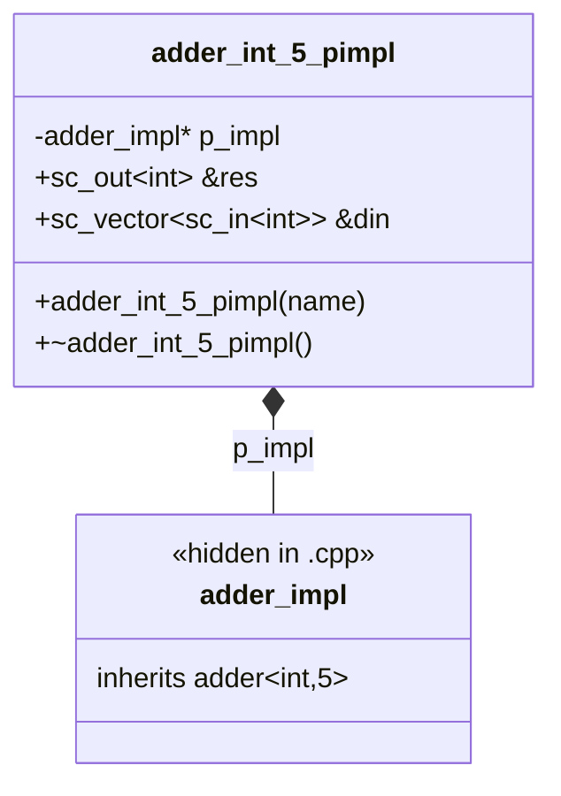

# In-Class Initialization -- 類別內初始化巨集

> **原始碼**: `ref/systemc/examples/sysc/2.4/in_class_initialization/`
> **難度**: 中級 | **軟體類比**: dependency injection (like Python's inject library) / Python field initialization / Python `@cached_property`

## 概述

這個範例展示 SystemC 2.4 引入的 in-class initialization 巨集。在 2.4 之前，所有的埠命名、process 註冊、子模組連接都必須寫在建構子中。新巨集讓這些程式碼可以**就地宣告**，大幅提升可讀性。

## 巨集逐一解析

### 1. `SC_NAMED` -- 自動命名

**問題**: 在 SystemC 中，每個 `sc_object`（埠、訊號、子模組等）都需要一個字串名稱。傳統寫法非常冗餘：

```cpp
// 舊寫法
SC_CTOR(my_module) : my_port("my_port"), my_signal("my_signal") { }
```

**解法**: `SC_NAMED` 自動用 C++ 變數名作為 SystemC 物件名：

```cpp
// 新寫法
sc_out<int>           SC_NAMED(res);           // 名稱自動為 "res"
sc_vector<sc_in<int>> SC_NAMED(din, N_INPUTS); // 名稱自動為 "din"，帶參數 N_INPUTS
```

**軟體類比**:
- **Python dataclass**: `field(default=...)` 自動從變數名推導
- **C++ structured bindings**: 自動從成員名稱推導

### 2. `SC_NAMED_WITH_INIT` -- 宣告加初始化

用於子模組的宣告，允許在宣告後附加一段初始化程式碼（通常用來做 port binding）：

```cpp
// 宣告 tester_inst 並立即綁定其所有埠
adder_tester<T, N_INPUTS> SC_NAMED_WITH_INIT(tester_inst) {
    tester_inst.clock(clock);
    tester_inst.reset(reset);
    tester_inst.res(res);
    tester_inst.din(din);
}
```

**軟體類比**: 這就像 Python 的 dependency injection，在宣告的同時完成配置：

```python
# Python inject library
import inject

@inject.autoparams()
def configure_datasource() -> DataSource:
    ds = DataSource()
    ds.url = "jdbc:..."
    ds.username = "..."
    return ds
```

### 3. `SC_METHOD_IMP` -- 類別內 Method 宣告

將 `SC_METHOD` 的註冊和 sensitivity 設定合併到宣告處：

```cpp
// 在 adder.h 中
SC_METHOD_IMP(add_method, { for(auto &d : din) sensitive << d; });
```

等價於傳統寫法：

```cpp
// 傳統寫法（在建構子中）
SC_CTOR(adder) {
    SC_METHOD(add_method);
    for(auto &d : din) sensitive << d;
}
```

**軟體類比**: 從「命令式註冊」變成「宣告式註冊」：

```python
# 命令式（舊）
scheduler.register(add_method, trigger)

# 宣告式（新）
@scheduler.scheduled(interval=1.0)
def add_method():
    ...
```

### 4. `SC_THREAD_IMP` 和 `SC_CTHREAD_IMP`

與 `SC_METHOD_IMP` 同理，分別用於 `SC_THREAD` 和 `SC_CTHREAD`：

```cpp
// SC_THREAD_IMP: 第二個參數是初始化程式碼
SC_THREAD_IMP(reset_thread, sensitive << clock.posedge_event();) {
    reset = 1;
    wait();
    reset = 0;
}

// SC_CTHREAD_IMP: 第二個參數是時脈邊緣，第三個是初始化程式碼
SC_CTHREAD_IMP(adder_tester_cthread, clock.pos(),
    { async_reset_signal_is(reset, true); }) {
    wait();
    // ... 測試邏輯
}
```

## 檔案逐一解析

### adder.h -- N 輸入加法器（Header-Only）

這是一個 template 模組，將 N 個輸入相加：

```cpp
template <typename T, int N_INPUTS>
struct adder : sc_module {
    sc_out<T>           SC_NAMED(res);              // 輸出結果
    sc_vector<sc_in<T>> SC_NAMED(din, N_INPUTS);    // N 個輸入

    SC_CTOR(adder){}

    // 在類別內宣告 SC_METHOD，對所有輸入埠敏感
    SC_METHOD_IMP(add_method, { for(auto &d : din) sensitive << d; });
};

// 方法實作可以在類別外
template <typename T, int N_INPUTS>
void adder<T,N_INPUTS>::add_method() {
    T result = 0;
    for(auto &d : din)
        result += d.read();
    res = result;
}
```

**軟體類比**: 這就像一個 reactive 的 computed property：

```python
# Python property 類比
@property
def result(self):
    return sum(self.inputs)
```

只要任何一個 `din` 改變，`add_method` 就會重新計算並更新 `res`。

### adder_int_5_pimpl.h / .cpp -- PImpl 慣用法

PImpl（Pointer to Implementation）是一種 C++ 設計模式，目的是**隱藏實作細節，只暴露介面**。



**為什麼需要 PImpl？**

| 優點 | 說明 | 軟體類比 |
| --- | --- | --- |
| 編譯隔離 | 修改 `adder.h` 不需要重新編譯使用 `adder_int_5_pimpl.h` 的檔案 | C++ abstract class / Python ABC vs implementation |
| 隱藏依賴 | 使用者不需要 include `adder.h` | Python 的 `_` 前綴私有慣例 |
| 二進位相容 | 修改實作不影響 ABI | 動態連結庫的穩定 API |

**Header 檔** (`adder_int_5_pimpl.h`):
```cpp
class adder_int_5_pimpl {
    struct adder_impl;      // forward declaration（只宣告，不定義）
    adder_impl* p_impl;     // 指向實作的指標
public:
    sc_out<int>           &res;   // 參考（reference）到內部埠
    sc_vector<sc_in<int>> &din;
};
```

**實作檔** (`adder_int_5_pimpl.cpp`):
```cpp
struct adder_int_5_pimpl::adder_impl : adder<int,5> {
    adder_impl(const sc_module_name& name) : adder(name) {}
};

adder_int_5_pimpl::adder_int_5_pimpl(const char* name)
    : p_impl(new adder_impl(name))
    , res(p_impl->res)     // 讓外部的 res 參考到內部實作的 res
    , din(p_impl->din)
{ }
```

### in_class_initialization.cpp -- 測試台

這個檔案展示了如何把所有新巨集組合在一起：

#### `adder_tester` -- 測試用模組

```cpp
template <typename T, int N_INPUTS>
struct adder_tester : sc_module {
    sc_in<bool>          SC_NAMED(clock);
    sc_in<bool>          SC_NAMED(reset);
    sc_in<T>             SC_NAMED(res);
    sc_vector<sc_out<T>> SC_NAMED(din, N_INPUTS);

    SC_CTOR(adder_tester){}

    // SC_CTHREAD_IMP: 綁定時脈邊緣 + 設定非同步重置
    SC_CTHREAD_IMP(adder_tester_cthread, clock.pos(),
                    { async_reset_signal_is(reset, true); }) {
        wait();
        for (int ii = 0; ii < TEST_SIZE; ++ii) {
            // 計算參考答案
            T ref_res = 0;
            for (int jj = 0; jj < N_INPUTS; ++jj) {
                T input = ii + jj;
                ref_res += input;
                din[jj] = input;
            }
            wait();
            sc_assert(res == ref_res);  // 驗證 adder 的輸出
        }
        sc_stop();
    }
};
```

#### `testbench` -- 頂層模組

```cpp
template <typename T, int N_INPUTS>
struct testbench : sc_module {
    sc_clock                SC_NAMED(clock, 10, SC_NS);  // 10ns 週期的時脈
    sc_signal<bool>         SC_NAMED(reset);
    sc_signal<T>            SC_NAMED(res);
    sc_vector<sc_signal<T>> SC_NAMED(din, N_INPUTS);

    SC_CTOR(testbench) {}

    // 子模組宣告 + port binding 一起完成
    adder_tester<T, N_INPUTS> SC_NAMED_WITH_INIT(tester_inst) {
        tester_inst.clock(clock);
        tester_inst.reset(reset);
        tester_inst.res(res);
        tester_inst.din(din);
    }

    adder<T, N_INPUTS> SC_NAMED_WITH_INIT(adder_inst) {
        adder_inst.res(res);
        adder_inst.din(din);
    }

    // SC_THREAD_IMP: 重置邏輯
    SC_THREAD_IMP(reset_thread, sensitive << clock.posedge_event();) {
        reset = 1;
        wait();
        reset = 0;
    }
};
```

## 新舊寫法完整對比

```cpp
// ========== 舊寫法（SystemC 2.3 以前）==========
struct old_testbench : sc_module {
    sc_clock clock;
    sc_signal<bool> reset;
    adder<int, 5> adder_inst;
    adder_tester<int, 5> tester_inst;

    old_testbench(sc_module_name name)
        : sc_module(name)
        , clock("clock", 10, SC_NS)   // 手動命名
        , reset("reset")               // 手動命名
        , adder_inst("adder_inst")     // 手動命名
        , tester_inst("tester_inst")   // 手動命名
    {
        // port binding 全部在建構子中
        tester_inst.clock(clock);
        tester_inst.reset(reset);
        adder_inst.din(din);
        // ... 省略其餘

        SC_THREAD(reset_thread);
        sensitive << clock.posedge_event();
    }

    void reset_thread() { ... }
};

// ========== 新寫法（SystemC 2.4）==========
struct new_testbench : sc_module {
    sc_clock SC_NAMED(clock, 10, SC_NS);   // 自動命名 + 參數
    sc_signal<bool> SC_NAMED(reset);        // 自動命名

    SC_CTOR(new_testbench) {}               // 建構子幾乎是空的！

    adder<int, 5> SC_NAMED_WITH_INIT(adder_inst) {
        adder_inst.din(din);    // 就地綁定
    }

    SC_THREAD_IMP(reset_thread, sensitive << clock.posedge_event();) {
        reset = 1; wait(); reset = 0;
    }
};
```

## 核心概念速查

| SystemC 2.4 巨集 | 取代的舊寫法 | 優點 |
| --- | --- | --- |
| `SC_NAMED(x)` | 建構子初始化列表中的 `x("x")` | 避免重複打字、不會打錯名稱 |
| `SC_NAMED(x, args...)` | `x("x", args...)` | 支援額外參數（如 vector 大小） |
| `SC_NAMED_WITH_INIT(x) { ... }` | 建構子中的 port binding 程式碼 | 宣告與配置放在一起，提升可讀性 |
| `SC_METHOD_IMP(f, init)` | 建構子中的 `SC_METHOD(f); init;` | Process 註冊就地完成 |
| `SC_THREAD_IMP(f, init)` | 建構子中的 `SC_THREAD(f); init;` | 同上 |
| `SC_CTHREAD_IMP(f, edge, init)` | 建構子中的 `SC_CTHREAD(f, edge); init;` | 同上 |
