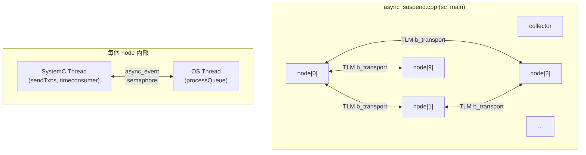
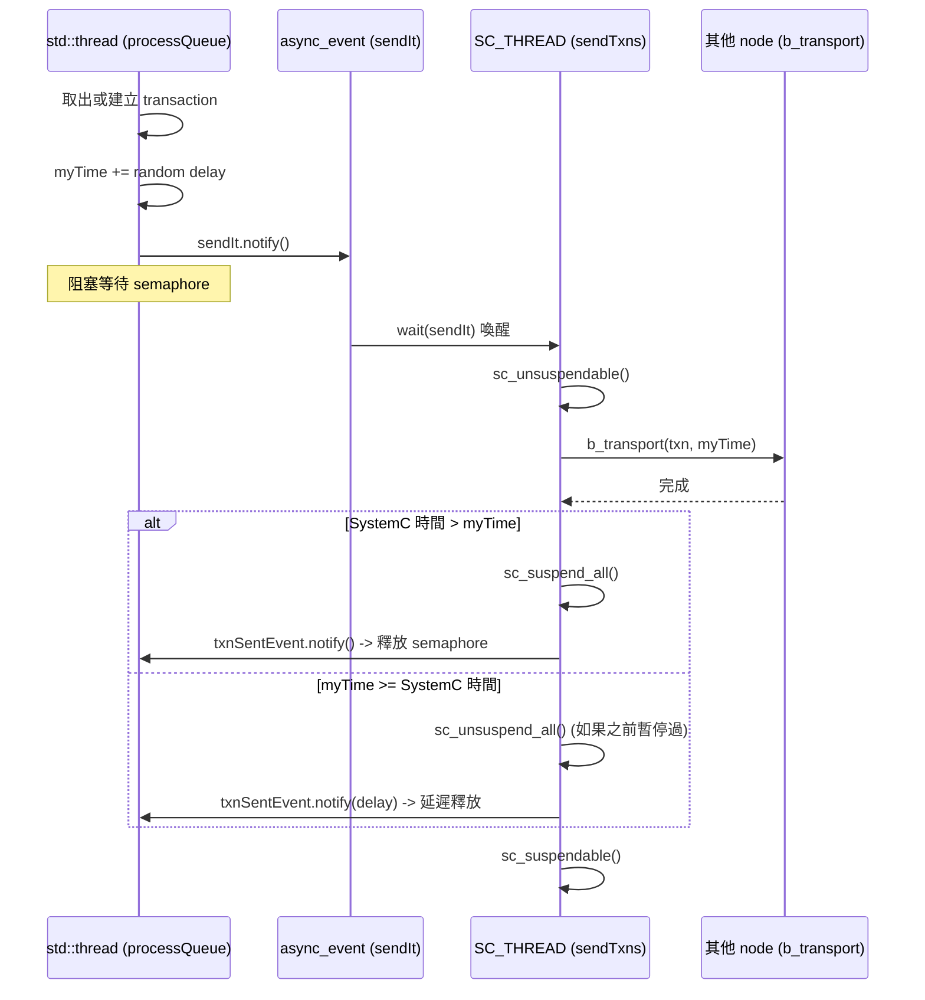

# async_suspend -- 非同步暫停與外部執行緒整合

> **難度**: 進階 | **軟體類比**: Python asyncio event loop 整合 native threads | **原始碼**: `ref/systemc/examples/sysc/async_suspend/`

## 概述

`async_suspend` 是一個進階範例，展示如何讓**多個 OS 原生執行緒**與 SystemC 模擬引擎協作，並透過 `sc_suspend_all()` / `sc_unsuspend_all()` 來控制模擬的暫停與恢復。

### 對軟體工程師的解釋

想像你正在建構一個 **Python asyncio 應用**，其中：
- **event loop**（SystemC kernel）是單執行緒的，負責排程所有事件
- 你有 **10 個 worker threads**（`asynctestnode` 中的 `std::thread`），各自做耗時的計算
- worker 完成後要把結果送回 event loop 處理
- 你需要確保 event loop 不會跑得太快，超過 worker 的「時間」

這個範例用到的 SystemC 新 API：

| API | 作用 | Python asyncio 類比 |
| --- | --- | --- |
| `async_event::notify()` | 從外部執行緒安全地觸發事件 | `loop.call_soon_threadsafe()` |
| `async_attach_suspending()` | 告訴 kernel 不要提早結束 | `loop.create_future()` 保持 event loop 活躍 |
| `sc_suspend_all()` | 暫停整個 SystemC 模擬 | `loop.stop()` 暫停 loop |
| `sc_unsuspend_all()` | 恢復模擬 | `loop.run_forever()` 恢復 loop |
| `sc_unsuspendable()` | 標記目前的程式碼區段不可被暫停 | 在 coroutine 中不含 `await` 的原子區段 |
| `sc_suspendable()` | 恢復可暫停狀態 | 回到正常排程 |

## 檔案列表

| 檔案 | 說明 | 文件連結 |
| --- | --- | --- |
| `async_event.h` | 執行緒安全的事件類別（繼承 `sc_event`） | [async-event.md](async-event.md) |
| `node.h` | `asynctestnode` 模組 -- 核心的雙執行緒節點 | [node.md](node.md) |
| `collector.h` | 事件收集器，用於記錄和報告時間戳 | [collector.md](collector.md) |
| `async_suspend.cpp` | 主程式，建立 10 個節點的全連接網路 | [async-suspend.md](async-suspend.md) |

## 架構總覽

## 核心概念：雙執行緒模型

每個 `asynctestnode` 都包含兩個世界：

## 學習路徑建議

1. 先讀 [async-event.md](async-event.md) -- 理解最基本的跨執行緒事件機制
2. 再讀 [collector.md](collector.md) -- 簡單的工具類別
3. 然後讀 [node.md](node.md) -- 核心的雙執行緒架構（最複雜的部分）
4. 最後讀 [async-suspend.md](async-suspend.md) -- 了解整體組裝和 TLM 網路
