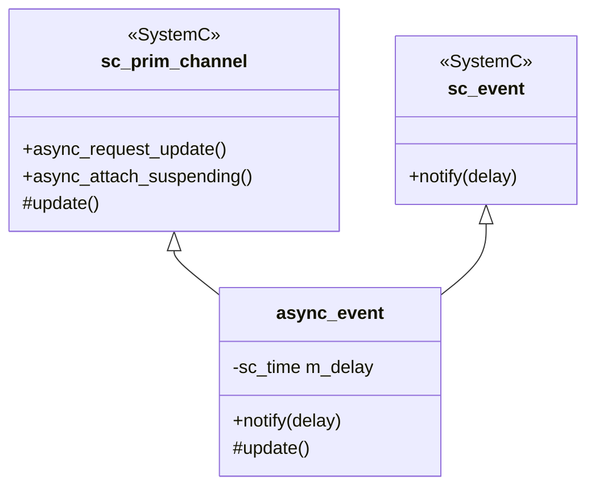
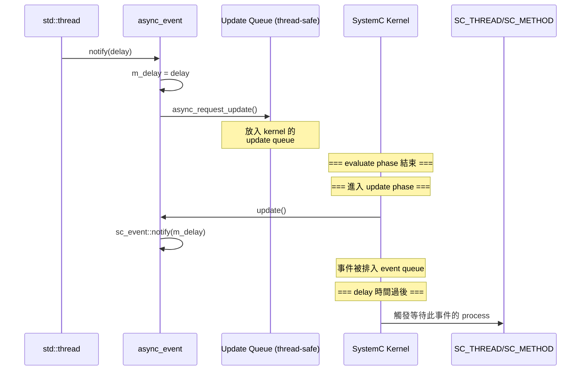

# async_event.h -- 跨執行緒事件通知

> **原始碼**: `ref/systemc/examples/sysc/async_suspend/async_event.h`
> **難度**: 中級 | **軟體類比**: Python `queue.Queue` 從 thread 通知主執行緒 / `loop.call_soon_threadsafe()`

## 概述

`async_event` 是一個**執行緒安全的 SystemC 事件**。它允許 OS 原生執行緒（`std::thread`）安全地通知 SystemC 模擬引擎中的事件，解決了 SystemC 單執行緒模型與外部多執行緒世界之間的溝通問題。

> **注意**: 這個版本和 `2.3/simple_async/async_event.h` 略有不同。這裡的版本直接繼承 `sc_event`，而 2.3 版本持有一個內部的 `sc_event` 成員。

## 類別定義

```cpp
class async_event : public sc_core::sc_prim_channel, public sc_event
{
private:
    sc_core::sc_time m_delay;

public:
    async_event(sc_module_name n = "")
    {
        async_attach_suspending();  // 防止模擬過早結束
    }

    // 可從任何執行緒安全呼叫
    void notify(sc_core::sc_time delay = SC_ZERO_TIME)
    {
        m_delay = delay;
        async_request_update();  // 排入 SystemC kernel 的 update queue
    }

protected:
    // 在 SystemC update phase 中被呼叫
    void update(void)
    {
        sc_event::notify(m_delay);  // 現在安全地觸發事件
    }
};
```

## 設計模式解析

### 雙重繼承



`async_event` 同時繼承了兩個角色：

1. **`sc_prim_channel`**: 提供 `async_request_update()` -- 唯一可以從外部執行緒安全呼叫的 SystemC API
2. **`sc_event`**: 讓 `async_event` 可以直接被 `wait()` 和 `sensitive` 使用，不需要額外轉換

### 與 2.3 版本的差異

| 特性 | 2.3 版 (`simple_async/async_event.h`) | async_suspend 版 |
| --- | --- | --- |
| sc_event 關係 | 持有一個 `m_event` 成員 | 直接繼承 `sc_event` |
| 使用方式 | 需要透過 `operator const sc_event&()` 轉換 | 可直接當 `sc_event` 使用 |
| 建構子 | 接受 `const char* name` | 接受 `sc_module_name n` |
| 設計考量 | 較保守，封裝更嚴格 | 較方便，可直接 `wait(async_event_instance)` |

## 運作機制詳解



### 三個階段

| 階段 | 執行環境 | 做了什麼 |
| --- | --- | --- |
| 1. `notify()` 呼叫 | 外部 `std::thread` | 儲存延遲時間，呼叫 `async_request_update()` |
| 2. `update()` 回呼 | SystemC kernel thread（update phase） | 安全地呼叫 `sc_event::notify()` |
| 3. 事件觸發 | SystemC kernel thread（evaluate phase） | 喚醒等待此事件的 `SC_THREAD` 或 `SC_METHOD` |

## 軟體類比

### Python queue.Queue 模式

```python
# async_event 的概念等價：
import queue
import threading
import time

notify_q = queue.Queue(maxsize=1)

# 外部 thread（相當於 std::thread）
def external_thread():
    time.sleep(1)
    notify_q.put(10e-9)  # 相當於 notify(10ns)

threading.Thread(target=external_thread).start()

# 主 thread（相當於 SystemC kernel）
while True:
    delay = notify_q.get()
    time.sleep(delay)
    handle_event()  # 相當於觸發 SC_METHOD
```

### Python asyncio 模式

```python
# async_event 的概念等價：
import asyncio
from concurrent.futures import ThreadPoolExecutor

loop = asyncio.get_event_loop()

def external_work():
    time.sleep(1)
    # 從外部執行緒安全地投遞事件
    loop.call_soon_threadsafe(loop.call_later, 0.00001, handle_event)

executor = ThreadPoolExecutor()
executor.submit(external_work)
```

## `async_attach_suspending()` 的重要性

如果沒有呼叫 `async_attach_suspending()`，當 SystemC 的 event queue 為空時（所有內部事件都處理完了），kernel 會認為「沒事可做了」而結束模擬。

但外部執行緒可能還在運行，隨時可能送來新事件。`async_attach_suspending()` 告訴 kernel：「我是一個外部事件來源，別急著結束。」

**軟體類比**:
- Python asyncio: `loop.run_forever()` 讓 event loop 保持活躍，即使沒有 pending callback
- Python threading: `threading.Event().wait()` 阻止 main thread 退出
- C++: `std::condition_variable::wait()` 讓 main thread 等待

## 注意事項

原始碼中的註解提到：

> Ensuring that the normal SystemC semantics of 'write-over-write' are maintained is left to the interested reader.

這意味著如果多個外部執行緒**同時**呼叫 `notify()` 並設定不同的 `m_delay`，會有競爭條件（race condition）。在生產環境中，你需要：

1. 用 mutex 保護 `m_delay` 的寫入
2. 或使用佇列來儲存多個通知請求
3. 或確保只有一個外部執行緒會呼叫 `notify()`
