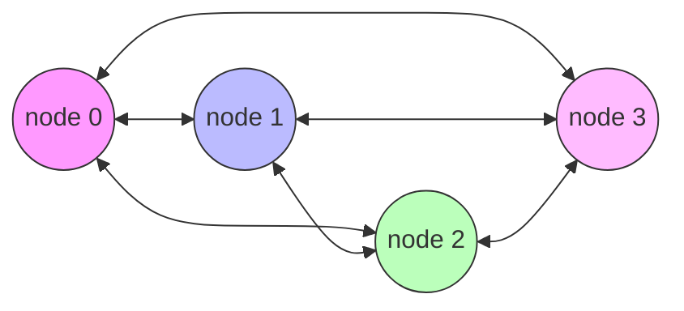
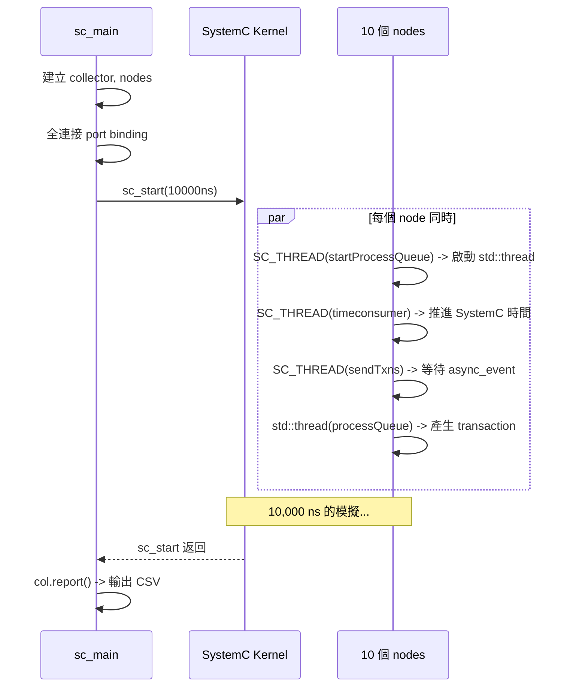

# async_suspend.cpp -- 主程式

> **原始碼**: `ref/systemc/examples/sysc/async_suspend/async_suspend.cpp`
> **難度**: 進階 | **軟體類比**: Python asyncio 中多個 worker thread 透過 event loop 協調

## 概述

`async_suspend.cpp` 是整個範例的入口。它建立了一個由 **10 個 `asynctestnode` 組成的全連接網路**，每個節點都可以透過 TLM `b_transport` 向其他任何節點發送 transaction。

## 程式碼解析

```cpp
int sc_main(int argc, char **argv)
{
    collector col;
    srand(0);  // 固定隨機種子，確保結果可重現

    // 設定 TLM quantum（時序解耦的最大允許偏移量）
    tlm_utils::tlm_quantumkeeper::set_global_quantum(
        sc_core::sc_time(1000, SC_NS));

    // 建立 10 個節點，每個都持有 collector 的參考
    sc_vector<asynctestnode> nodes("nodes", NODES,
        [&](const char *n, size_t i) {
            return new asynctestnode(n, col);
        });

    // 全連接：每個節點的 init_socket 連到其他所有節點的 target_socket
    for (int n = 0; n < NODES; n++)
        for (int nn = 0; nn < NODES; nn++)
            if (n != nn)
                nodes[n].init_socket(nodes[nn].target_socket);

    sc_start(sc_time(10000, SC_NS));  // 模擬 10,000 ns
    col.report();                      // 輸出時間戳報告
    return 0;
}
```

### 逐段解釋

#### 1. `collector col`

一個執行緒安全的時間戳記錄器。所有節點（無論是在 SystemC 執行緒還是 OS 執行緒中）都會將事件時間寫入 collector。最後用 `report()` 輸出 CSV 格式的報告。

#### 2. `set_global_quantum`

TLM Quantum Keeper 是一種**時序解耦（temporal decoupling）**機制。

**軟體類比**: 想像多個微服務各自維護自己的「本地時鐘」。`global_quantum` 規定了本地時鐘最多可以偏離全域時鐘多少。設為 1000ns 表示每個節點最多可以「搶跑」1000ns 才需要和 SystemC kernel 同步。

這就像分散式系統中的 **clock skew tolerance**。

#### 3. `sc_vector` 搭配 lambda 建構

```cpp
sc_vector<asynctestnode> nodes("nodes", NODES,
    [&](const char *n, size_t i) {
        return new asynctestnode(n, col);
    });
```

`sc_vector` 是 SystemC 的容器，類似 `std::vector` 但物件具有 SystemC 的層級名稱管理。lambda 作為 factory function，為每個元素提供自訂的建構邏輯。

**軟體類比**: Python 的 dependency injection (inject library) 搭配 provider scope，每次呼叫都建立新實例。

#### 4. 全連接拓撲

```cpp
for (int n = 0; n < NODES; n++)
    for (int nn = 0; nn < NODES; nn++)
        if (n != nn)
            nodes[n].init_socket(nodes[nn].target_socket);
```

每個節點的 `init_socket`（initiator，發起者）連接到所有其他節點的 `target_socket`（target，目標）。這形成了一個 **10 節點的全連接網路**（每個節點有 9 條出去的連線）。



（實際為 10 個節點，此處簡化為 4 個以利說明）

**軟體類比**: 這就像 Kubernetes 中的 Service Mesh，每個 pod 都可以直接呼叫任何其他 pod 的 API。

#### 5. 模擬與報告

```cpp
sc_start(sc_time(10000, SC_NS));  // 跑 10 微秒
col.report();                      // 印出 CSV
```

模擬結束後，`collector` 會輸出所有記錄的事件，格式為 CSV，可以匯入試算表繪圖。

## 執行流程



## 整體設計的軟體類比

這個範例模擬的是一個**分散式系統**，其中：

| 範例概念 | 分散式系統對應 |
| --- | --- |
| 10 個 `asynctestnode` | 10 個微服務 |
| 全連接的 TLM socket | Service Mesh（每個服務都能呼叫其他服務） |
| `b_transport` | 同步 RPC 呼叫 |
| `std::thread` (processQueue) | 每個服務的業務邏輯執行緒 |
| `SC_THREAD` (sendTxns) | 每個服務的 RPC 發送執行緒 |
| `async_event` | 跨執行緒的 RPC 請求佇列 |
| `sc_suspend_all` | 全域的流量控制（rate limiting） |
| `collector` | 分散式追蹤系統（如 Jaeger / Zipkin） |
| `global_quantum` | 時鐘偏移容忍度（clock skew tolerance） |
