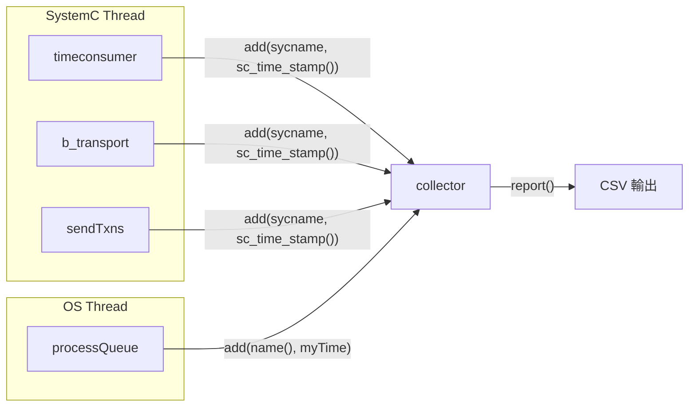

# collector.h -- 事件收集器

> **原始碼**: `ref/systemc/examples/sysc/async_suspend/collector.h`
> **難度**: 入門 | **軟體類比**: 分散式追蹤收集器（Jaeger / Zipkin）

## 概述

`collector` 是一個執行緒安全的工具類別，用於記錄模擬過程中所有節點的事件時間戳。模擬結束後，可以輸出 CSV 格式的報告，匯入試算表繪製圖表。

### 對軟體工程師的解釋

`collector` 就是一個簡化版的**分散式追蹤收集器**。在微服務架構中，Jaeger 或 Zipkin 收集每個服務的 span 和 timestamp；在這個 SystemC 範例中，`collector` 收集每個節點（或 SystemC kernel）在每個時間點的狀態。

## 類別定義

```cpp
class collector {
private:
    std::unordered_map<const char*, sc_time> names;  // 每個 name 的最新時間
    std::mutex lock;                                   // 執行緒安全鎖
    std::vector<std::pair<const char*, const sc_time>> times;  // 所有事件記錄

public:
    void add(const char* name, const sc_time mytime);
    void csvreport();
    void report();
};
```

## 方法解析

### `add()` -- 記錄事件

```cpp
void add(const char* name, const sc_time mytime) {
    std::lock_guard<std::mutex> guard(lock);
    if (names.find(name) == names.end()) {
        names.insert(std::make_pair(name, SC_ZERO_TIME));
    }
    times.push_back(std::make_pair(name, mytime));
}
```

**為什麼需要 mutex？** 因為 `add()` 會從兩種執行緒被呼叫：

1. SystemC 的 `SC_THREAD`（例如 `timeconsumer`、`b_transport`）
2. OS 原生的 `std::thread`（例如 `processQueue`）

這兩者可能同時執行，所以需要 `std::mutex` 保護共享資料。

**軟體類比**: 這就像一個 thread-safe 的 logger：

```go
type Collector struct {
    mu     sync.Mutex
    events []Event
}

func (c *Collector) Add(name string, t time.Duration) {
    c.mu.Lock()
    defer c.mu.Unlock()
    c.events = append(c.events, Event{name, t})
}
```

### `csvreport()` -- 輸出 CSV

```cpp
void csvreport() {
    std::lock_guard<std::mutex> guard(lock);
    // 印出表頭
    cout << "event";
    for (auto kv : names)
        cout << ", " << kv.first;
    cout << "\n";

    // 印出每一列：每個事件發生時，所有 name 的最新時間
    int i = 0;
    for (auto it = times.begin(); it != times.end(); ++it) {
        names[std::get<0>(*it)] = std::get<1>(*it);
        cout << i++;
        for (auto kv : names)
            cout << ", " << kv.second.to_seconds() * 1000000000;
        cout << "\n";
    }
}
```

輸出格式範例：

```
event, SystemC, nodes.node_0, nodes.node_1, ...
0, 0, 0, 0
1, 0, 45, 0
2, 0, 45, 23
3, 100, 45, 23
...
```

每一列代表一個事件發生的瞬間。每一欄代表該 name 最後一次記錄的時間（以奈秒為單位）。

### `report()` -- 選擇輸出方式

```cpp
void report() {
    csvreport();  // 預設使用 CSV
    // 如果定義了 WITHMATPLOT，則改用 matplotlib 繪圖
}
```

如果編譯時定義了 `WITHMATPLOT`，會改用 Python 的 matplotlib（透過 `matplotlibcpp.h`）直接繪製圖表並儲存為 `output.png`。

## 資料流圖



## 設計觀察

| 特點 | 說明 |
| --- | --- |
| 執行緒安全 | 使用 `std::mutex` 保護所有共享狀態 |
| 只追加不刪除 | `times` 只會 `push_back`，不會修改歷史記錄 |
| 雙時間軸記錄 | SystemC 的事件用 `sc_time_stamp()`，OS 執行緒的事件用 `myTime` |
| 延遲輸出 | 所有事件在模擬結束後才輸出，避免 I/O 影響模擬效能 |
