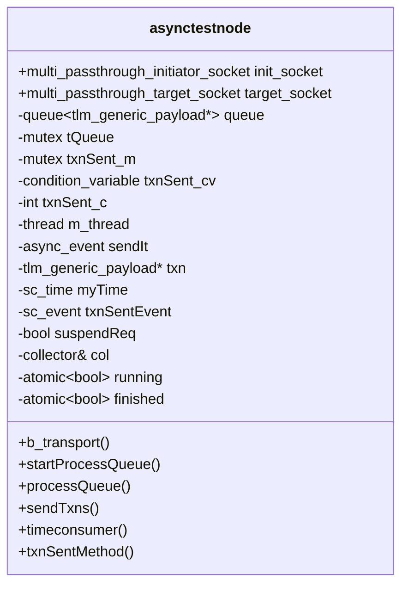
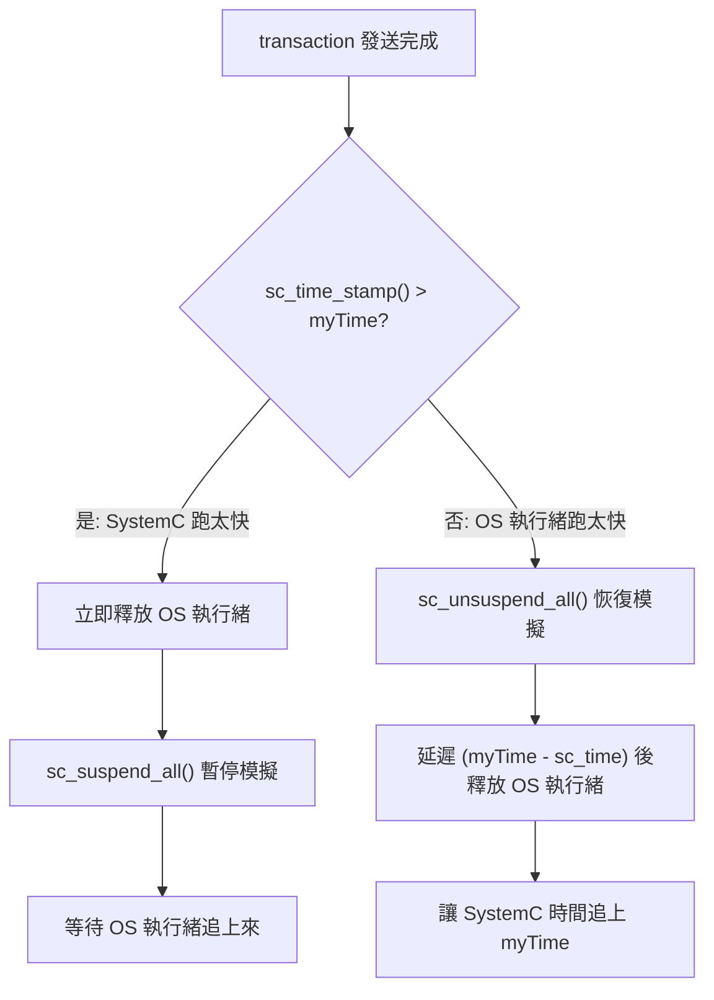

# node.h -- asynctestnode 雙執行緒節點

> **原始碼**: `ref/systemc/examples/sysc/async_suspend/node.h`
> **難度**: 進階 | **軟體類比**: gRPC 服務中的 worker thread + event loop 架構

## 概述

`asynctestnode` 是這個範例中最核心也最複雜的模組。每個節點同時擁有一個 **SystemC 執行緒**和一個 **OS 原生執行緒**，兩者透過 `async_event` 和 semaphore 協作。

### 對軟體工程師的解釋

想像一個 gRPC 伺服器：
- **worker thread** 在背景處理業務邏輯，產生要傳送的 RPC 請求
- **event loop thread** 負責實際發送 RPC，因為網路 I/O 必須在特定的執行緒上完成
- worker 完成後通知 event loop「幫我送這個 request」
- event loop 送完後通知 worker「送完了，你可以繼續」

`asynctestnode` 做的就是完全一樣的事情，只是把「event loop」換成了 SystemC kernel。

## 成員概覽



## 執行緒與 Process 架構

每個 `asynctestnode` 有以下並行執行的部分：

| 名稱 | 類型 | 執行環境 | 功能 |
| --- | --- | --- | --- |
| `processQueue` | `std::thread` | OS 原生執行緒 | 產生或回收 transaction，維護 `myTime` |
| `sendTxns` | `SC_THREAD` | SystemC kernel | 接收 async_event，發送 TLM transaction |
| `timeconsumer` | `SC_THREAD` | SystemC kernel | 隨機等待，推進 SystemC 時間 |
| `txnSentMethod` | `SC_METHOD` | SystemC kernel | 釋放 semaphore，通知 OS 執行緒可以繼續 |
| `b_transport` | callback | SystemC kernel | 處理來自其他節點的 transaction |

## 核心流程詳解

### 1. processQueue -- OS 執行緒端

```cpp
void processQueue() {
    while (running) {
        // 1. 從 queue 取出或新建 transaction
        {
            std::lock_guard<std::mutex> guard(tQueue);
            if (queue.empty())
                txn = new tlm::tlm_generic_payload();
            else {
                txn = queue.front();
                queue.pop();
            }
        }

        // 2. 推進自己的本地時間
        myTime += sc_core::sc_time(rand() % SPEEDNODE, SC_NS);

        // 3. 通知 SystemC 端發送 transaction
        sendIt.notify();

        // 4. 等待 SystemC 端完成發送
        {
            std::unique_lock<std::mutex> lock(txnSent_m);
            while (txnSent_c == 0)
                txnSent_cv.wait(lock);
            txnSent_c--;
        }
    }
    finished = true;
}
```

**軟體類比 -- Producer-Consumer 模式**:

```go
func (n *Node) processQueue() {
    for n.running {
        txn := n.getOrCreateTxn()
        n.myTime += randomDelay()
        n.sendCh <- txn          // notify SystemC
        <-n.doneCh               // wait for completion
    }
}
```

### 2. sendTxns -- SystemC 端

```cpp
void sendTxns() {
    while(1) {
        wait(sendIt);                    // 等待 async_event
        sc_unsuspendable();              // 標記不可暫停
        {
            // 隨機選一個目標節點發送
            init_socket[rand() % init_socket.size()]->b_transport(*txn, myTime);

            // 時間同步策略
            if (sc_time_stamp() > myTime) {
                // SystemC 跑太快了 -> 暫停 SystemC
                txnSentEvent.notify();   // 立即釋放 OS 執行緒
                if (!suspendReq) {
                    suspendReq = true;
                    sc_suspend_all();    // 暫停整個模擬
                }
            } else {
                // OS 執行緒跑太快了 -> 延遲釋放
                if (suspendReq) {
                    sc_unsuspend_all();  // 恢復模擬
                    suspendReq = false;
                }
                txnSentEvent.notify(myTime - sc_time_stamp());  // 延遲釋放
            }
        }
        sc_suspendable();                // 恢復可暫停狀態
    }
}
```

### 3. 時間同步策略

這是整個範例最精妙的部分。每個節點維護自己的「本地時間」（`myTime`），並透過以下策略與 SystemC 全域時間同步：



**軟體類比**: 這就像分散式系統中的**向量時鐘（Vector Clock）**同步策略。每個節點有自己的邏輯時鐘，當發現和全域時鐘偏差太大時，就透過「等待」或「暫停」來收斂。

| 情境 | 動作 | 效果 |
| --- | --- | --- |
| SystemC 時間 > myTime | `sc_suspend_all()` + 立即釋放 OS 執行緒 | 暫停模擬，讓 OS 執行緒追上 |
| myTime >= SystemC 時間 | 延遲 `txnSentEvent` + `sc_unsuspend_all()` | 讓 SystemC 時間自然推進到 myTime |

### 4. b_transport -- 接收端

```cpp
void b_transport(int from, tlm::tlm_generic_payload &trans, sc_core::sc_time &delay) {
    wait(rand() % SPEEDBTRANS, SC_NS);  // 模擬處理時間
    // 把 transaction 放回 queue，供 OS 執行緒回收再利用
    {
        std::lock_guard<std::mutex> guard(tQueue);
        queue.push(&trans);
    }
}
```

收到 transaction 後，等待一段隨機時間（模擬處理延遲），然後把 transaction 放回佇列以供重複使用。

**軟體類比**: 這就像一個 HTTP handler，處理完請求後把 request object 放回 object pool。

### 5. txnSentMethod -- 釋放 semaphore

```cpp
void txnSentMethod() {
    // 在 SystemC 中安全地釋放 OS 執行緒的 semaphore
    std::unique_lock<std::mutex> lock(txnSent_m);
    txnSent_c++;
    txnSent_cv.notify_one();
}
```

這是一個 `SC_METHOD`，由 `txnSentEvent` 觸發。它的唯一作用是釋放 OS 執行緒端的 condition variable，讓 `processQueue` 可以繼續下一筆 transaction。

## Semaphore 機制圖解

```mermaid
sequenceDiagram
    participant OS as processQueue (std::thread)
    participant SEM as Semaphore (mutex + cv)
    participant SC as sendTxns (SC_THREAD)
    participant M as txnSentMethod (SC_METHOD)

    OS->>OS: sendIt.notify()
    OS->>SEM: wait (txnSent_c == 0)
    Note over OS: BLOCKED

    SC->>SC: wait(sendIt)
    SC->>SC: b_transport(...)
    SC->>M: txnSentEvent.notify(delay)

    Note over SC,M: delay 時間後...

    M->>SEM: txnSent_c++ ; notify_one()
    SEM-->>OS: UNBLOCKED
    OS->>OS: 繼續下一筆 transaction
```

## sc_unsuspendable / sc_suspendable

這對 API 用來保護一段程式碼不被 `sc_suspend_all()` 中斷：

```cpp
sc_unsuspendable();  // 從此處開始，即使有人呼叫 sc_suspend_all()，也不會暫停
{
    // 發送 transaction -- 這段程式碼必須完成，不能中途暫停
    init_socket[idx]->b_transport(*txn, myTime);
}
sc_suspendable();    // 恢復正常的可暫停狀態
```

**為什麼需要？** 如果在 `b_transport` 執行到一半時模擬被暫停，target 端的 `wait()` 可能永遠不會返回，造成死鎖。

**軟體類比**: 這就像資料庫 transaction 的 isolation -- 一旦開始就必須完成，不能在中間被中斷：

```go
tx, _ := db.Begin()
defer tx.Commit()  // 相當於 sc_suspendable()
// ... 這段不能被中斷 ...
```

## 常數定義

| 常數 | 值 | 用途 |
| --- | --- | --- |
| `SPEEDSYSTEMC` | 1000 | `timeconsumer` 的隨機等待範圍（0-999 NS） |
| `SPEEDNODE` | 100 | `processQueue` 的隨機 `myTime` 遞增範圍（0-99 NS） |
| `SPEEDBTRANS` | 10 | `b_transport` 的隨機處理時間範圍（0-9 NS） |
