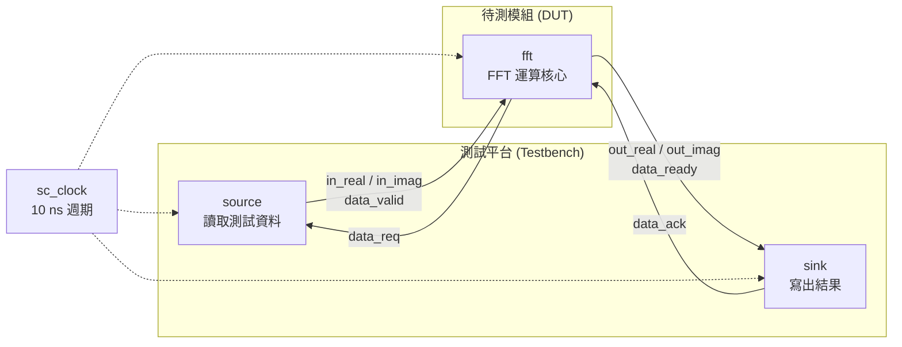
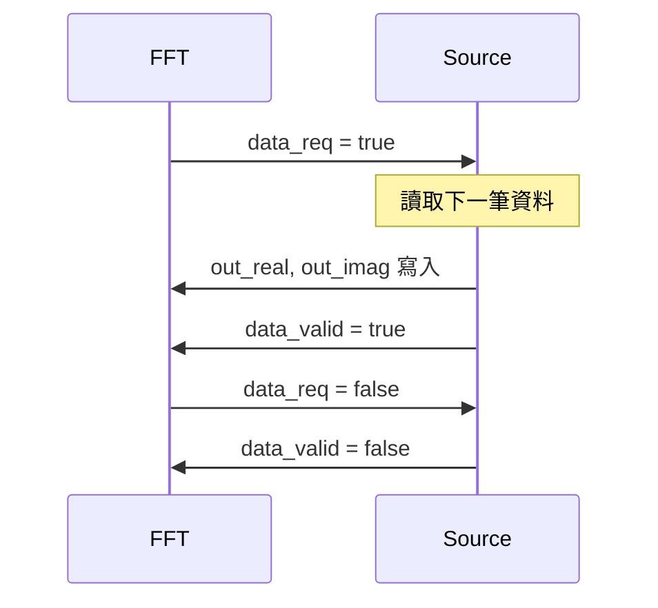

# FFT 範例總覽 -- 浮點數與定點數實作

## 軟體工程師的直覺

想像你在手機上打開音樂播放器，看到那個隨音樂跳動的頻譜動畫（equalizer visualization）。那個動畫背後的核心演算法就是 **FFT (Fast Fourier Transform)**。它的工作是：把一段隨時間變化的訊號（時域），分解成不同頻率的組成成分（頻域）。

用軟體的語言來說：FFT 就像一個 `Map` 操作，把「每個時間點的數值」陣列，轉換成「每個頻率的強度」陣列。

## 為什麼有兩個版本？

這個範例包含兩個子目錄，實作完全相同的 16-point FFT 演算法，但使用不同的數值型別：

| 比較項目 | `fft_flpt` (浮點數) | `fft_fxpt` (定點數) |
|---------|---------------------|---------------------|
| 數值型別 | C++ `float` | SystemC `sc_int<16>` |
| 精度 | 高（IEEE 754 浮點數） | 較低（16-bit 定點數，5 bit 整數 + 10 bit 小數） |
| 硬體成本 | 非常昂貴（浮點數乘法器巨大） | 便宜（整數乘法器小很多） |
| 用途 | 功能驗證、演算法開發 | 實際硬體實作的模型 |

**軟體類比**：浮點數版本就像用 `double` 做科學計算，定點數版本就像遊戲開發中用整數模擬小數（例如用「分」而不是「元」來儲存金額：`$12.34` 存成 `1234`）。

## 系統架構

兩個版本的模組架構完全相同，只有資料型別不同：



資料流是一個簡單的 pipeline：

1. **source** 從檔案讀入 16 個複數樣本（實部 + 虛部）
2. **fft** 執行 16-point DIF (Decimation-In-Frequency) FFT 運算
3. **sink** 將運算結果寫到輸出檔案

模組之間使用 handshake 信號（`data_req` / `data_valid` 和 `data_ready` / `data_ack`）來同步資料傳輸。

## 檔案清單

### `fft_flpt/` -- 浮點數版本

| 檔案 | 用途 | 說明 |
|------|------|------|
| `fft.h` | FFT 模組介面 | 宣告 ports，資料型別為 `float` |
| `fft.cpp` | FFT 演算法實作 | 使用 C++ `float` 做 butterfly 運算 |
| `source.h` | 資料來源介面 | 讀取浮點數測試資料 |
| `source.cpp` | 資料來源實作 | 從 `in_real` / `in_imag` 檔案讀入 `float` 值 |
| `sink.h` | 結果接收介面 | 寫出浮點數結果 |
| `sink.cpp` | 結果接收實作 | 將 `float` 結果寫到 `out_real` / `out_imag` 檔案 |
| `main.cpp` | 頂層連接 | 實例化模組、建立信號、啟動模擬 |

### `fft_fxpt/` -- 定點數版本

| 檔案 | 用途 | 說明 |
|------|------|------|
| `fft.h` | FFT 模組介面 | 宣告 ports，資料型別為 `sc_int<16>` |
| `fft.cpp` | FFT 演算法實作 | 使用 `sc_int` 做 butterfly 運算，含 bit-level 操作 |
| `source.h` | 資料來源介面 | 讀取整數測試資料 |
| `source.cpp` | 資料來源實作 | 從檔案讀入 `int` 值，寫出 `sc_int<16>` |
| `sink.h` | 結果接收介面 | 寫出整數結果 |
| `sink.cpp` | 結果接收實作 | 將 `sc_int<16>` 轉為 `int` 後寫出 |
| `main.cpp` | 頂層連接 | 與浮點數版本結構相同，信號型別改為 `sc_int<16>` |

## 關鍵 SystemC 概念

### SC_CTHREAD -- 同步 Clocked Thread

這個範例中所有模組都使用 `SC_CTHREAD`，而不是 `SC_METHOD` 或 `SC_THREAD`。

```cpp
SC_CTOR(fft) {
    SC_CTHREAD(entry, CLK.pos());  // 在 clock 正緣觸發
}
```

`SC_CTHREAD` 是一種只在 clock edge 被喚醒的 thread process。它的 `wait()` 永遠等待下一個 clock edge。這跟軟體中「每個 tick 執行一次的 game loop」概念類似。

### sc_int / sc_uint -- 定點整數型別

在定點數版本中，所有資料都用 `sc_int<16>` 表示。這是一個 16-bit 有號整數，但在這個範例中它被用來表示定點數：

- 1 bit 符號位
- 5 bits 整數部分
- 10 bits 小數部分

例如 `cos(22.5度) = 0.9239` 被表示為 `942`（即 `0.9239 * 1024 ≈ 942`）。

### Handshake 同步協定

模組之間不是直接傳資料，而是透過 request/acknowledge 的 handshake 機制：



這就像軟體中的 producer-consumer pattern，但用硬體信號而不是 queue/semaphore 來同步。

## 延伸閱讀

- [spec.md](spec.md) -- FFT 硬體規格，給軟體工程師的背景知識
- [fft-flpt.md](fft-flpt.md) -- 浮點數 FFT 模組詳解
- [fft-fxpt.md](fft-fxpt.md) -- 定點數 FFT 模組詳解
- [source.md](source.md) -- 資料來源模組
- [sink.md](sink.md) -- 結果接收模組
- [main.md](main.md) -- 頂層連接與模擬啟動
