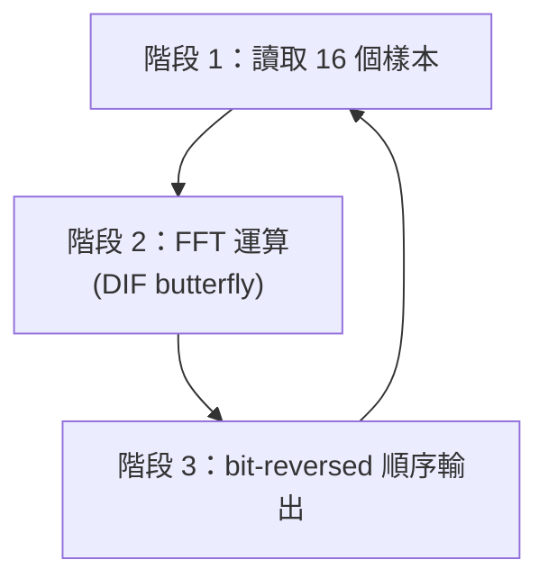
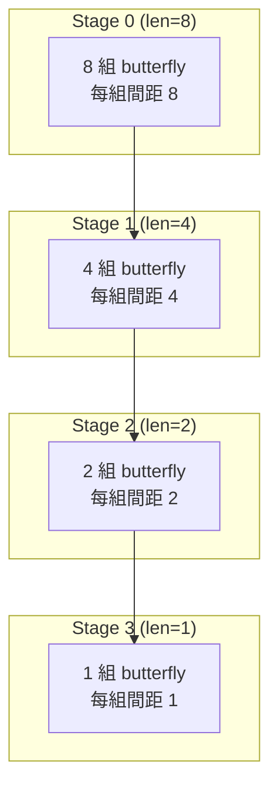

# 浮點數 FFT 模組 (`fft_flpt/fft.h` + `fft.cpp`)

## 軟體工程師的直覺

想像你有一杯混合了紅、藍、綠三種顏料的水。FFT 的工作就像一台「顏料分離機」，能告訴你這杯混合水裡面紅色佔多少、藍色佔多少、綠色佔多少。

在訊號處理的語言中：輸入是一段「混合在一起的聲音波形」（時域），輸出是「每個頻率各有多少能量」（頻域）。

## 模組介面

```
原始碼：fft_flpt/fft.h
```

```cpp
struct fft: sc_module {
    sc_in<float>  in_real;      // 輸入：複數的實部
    sc_in<float>  in_imag;      // 輸入：複數的虛部
    sc_in<bool>   data_valid;   // 來自 source 的信號：資料已準備好
    sc_in<bool>   data_ack;     // 來自 sink 的信號：已收到輸出
    sc_out<float> out_real;     // 輸出：FFT 結果的實部
    sc_out<float> out_imag;     // 輸出：FFT 結果的虛部
    sc_out<bool>  data_req;     // 對 source 的請求：請給我下一筆資料
    sc_out<bool>  data_ready;   // 對 sink 的通知：輸出已準備好
    sc_in_clk     CLK;          // 時脈
};
```

這個介面用軟體的角度來看，就是一個有 8 個參數的 function：4 個輸入、4 個輸出。`bool` 信號是 flow control（像是 TCP 的 ACK）。

## 演算法流程

`entry()` 函式是一個無窮迴圈，每次迭代處理 16 個複數樣本。流程分為三個階段：



### 階段 1：讀取樣本

```cpp
while (index < 16) {
    data_req.write(true);                    // 告訴 source：我要資料
    do { wait(); } while (data_valid == true); // 等 source 準備好
    sample[index][0] = in_real.read();       // 讀取實部
    sample[index][1] = in_imag.read();       // 讀取虛部
    index++;
    data_req.write(false);                   // 告訴 source：我讀完了
    wait();
}
```

用軟體類比：這就像從一個 blocking queue 中連續 dequeue 16 筆複數資料。

### 階段 2：FFT 核心運算

這個範例實作的是 **DIF (Decimation-In-Frequency)** 版本的 Radix-2 FFT。

#### Twiddle Factor 計算

首先計算「旋轉因子」（twiddle factors），也就是 FFT 中用到的三角函數值：

```cpp
theta = 8.0f * atanf(1.0f) / N;  // theta = 2*pi/16 = 22.5 度
w_real = cos(theta);              // W 的實部
w_imag = -sin(theta);             // W 的虛部
```

然後用遞迴乘法產生所有需要的 W 值（`W[0]` 到 `W[6]`），避免重複呼叫三角函數。這就像用軟體中的 memoization 來加速計算。

#### Butterfly 運算

FFT 的核心是「butterfly」運算。對於 N=16 的 FFT，需要 M=4 個 stage，每個 stage 做若干次 butterfly：



每個 butterfly 的基本操作：

```
輸出1 = 輸入1 + 輸入2
輸出2 = (輸入1 - 輸入2) * W[k]
```

其中 `W[k]` 是旋轉因子。第一個 iteration（`j=0`）因為 `W[0] = 1`，所以不需要乘法，只做加減法。

用軟體的語言：這就是一個 divide-and-conquer 演算法。每個 stage 把問題切成更小的子問題，用 butterfly 操作來合併結果。這跟 merge sort 的結構很像，只是合併操作是複數乘法而不是比較。

#### 程式碼中的 butterfly（浮點版）

```cpp
// 不需要乘法的部分（W = 1）
tmp_real = sample[index][0] + sample[index2][0];
tmp_imag = sample[index][1] + sample[index2][1];
sample[index2][0] = sample[index][0] - sample[index2][0];
sample[index2][1] = sample[index][1] - sample[index2][1];
sample[index][0] = tmp_real;
sample[index][1] = tmp_imag;

// 需要乘法的部分（W != 1）
tmp_real2 = sample[index][0] - sample[index2][0];
tmp_imag2 = sample[index][1] - sample[index2][1];
sample[index2][0] = tmp_real2 * W[windex][0] - tmp_imag2 * W[windex][1];
sample[index2][1] = tmp_real2 * W[windex][1] + tmp_imag2 * W[windex][0];
```

複數乘法 `(a + bi)(c + di) = (ac - bd) + (ad + bc)i` 需要 4 次實數乘法和 2 次加減法。

### 階段 3：Bit-Reversed 輸出

DIF FFT 的輸出順序是 bit-reversed 的。例如 index 3（二進位 `0011`）的結果要放在 index 12（二進位 `1100`）的位置。

```cpp
bits_i = i;
bits_index[3] = bits_i[0];  // 反轉 bit 順序
bits_index[2] = bits_i[1];
bits_index[1] = bits_i[2];
bits_index[0] = bits_i[3];
index = bits_index.to_uint();
```

這裡使用了 SystemC 的 `sc_uint<4>` 型別來做 bit-level 操作，這在純 C++ 中需要用位元運算才能達成。

## 資料結構

整個 FFT 的資料存在一個 local array 中：

```cpp
float sample[16][2];  // 16 個複數樣本，[0] = 實部，[1] = 虛部
```

這是 in-place 演算法：輸入和輸出使用同一塊記憶體。用軟體的語言：這就像 in-place sort，不需要額外的陣列。

## 重點觀察

1. **所有運算都在 `float` 上進行** -- 這就是標準 C++ 浮點數運算，沒有任何硬體特殊性。
2. **`wait()` 是唯一的「硬體味道」** -- 每次 `wait()` 代表等待一個 clock cycle。在浮點數版本中，整個 FFT 運算（階段 2）沒有任何 `wait()`，意味著它在模擬中是「瞬間」完成的。
3. **Handshake 協定** -- 讀入和寫出時使用 request/acknowledge 模式，每筆資料至少花費 2 個 clock cycles。
