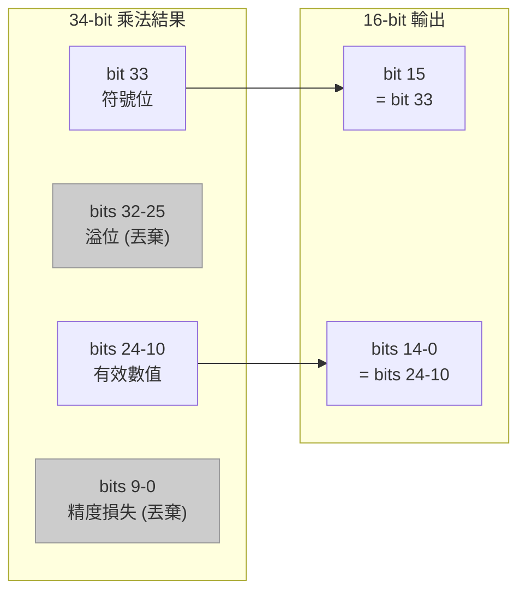

# 定點數 FFT 模組 (`fft_fxpt/fft.h` + `fft.cpp`)

## 軟體工程師的直覺

這個模組和浮點數版本做的事情完全一樣 -- 16-point FFT。差別在於：**所有的 `float` 都被換成了固定位寬的整數 (`sc_int<16>`)**。

為什麼要這樣做？因為在真實的晶片上，一個浮點數乘法器可能需要幾萬個邏輯閘，而一個 16-bit 整數乘法器只需要幾千個。如果你的 WiFi 晶片每秒要做幾百萬次 FFT，用浮點數意味著晶片會又大又貴又耗電。

**軟體類比**：這就像遊戲開發中把所有座標從 `double` 改成 `int16_t`，犧牲一些精度來換取效能。或者像是把金額從 `float` 改成用「分」表示的 `int`（`$12.34` 變成 `1234`）。

## 模組介面的差異

```
原始碼：fft_fxpt/fft.h
```

浮點數版本 vs 定點數版本：

```cpp
// fft_flpt
sc_in<float>  in_real;
sc_out<float> out_real;

// fft_fxpt
sc_in<sc_int<16> >  in_real;
sc_out<sc_int<16> > out_real;
```

唯一的改動就是把 `float` 換成 `sc_int<16>`。控制信號（`data_valid`、`data_ack` 等）完全不變。

## 定點數表示法

在這個範例中，16-bit 整數被解釋為 **`<s,5,10>` 格式**：

```
[15] [14 13 12 11 10] [9 8 7 6 5 4 3 2 1 0]
 ^        ^                    ^
 符號位   5 bits 整數部分      10 bits 小數部分
```

這意味著：
- 實際值 = 整數值 / 1024（因為 2^10 = 1024）
- 可表示範圍：大約 -16.0 到 +15.999
- 精度：1/1024 ≈ 0.001

例如，`cos(22.5度) = 0.9239` 在定點數中的表示：

```cpp
w_real = 942;  // 942 / 1024 = 0.9199... (接近 0.9239)
w_imag = -389; // -389 / 1024 = -0.3799... (接近 -0.3827)
```

## 與浮點數版本的關鍵差異

### 差異 1：Twiddle Factor 改為常數

浮點數版本用 `cos()` 和 `sin()` 即時計算，定點數版本直接用預先算好的整數常數：

```cpp
// fft_flpt：即時計算
w_real = cos(theta);
w_imag = -sin(theta);

// fft_fxpt：預先算好的常數
w_real = 942;   // cos(22.5 deg) * 1024
w_imag = -389;  // -sin(22.5 deg) * 1024
```

這在軟體中很常見：把執行期的浮點計算改成編譯期的查表（lookup table）。

### 差異 2：需要手動管理 Bit Width

浮點數乘法的結果還是 `float`，但整數乘法會讓位寬加倍。16-bit x 16-bit = 32-bit：

```cpp
sc_int<16> a, b;
sc_int<32> result = a * b;  // 乘法結果需要 32 bits
```

加法也會溢位：16-bit + 16-bit 可能需要 17-bit：

```cpp
sc_int<16> a, b;
sc_int<17> sum = a + b;     // 加法結果需要 17 bits
```

在程式碼中可以看到各種不同位寬的變數：

```cpp
sc_int<16> real[16];    // 原始資料：16-bit
sc_int<17> tmp_real1;   // 加法結果：17-bit
sc_int<34> tmp_real3;   // 乘法結果：34-bit（17 * 16 + 1）
```

### 差異 3：Butterfly 函式

浮點數版本直接 inline 計算，定點數版本抽出獨立的 `func_butterfly()` 函式。因為定點數需要做精確的 bit 擷取：

```cpp
void func_butterfly(
    const sc_int<16>& w_real, const sc_int<16>& w_imag,
    const sc_int<16>& real1_in, const sc_int<16>& imag1_in,
    const sc_int<16>& real2_in, const sc_int<16>& imag2_in,
    sc_int<16>& real1_out, sc_int<16>& imag1_out,
    sc_int<16>& real2_out, sc_int<16>& imag2_out
);
```

### 差異 4：Bit 擷取（截斷與對齊）

這是定點數版本最關鍵的差異。乘法結果是 34-bit，但輸出只要 16-bit，需要小心地擷取正確的 bits：

```cpp
// 34-bit 乘法結果：
// [33]  [32..25]  [24..10]  [9..0]
//  ^      ^         ^         ^
// 符號  溢位bits  我們要的   精度損失

// 擷取 sign bit
real2_out[15] = tmp_real3[33];

// 擷取中間 15 bits
real2_out.range(14,0) = tmp_real3.range(24,10);
```

用軟體的語言：這就像做完一個高精度計算後，round 回低精度。類似 `(int)((double_result * 1024) / 1024)`。



### 差異 5：W 值的遞迴計算

浮點數版本的 W 值遞迴很簡單（直接乘 `float`）。定點數版本需要在每次乘法後做 bit 擷取：

```cpp
w_temp1 = w_rec_real * w_real;  // 32-bit result
w_temp5 = w_temp1 - w_temp2;   // 33-bit result

// 截斷回 16-bit
W_real[w_index][15] = w_temp5[32];              // sign bit
W_real[w_index].range(14,0) = w_temp5.range(24,10); // value bits
```

每次截斷都會引入一點誤差，這些誤差會累積。這就是定點數運算的核心挑戰。

## 程式碼結構對照表

| 功能 | 浮點數版本 | 定點數版本 |
|------|-----------|-----------|
| 資料陣列 | `float sample[16][2]` | `sc_int<16> real[16]`, `sc_int<16> imag[16]` |
| W 值計算 | `cos()` / `sin()` | 預計算常數 `942` / `-389` |
| 乘法 | `float * float` -> `float` | `sc_int<16> * sc_int<16>` -> `sc_int<32>` |
| Butterfly | inline 計算 | 獨立函式 `func_butterfly()` |
| 精度管理 | 自動（IEEE 754） | 手動 bit 擷取 `range()` |
| Bit reversal | `sc_uint<4>` bit 操作 | 相同 |

## 重點觀察

1. **演算法邏輯完全相同** -- 兩個版本的 DIF FFT 演算法結構一模一樣，只是數值運算的表示方法不同。
2. **定點數需要「手動浮點」** -- 軟體工程師平常不需要擔心乘法結果的位寬，但硬體設計師必須精確控制每個 bit。
3. **精度 vs 成本的取捨** -- 截斷 bits 就是在丟精度。選擇保留哪些 bits（`range(24,10)`）是硬體設計的核心決策。
4. **`sc_int<N>` 的 bit 操作** -- `range()`、`[]` 等方法讓 C++ 程式碼能表達硬體中常見的 bit slicing 操作，這在純 C++ 中需要用 shift 和 mask 才能做到。
