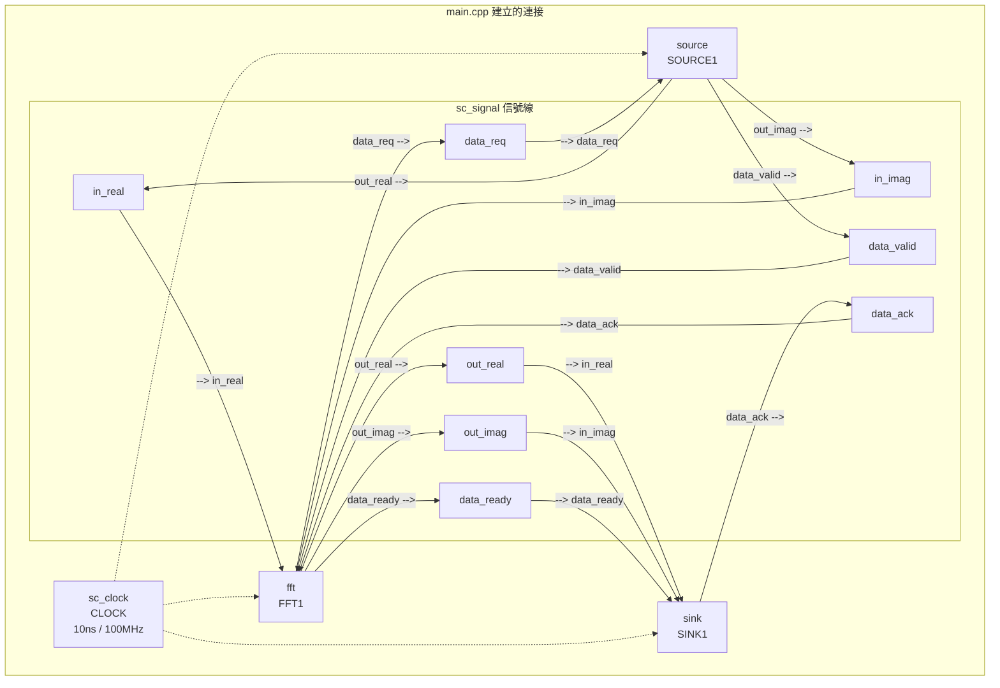

# Main -- 頂層連接與模擬啟動

## 軟體工程師的直覺

`main.cpp` 的角色就像是一個 **application entry point** 加上 **dependency injection container**。它負責：

1. 建立所有元件（模組實例化）
2. 把元件之間的介面連接起來（信號綁定）
3. 啟動整個系統（開始模擬）

用軟體框架的語言：這就是 dependency injection (like Python's inject library) 的 container 或 Angular 的 Module -- 定義元件之間的 wiring。

## 兩個版本的比較

```
原始碼：fft_flpt/main.cpp
原始碼：fft_fxpt/main.cpp
```

兩個版本的結構完全相同，唯一差異是信號的型別：

```cpp
// fft_flpt
sc_signal<float> in_real;
sc_signal<float> out_real;

// fft_fxpt
sc_signal<sc_int<16>> in_real;
sc_signal<sc_int<16>> out_real;
```

## 程式碼結構解析

### 步驟 1：宣告信號

```cpp
sc_signal<float> in_real;       // source -> fft 的實部資料
sc_signal<float> in_imag;       // source -> fft 的虛部資料
sc_signal<bool>  data_valid;    // source -> fft 的 handshake
sc_signal<bool>  data_ack;      // sink -> fft 的 handshake
sc_signal<float> out_real;      // fft -> sink 的實部結果
sc_signal<float> out_imag;      // fft -> sink 的虛部結果
sc_signal<bool>  data_req;      // fft -> source 的 handshake
sc_signal<bool>  data_ready;    // fft -> sink 的 handshake
```

`sc_signal` 就像是軟體中的 shared variable，但有一個關鍵差異：寫入的值要到下一個 delta cycle 才會被讀到。這模擬了硬體中導線的行為。

### 步驟 2：建立 Clock

```cpp
sc_clock clock("CLOCK", 10, SC_NS, 0.5, 0.0, SC_NS);
```

參數含義：
- `"CLOCK"` -- 名稱（用於 debug）
- `10, SC_NS` -- 週期 10 奈秒（100 MHz）
- `0.5` -- duty cycle 50%（高電位和低電位各 5 ns）
- `0.0, SC_NS` -- 起始偏移為 0

用軟體的語言：這就是一個 timer，每 10 ns 觸發一次。所有 `SC_CTHREAD` 都在這個 timer 的節奏下執行。

### 步驟 3：實例化模組並連接

```cpp
fft FFT1("FFTPROCESS");
FFT1.in_real(in_real);      // 把 port 連到 signal
FFT1.in_imag(in_imag);
FFT1.data_valid(data_valid);
// ... 其餘 port 綁定 ...
FFT1.CLK(clock);
```

這種 **port binding** 語法就是 SystemC 的 dependency injection。每個模組宣告自己需要什麼 port，`main` 負責把實際的 signal 注入進去。

### 步驟 4：啟動模擬

```cpp
sc_start();  // 開始模擬，直到 sc_stop() 被呼叫
return 0;
```

`sc_start()` 不帶參數表示「無限制地執行，直到有人呼叫 `sc_stop()`」。在這個範例中，`source` 模組在讀完輸入檔案後會呼叫 `sc_stop()`。

## 完整連接圖



## `sc_main` vs `main`

SystemC 使用 `sc_main` 而不是標準 C++ 的 `main`。這是因為 SystemC library 需要在使用者程式碼之前做一些初始化工作（建立 simulation kernel）。實際的 `main` 函式由 SystemC library 提供，它會呼叫使用者定義的 `sc_main`。

```cpp
int sc_main(int, char*[])  // 注意：參數名稱被省略了
```

## 關鍵觀察

1. **沒有任何邏輯** -- `main.cpp` 純粹是 wiring，不含任何計算邏輯。這是硬體設計的典型模式：頂層只負責連接，所有功能都在子模組中。
2. **信號是共享的** -- 注意 `in_real` 信號同時連接到 `SOURCE1.out_real` 和 `FFT1.in_real`。一個 signal 可以有一個 writer 和多個 reader（就像一條導線）。
3. **所有模組共用同一個 clock** -- 這是同步設計（synchronous design）的特徵。真實系統可能有多個 clock domain，但這個範例只用一個。
4. **模擬結束由 testbench 控制** -- `sc_start()` 不指定時間，靠 `source` 的 `sc_stop()` 來結束。這是常見的模式。
