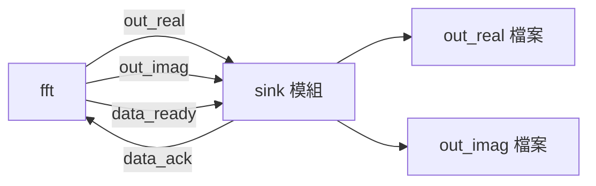
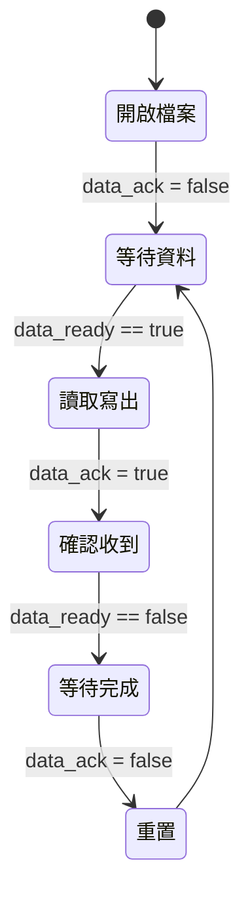

# Sink 模組 -- 結果接收與驗證

## 軟體工程師的直覺

`sink` 模組是一個 **file writer** 或 **data consumer**。它從 FFT 模組接收運算結果，寫入輸出檔案。之後可以與 golden reference 檔案比對來驗證正確性。

用軟體的語言：這就是一個從 blocking queue 消費資料、寫到檔案的 consumer thread，搭配一個離線的 `diff` 來做 assertion。

## 兩個版本的比較

```
原始碼：fft_flpt/sink.h, fft_flpt/sink.cpp
原始碼：fft_fxpt/sink.h, fft_fxpt/sink.cpp
```

### 介面差異

| Port | 浮點數版本 | 定點數版本 |
|------|-----------|-----------|
| `in_real` | `sc_in<float>` | `sc_in<sc_int<16>>` |
| `in_imag` | `sc_in<float>` | `sc_in<sc_int<16>>` |
| `data_ready` | `sc_in<bool>` | `sc_in<bool>` (相同) |
| `data_ack` | `sc_out<bool>` | `sc_out<bool>` (相同) |

### 輸出格式差異

```cpp
// fft_flpt：寫出浮點數（科學記號）
fprintf(fp_real, "%e  \n", in_real.read());

// fft_fxpt：先轉換為 int 再寫出
sc_int<16> tmp = in_real.read();
int tmp_out = tmp.to_int();
fprintf(fp_real, "%d  \n", tmp_out);
```

定點數版本需要額外的 `to_int()` 轉換，因為 `sc_int<16>` 不能直接用 `%d` 印出。

## 模組結構



## 運作流程



核心程式碼（以浮點數版本為例）：

```cpp
void sink::entry() {
    fp_real = fopen("out_real", "w");
    fp_imag = fopen("out_imag", "w");
    data_ack.write(false);

    while(true) {
        // 1. 等待 FFT 輸出準備好
        do { wait(); } while (!(data_ready == true));

        // 2. 讀取結果並寫入檔案
        fprintf(fp_real, "%e  \n", in_real.read());
        fprintf(fp_imag, "%e  \n", in_imag.read());

        // 3. 通知 FFT：我已收到
        data_ack.write(true);

        // 4. 等待 FFT 取消 data_ready
        do { wait(); } while (!(data_ready == false));

        // 5. 重置 acknowledge
        data_ack.write(false);
    }
}
```

## Destructor 與資源管理

`sink` 模組有一個值得注意的設計 -- 它在 destructor 中關閉檔案：

```cpp
~sink() {
    fclose(fp_real);
    fclose(fp_imag);
}
```

而 `source` 模組沒有做這件事。在 SystemC 中，模組的 destructor 會在模擬結束時被呼叫。這確保輸出檔案的內容被完整寫入（flush）。

用軟體的語言：這就像 RAII pattern -- 用 destructor 來確保資源被正確釋放。

## 驗證機制

這個範例的驗證是離線比對。每個版本都附有 golden reference 檔案：

```
out_real.1.golden  out_real.2.golden  out_real.3.golden  out_real.4.golden
out_imag.1.golden  out_imag.2.golden  out_imag.3.golden  out_imag.4.golden
```

驗證流程：

1. 執行模擬，`sink` 產生 `out_real` 和 `out_imag`
2. 用 `diff` 比對輸出與 golden reference
3. 如果完全相同，代表 FFT 實作正確

這跟軟體中的 snapshot testing 概念一樣：先產生一個已知正確的輸出作為 baseline，之後每次修改都跟 baseline 比對。

## 關鍵觀察

1. **Sink 不做任何驗證邏輯** -- 它只負責寫檔案。驗證是在模擬外部用 `diff` 完成的。更進階的 testbench 可能會在 sink 內部直接做比對。
2. **Handshake 是對稱的** -- source-to-FFT 和 FFT-to-sink 的 handshake 協定是映射關係：`data_req`/`data_valid` 對應 `data_ready`/`data_ack`。
3. **無窮迴圈** -- `sink` 的 `while(true)` 迴圈永遠不會自行結束。模擬的終止是由 `source` 呼叫 `sc_stop()` 來觸發的。
