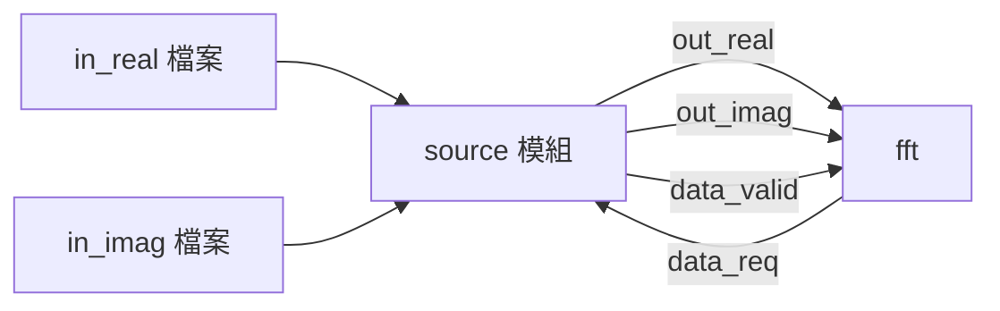
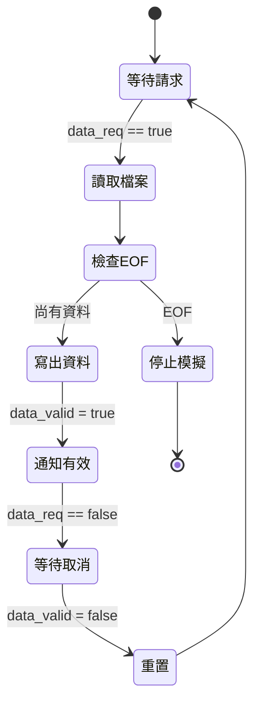

# Source 模組 -- 測試資料產生器

## 軟體工程師的直覺

`source` 模組的角色就像一個 **file reader** 或 **data producer**。它從檔案中讀取預先準備好的測試資料，然後透過 handshake 協定一筆一筆送給 FFT 模組。

用軟體的語言：這就是一個從檔案讀取資料、push 到 blocking queue 的 producer thread。

## 兩個版本的比較

### 共同結構

兩個版本的 `source` 結構完全相同：

```
原始碼：fft_flpt/source.h, fft_flpt/source.cpp
原始碼：fft_fxpt/source.h, fft_fxpt/source.cpp
```



### 介面差異

| Port | 浮點數版本 | 定點數版本 |
|------|-----------|-----------|
| `out_real` | `sc_out<float>` | `sc_out<sc_int<16>>` |
| `out_imag` | `sc_out<float>` | `sc_out<sc_int<16>>` |
| `data_req` | `sc_in<bool>` | `sc_in<bool>` (相同) |
| `data_valid` | `sc_out<bool>` | `sc_out<bool>` (相同) |

### 讀檔差異

```cpp
// fft_flpt：讀取浮點數
float tmp_val;
fscanf(fp_real, "%f \n", &tmp_val);

// fft_fxpt：讀取整數
int tmp_val;
fscanf(fp_real, "%d", &tmp_val);
```

浮點數版本的輸入檔案包含像 `1.5` 這樣的小數，定點數版本的輸入檔案包含像 `1536` 這樣的整數（即 `1.5 * 1024`）。

## 運作流程

`entry()` 函式的邏輯非常簡單：



核心程式碼（以浮點數版本為例）：

```cpp
void source::entry() {
    fp_real = fopen("in_real", "r");
    fp_imag = fopen("in_imag", "r");
    data_valid.write(false);

    while(true) {
        // 1. 等待 FFT 模組發出請求
        do { wait(); } while (!(data_req == true));

        // 2. 從檔案讀取一筆資料
        if (fscanf(fp_real, "%f \n", &tmp_val) == EOF) {
            sc_stop();  // 檔案讀完，結束模擬
            break;
        }
        out_real.write(tmp_val);
        // ... 同樣讀取虛部 ...

        // 3. 通知 FFT：資料已準備好
        data_valid.write(true);

        // 4. 等待 FFT 收到資料（取消請求）
        do { wait(); } while (!(data_req == false));

        // 5. 重置 data_valid
        data_valid.write(false);
        wait();
    }
}
```

## Handshake 時序

每筆資料的傳輸至少需要 3 個 clock cycles：

```
Clock:      |  1  |  2  |  3  |  4  |  5  |
data_req:   __/‾‾‾‾‾‾‾‾‾‾‾\_______________
data_valid: __________/‾‾‾‾‾‾‾‾‾\__________
out_real:   ----------<VALID>---------------
out_imag:   ----------<VALID>---------------
```

1. **Cycle 1-2**: FFT 拉高 `data_req`，source 偵測到後讀檔並輸出資料
2. **Cycle 2-3**: source 拉高 `data_valid`，FFT 偵測到後讀取資料
3. **Cycle 3-4**: FFT 拉低 `data_req`，source 偵測到後拉低 `data_valid`

## 測試資料檔案

每個版本都有多組測試資料：

| 檔案 | 用途 |
|------|------|
| `in_real` / `in_imag` | 第一組測試向量的輸入 |
| `in_real.1` ~ `in_real.4` | 額外測試向量（需手動切換） |
| `in_imag.1` ~ `in_imag.4` | 對應的虛部 |

程式碼中 hardcode 了 `"in_real"` 和 `"in_imag"` 作為檔名。

## 關鍵觀察

1. **`sc_stop()` 結束模擬** -- 當輸入檔案讀完時，`source` 呼叫 `sc_stop()` 來終止整個模擬。這是 SystemC 中常見的模式：讓 testbench 來控制模擬的結束時機。
2. **Blocking I/O** -- `do { wait(); } while (condition)` 是 SystemC 中的 blocking wait 模式，等效於軟體中的 `while(condition) { sleep(tick); }`。
3. **沒有資源管理** -- `fopen` 後沒有在 destructor 中 `fclose`（與 `sink` 不同）。這在模擬中不是大問題，但在真正的軟體中需要注意。
