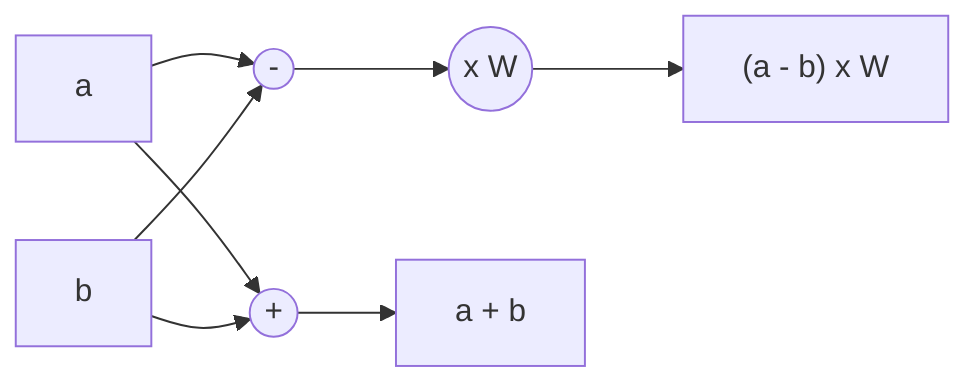
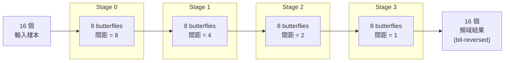
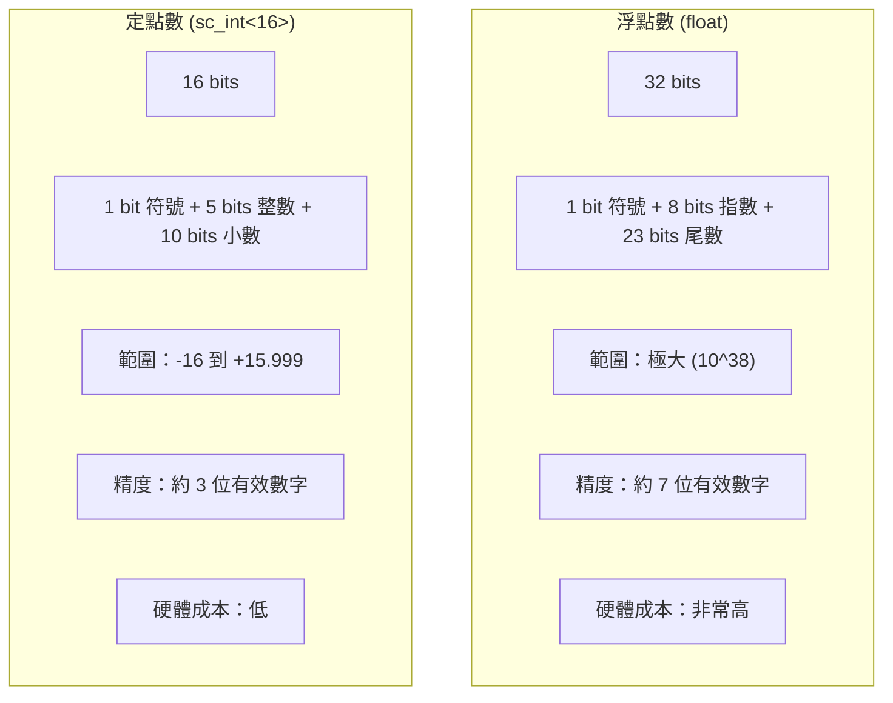
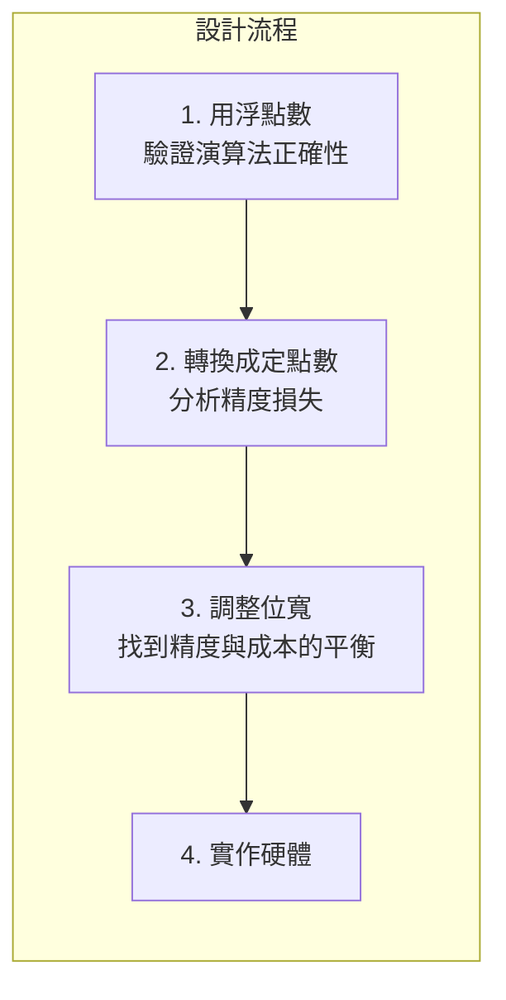
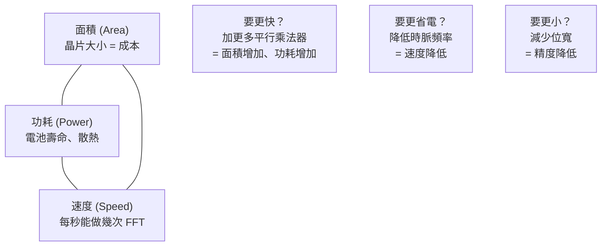

# FFT 硬體規格 -- 給軟體工程師的背景知識

## 什麼是 FFT？

**FFT (Fast Fourier Transform)** 是一個數學演算法，它把「隨時間變化的訊號」轉換成「不同頻率的組成成分」。

### 日常生活中的例子

想像你在一間房間裡同時聽到三種聲音：低沉的引擎聲、中等的人聲、高亢的鳥叫聲。你的耳朵能「分辨」出這三種聲音。FFT 做的就是同樣的事 -- 把混在一起的訊號，拆解成各個頻率的成分。

```
時域（你聽到的混合聲音）          頻域（FFT 拆解出的成分）

  振幅                              能量
   ^  ~~~                            ^
   | ~   ~~  ~                       |  |
   |~  ~~  ~~  ~~~                   |  |     |
   |    ~    ~~    ~                  |  |     |  |
   +-----------> 時間                +-----------> 頻率
                                       低音  中音  高音
```

### 軟體工程師熟悉的類比

| 概念 | 軟體類比 |
|------|---------|
| 時域訊號 | 一個 `float[]` 陣列，index 是時間 |
| 頻域訊號 | 一個 `float[]` 陣列，index 是頻率 |
| FFT 運算 | 一個 `transform(input[]) -> output[]` 函式 |
| 複數 | 一個 `struct { float real, imag; }` |
| N-point FFT | 陣列長度 N 的轉換（本範例 N=16） |

## 真實世界的應用

FFT 無處不在：

| 應用領域 | 怎麼用 FFT |
|---------|-----------|
| **WiFi / 5G (OFDM)** | 把無線電波中的多個子載波分離出來。你手機裡的 WiFi 晶片每秒做數百萬次 FFT |
| **音訊處理** | 音樂播放器的頻譜動畫、噪音消除、語音辨識 |
| **雷達** | 從回波中分析目標的速度和距離 |
| **醫學影像** | MRI 掃描器用 FFT 重建身體內部影像 |
| **影像壓縮** | JPEG 用類似的頻域轉換來壓縮圖片 |

## FFT 演算法原理

### Butterfly 運算

FFT 的核心操作叫做 **butterfly**，因為它的資料流圖形看起來像蝴蝶的翅膀：



每個 butterfly 接收兩個輸入，產生兩個輸出：
- 輸出 1 = 輸入 1 + 輸入 2
- 輸出 2 = (輸入 1 - 輸入 2) x W

其中 W 是「旋轉因子」（twiddle factor），是一個複數常數。

### 16-Point FFT 的完整結構

一個 16-point FFT 需要 4 個 stage（因為 log2(16) = 4），每個 stage 包含 8 個 butterfly：



總運算量：
- 加法/減法：N x log2(N) = 16 x 4 = 64 次
- 複數乘法：約 N/2 x log2(N) = 32 次（扣掉 W=1 的情況會更少）

相比直接計算 DFT 需要 N^2 = 256 次乘法，FFT 快了 8 倍。當 N 更大時差異更驚人（N=1024 時快 100 倍）。

## 為什麼需要兩種實作？

### 浮點數 vs 定點數



### 什麼是定點數？

**定點數就是用整數來模擬小數**。這是軟體工程師最容易理解的解釋。

想像你在寫一個不支援浮點數的嵌入式系統（或者更實際的：你在用整數來處理金額）：

```
實際金額：$12.34
整數儲存：1234 (cents)
轉換關係：實際值 = 整數值 / 100
```

FFT 範例中的定點數用同樣的概念，只是「小數點位置」不同：

```
實際值：0.9239 (cos 22.5度)
整數儲存：942
轉換關係：實際值 = 整數值 / 1024 (因為小數部分有 10 bits)
驗證：942 / 1024 = 0.9199 ≈ 0.9239
```

### 為什麼不全用浮點數？

在軟體世界中，`float` 和 `int` 的運算速度差不多（現代 CPU 都有 FPU）。但在硬體世界中，差異巨大：

| 比較 | 16-bit 整數乘法器 | 32-bit 浮點數乘法器 |
|------|-------------------|---------------------|
| 邏輯閘數量 | 約 2,000 | 約 20,000 |
| 晶片面積 | 小 | 大 10 倍 |
| 功耗 | 低 | 高 |
| 延遲 | 快 | 較慢（需要指數對齊等額外步驟） |

一個 FFT 模組可能需要多個乘法器並行運算。如果每個都用浮點數，晶片會大到不實際。

### 精度 vs 成本的取捨



這就是為什麼這個範例有兩個版本：
1. **`fft_flpt`** -- 用浮點數當作 golden reference（正確答案）
2. **`fft_fxpt`** -- 用定點數模擬實際硬體，驗證精度是否夠用

## 定點數運算的陷阱

### 溢位 (Overflow)

16-bit 加 16-bit 可能產生 17-bit 的結果：

```
最大正值：  0111_1111_1111_1111 (32767)
          + 0111_1111_1111_1111 (32767)
          = 1111_1111_1111_1110 (65534，需要 17 bits)
```

如果只用 16-bit 儲存，結果會溢位變成負數。所以程式碼中用了更大的型別：

```cpp
sc_int<17> tmp_real1 = real1_in + real2_in;  // 17 bits 防止溢位
```

### 截斷誤差 (Truncation Error)

乘法後需要把結果從 34-bit 截斷回 16-bit。被丟掉的 bits 就是精度損失：

```
34-bit 乘法結果：
[符號] [溢位 bits | 保留的 15 bits | 丟棄的 10 bits]
                    ^                 ^
                  我們保留的         精度損失
```

每次截斷大約損失 10 bits 的精度（即 1/1024 的誤差）。經過多次 butterfly 運算，誤差會累積。

### 誤差累積

4 個 stage 的 FFT，每個 stage 都有截斷誤差。最終結果可能與浮點數版本有幾個百分比的差異。硬體設計師的工作就是確保這個誤差在應用可接受的範圍內。

## 面積 / 功耗 / 速度的三角取捨

硬體設計中，這三個指標永遠是互相矛盾的：



這個範例展示的「浮點 vs 定點」選擇，就是面積/功耗取捨的最典型案例。

## 本範例的規格

| 參數 | 值 |
|------|-----|
| FFT 大小 | 16-point (N=16) |
| 演算法 | Radix-2 DIF (Decimation-In-Frequency) |
| 資料格式（浮點） | IEEE 754 `float` (32-bit) |
| 資料格式（定點） | `sc_int<16>`，格式 `<s,5,10>` |
| Butterfly stages | 4 (= log2(16)) |
| 每個 stage 的 butterfly 數 | 8 (= N/2) |
| 輸出順序 | Bit-reversed |
| I/O 協定 | Request/Acknowledge handshake |
| Clock | 10 ns 週期 (100 MHz) |
