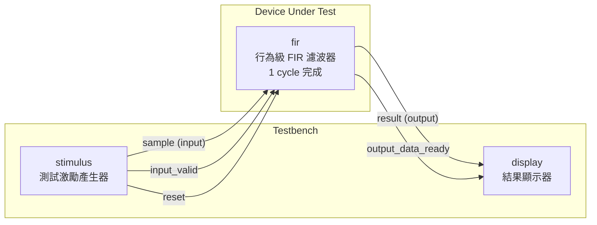
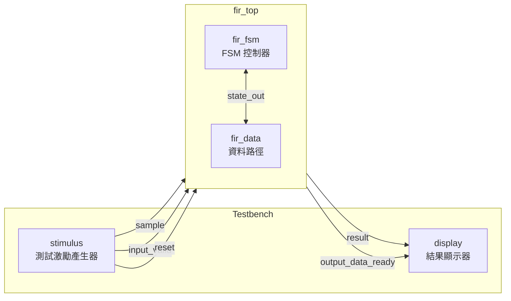
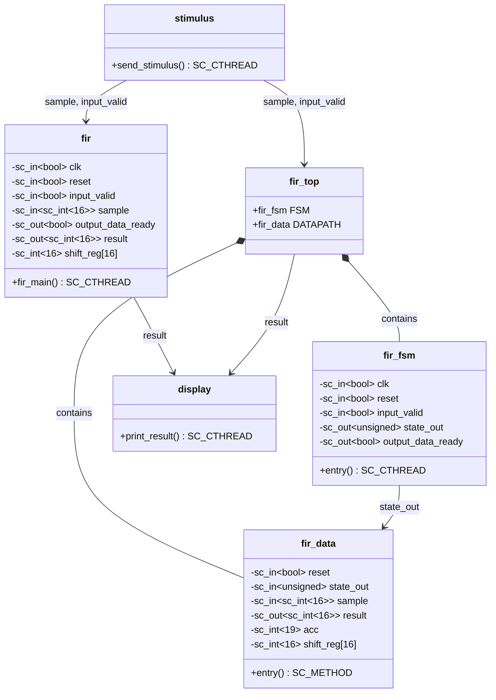

# FIR 濾波器範例 -- Behavioral 與 RTL 雙實作

> **閱讀難度**: 中級 | **前置知識**: SC_MODULE 基礎、SC_CTHREAD 概念
> **原始碼位置**: `examples/sysc/fir/`

---

## 總覽

本範例實作一個 **16-tap FIR (Finite Impulse Response) 濾波器**，並提供兩種不同抽象層級的實作：

| 實作方式 | 對應檔案 | 軟體類比 |
|---------|---------|---------|
| **Behavioral（行為級）** | `fir.h`, `fir.cpp` | 像直接呼叫一個函式，一次算完 |
| **RTL（暫存器傳輸級）** | `fir_fsm.h/.cpp`, `fir_data.h/.cpp`, `fir_top.h` | 像把一個函式拆成狀態機 + 資料處理器，分多步驟完成 |

### 軟體工程師的直覺

FIR 濾波器本質上就是一個 **滑動視窗加權平均（sliding window weighted average）**。

想像你在做股票分析的移動平均線：
- 你有最近 16 天的股價（shift register）
- 每天的權重不同（coefficients）
- 把「股價 x 權重」全部加起來，就是今天的濾波結果

唯一的差別是：FIR 的權重（係數）是精心設計過的，用來過濾特定頻率的訊號。

---

## 資料流程圖

### Behavioral 版本 -- 單一模組，一個 clock cycle 完成

### RTL 版本 -- FSM + Datapath，四個 clock cycle 完成

---

## 模組類別圖

---

## 檔案列表

| 檔案 | 用途 | 文件連結 |
|------|------|---------|
| `fir_const.h` | 16 個濾波器係數定義 | [fir-const.md](fir-const.md) |
| `fir.h` / `fir.cpp` | Behavioral FIR 實作 | [fir.md](fir.md) |
| `fir_fsm.h` / `fir_fsm.cpp` | RTL FSM 控制器 | [fir-fsm.md](fir-fsm.md) |
| `fir_data.h` / `fir_data.cpp` | RTL 資料路徑 | [fir-data.md](fir-data.md) |
| `fir_top.h` | RTL 頂層模組（組合 FSM + Datapath） | [fir-top.md](fir-top.md) |
| `stimulus.h` / `stimulus.cpp` | 測試激勵產生器 | [stimulus.md](stimulus.md) |
| `display.h` / `display.cpp` | 結果輸出顯示器 | [display.md](display.md) |
| `main.cpp` | Behavioral 測試平台 | [main.md](main.md) |
| `main_rtl.cpp` | RTL 測試平台 | [main.md](main.md) |

---

## 核心觀念

### 同一演算法，兩種抽象層級

這是本範例最重要的觀念：**Behavioral 和 RTL 做的是完全相同的運算**，差別在於「怎麼在硬體上實現」。

| 面向 | Behavioral | RTL |
|------|-----------|-----|
| **抽象程度** | 高（描述「做什麼」） | 低（描述「怎麼做」） |
| **Clock cycle** | 1 cycle 完成全部 16-tap | 4 cycles 完成（每 cycle 4 taps） |
| **軟體類比** | 直接呼叫 `calculate()` | 用 state machine 分步驟算 |
| **硬體資源** | 需要 16 個乘法器（平行運算） | 可以只用 4 個乘法器（分時共用） |
| **建模工具** | `SC_CTHREAD` | `SC_CTHREAD`（FSM）+ `SC_METHOD`（Datapath） |

### 關鍵 SystemC 概念

1. **SC_CTHREAD（Clocked Thread）**：與 clock 同步的執行緒，適合描述有狀態的序列邏輯
2. **Behavioral Modeling**：像寫普通程式一樣描述功能，不關心時序細節
3. **RTL Modeling**：將設計分成「控制」（FSM）和「計算」（Datapath），精確描述每個 clock cycle 的行為
4. **FSM + Datapath 分解**：硬體設計的經典架構模式，類似軟體中的 MVC 分離

---

## 建議閱讀順序

1. [spec.md](spec.md) -- 先理解 FIR 濾波器是什麼
2. [fir-const.md](fir-const.md) -- 了解濾波器係數
3. [fir.md](fir.md) -- 看 Behavioral 實作（較簡單）
4. [fir-fsm.md](fir-fsm.md) -- 再看 RTL 的控制器
5. [fir-data.md](fir-data.md) -- 再看 RTL 的資料路徑
6. [fir-top.md](fir-top.md) -- 看兩者如何組合
7. [stimulus.md](stimulus.md) + [display.md](display.md) -- 測試環境
8. [main.md](main.md) -- 完整測試平台
