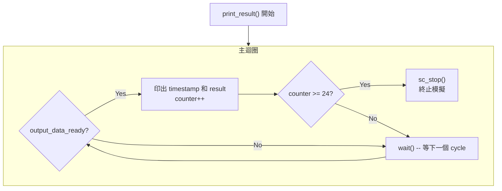

# 結果顯示模組

> **檔案**: `display.h`, `display.cpp`
> **難度**: 初級 | **關鍵概念**: sc_stop(), 模擬終止控制

---

## 概述

`display` 模組是一個 **monitor（監控器）**，負責觀察 FIR 濾波器的輸出，並在終端印出結果。當收集到足夠的結果後，它會呼叫 `sc_stop()` 終止整個模擬。

---

## 模組介面

| Port | 方向 | 型別 | 說明 |
|------|------|------|------|
| `clk` | in | `bool` | 時脈 |
| `output_data_ready` | in | `bool` | 來自 FIR 的輸出就緒旗標 |
| `result` | in | `sc_int<16>` | 來自 FIR 的計算結果 |

---

## 執行流程



---

## sc_stop() 的作用

`sc_stop()` 是 SystemC kernel 提供的全域函式，用來 **終止整個模擬**。

```cpp
if (counter >= 24) {
    sc_stop();  // graceful shutdown
}
```

### 軟體類比

| SystemC | 軟體 |
|---------|------|
| `sc_stop()` | `process.exit()` 或測試框架中的 `done()` |
| 模擬繼續運行 | event loop 繼續運行 |
| 所有模組同時停止 | 所有 Python coroutine (asyncio) / thread 同時結束 |

### 為什麼是 24 個結果？

24 是一個任意選擇的數字，足以驗證濾波器的行為是否正確。在實際的硬體驗證中，會有更嚴謹的 pass/fail 判斷邏輯（例如比較 golden reference）。

---

## 輸出格式

每當 `output_data_ready` 為 true 時，display 會印出類似這樣的訊息：

```
at time [TIMESTAMP] the FIR ipnut is SAMPLE and the output is RESULT
```

其中 `TIMESTAMP` 是 SystemC 的模擬時間（`sc_time_stamp()`），讓你知道每個結果是在哪個時間點產生的。

---

## 設計觀察

### Monitor Pattern

`display` 是一個典型的 **monitor** 模組：

- 只讀取訊號，不寫入任何訊號
- 不影響 DUT（Device Under Test）的行為
- 可以隨時新增或移除，不影響功能正確性

這就像軟體中的 **logger** 或 **observer** -- 被動地觀察系統狀態，不介入系統運作。

### 使用 SC_CTHREAD

display 使用 `SC_CTHREAD` 與 clock 同步，確保在每個 clock edge 檢查 `output_data_ready`。這是觀察同步訊號的標準做法。
