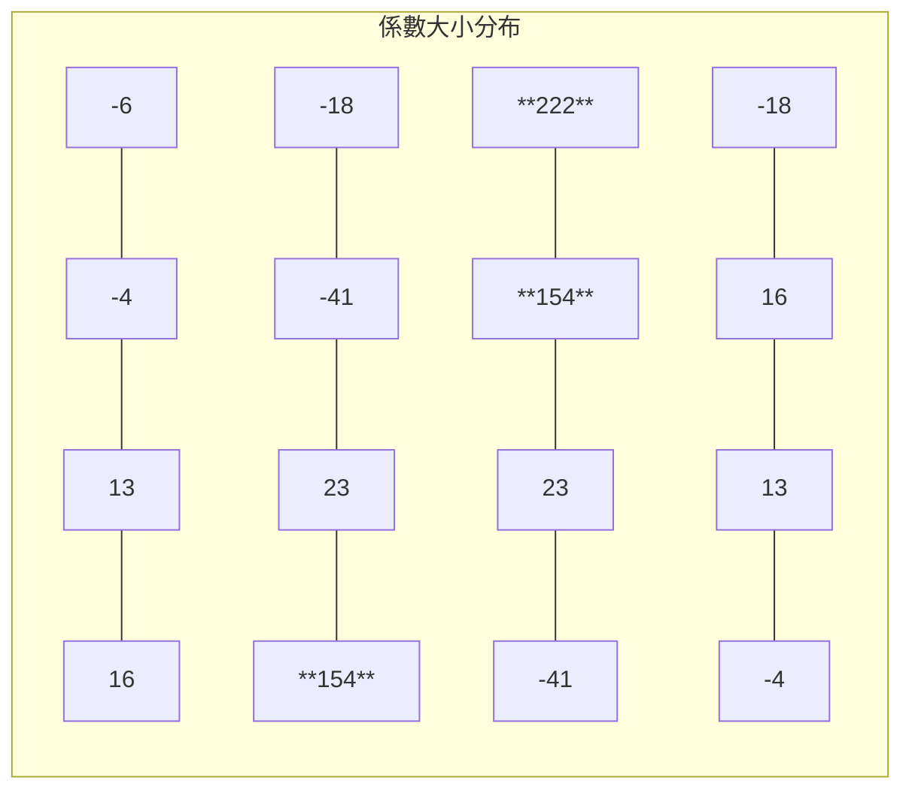

# 濾波器係數

> **檔案**: `fir_const.h`
> **難度**: 初級 | **關鍵概念**: FIR 係數, 對稱性, 低通濾波

---

## 概述

`fir_const.h` 定義了 16 個 FIR 濾波器的係數（tap coefficients）：

```
-6, -4, 13, 16, -18, -41, 23, 154, 222, 154, 23, -41, -18, 16, 13, -4
```

這些數字決定了濾波器的特性 -- 它會保留哪些頻率的訊號，濾除哪些。

---

## 係數的對稱性

觀察這 16 個係數，你會發現它們幾乎是 **左右對稱** 的：

```
位置:  0    1   2   3    4    5   6    7    8    9   10   11   12  13  14  15
係數: -6   -4  13  16  -18  -41  23  154  222  154   23  -41  -18  16  13  -4
       ^                                                                  ^
       |__________________ 幾乎對稱 __________________________________|
```

更精確地說，`coeff[i] == coeff[15-i]`（除了第一個 -6 和最後一個 -4 略有不同）。

### 為什麼要對稱？

對稱的係數具有 **線性相位（linear phase）** 特性。用日常語言來說：

> 線性相位意味著濾波器在過濾訊號時，**不會扭曲訊號的形狀**，只會改變振幅。

**軟體類比**：想像你在用 Photoshop 的模糊濾鏡。對稱的模糊核（blur kernel）會均勻地模糊影像；不對稱的核會讓影像往某個方向「偏移」。線性相位就是確保「不偏移」。

---

## 這些數字代表什麼？

### 從「加權平均」的角度理解

每個係數就是一個「權重」。數值越大的位置，對應的 sample 對最終結果影響越大：



- **中心位置**（tap 7, 8, 9）的權重最大（154, 222, 154）：最近的資料最重要
- **兩端**的權重很小甚至為負：較遠的資料影響小，負值用來「修正」邊緣效應
- **負值**的係數：它們的存在使得濾波器能更精確地在特定頻率處「截斷」

### 低通濾波器（Low-pass Filter）

這組係數構成一個 **低通濾波器**：

- **保留**：低頻訊號（緩慢變化的部分）
- **濾除**：高頻訊號（快速變化的部分、雜訊）

**日常類比**：

| 應用 | 低通濾波效果 |
|------|------------|
| 音訊處理 | 去除高頻雜訊，保留人聲 |
| 影像處理 | 模糊濾鏡（去除細節/雜訊） |
| 股票分析 | 移動平均線（去除日間波動，看趨勢） |
| 溫度感測 | 平滑化讀數（去除瞬間跳動） |

---

## 係數的定義方式

在 `fir_const.h` 中，係數以 `const sc_int<16>` 陣列定義，每個係數是 16-bit 有號整數。

為什麼用整數而不是浮點數？在硬體中，整數運算比浮點數運算 **快很多倍、省很多電路面積**。這些整數係數是從理想的浮點係數經過「量化（quantization）」得到的。

---

## 驗算：為什麼 16 個 tap？

Tap 數量（也叫「階數 order」）決定了濾波器的「精確度」：

- **更多 tap** = 更精確的頻率分離，但需要更多計算和硬體資源
- **更少 tap** = 比較粗糙，但更快、更省資源

16 tap 是一個常見的教學範例大小，足以展示 FIR 的概念，又不會太複雜。
