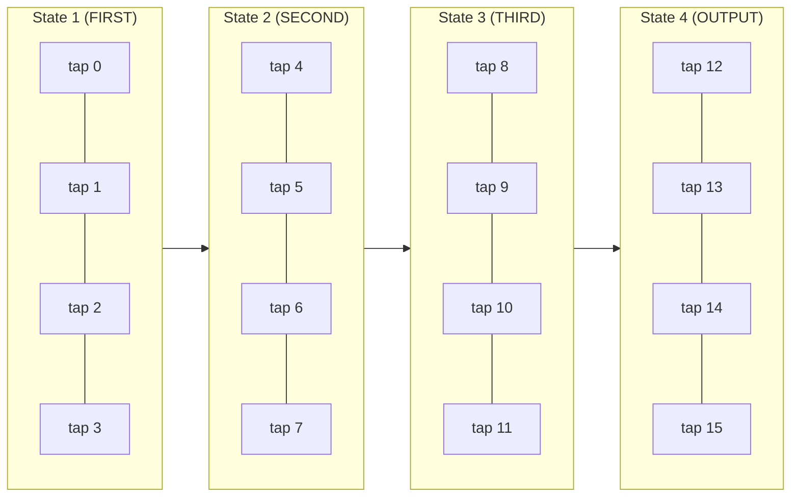
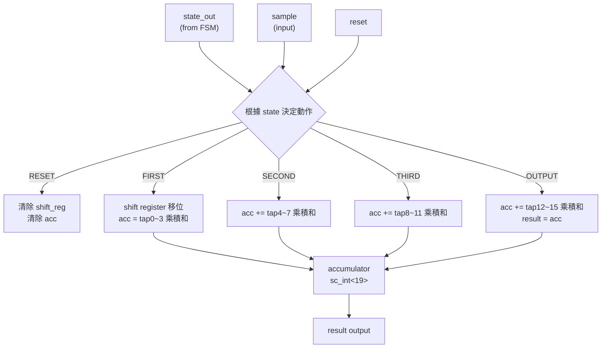

# RTL 資料路徑（Datapath）

> **檔案**: `fir_data.h`, `fir_data.cpp`
> **難度**: 中級 | **關鍵概念**: SC_METHOD, 累加器, 分時計算

---

## 概述

`fir_data` 是 RTL 版 FIR 濾波器的 **資料路徑（Datapath）**。它負責實際的數學運算：移位暫存器操作和卷積計算。它不決定「什麼時候做」（那是 FSM 的工作），只決定「怎麼做」。

---

## 核心概念：分時計算

Behavioral 版本在一個 cycle 算完 16 個 tap。RTL 版本把 16 個 tap 分成 **4 組，每組 4 個**，分 4 個 clock cycle 完成：



每個 cycle 裡，4 個 tap 的乘積累加到同一個 accumulator 上。4 個 cycle 後，accumulator 就是完整的卷積結果。

---

## 模組介面

| Port | 方向 | 型別 | 說明 |
|------|------|------|------|
| `reset` | in | `bool` | 重置訊號 |
| `state_out` | in | `unsigned` | 來自 FSM 的狀態編號 |
| `sample` | in | `sc_int<16>` | 輸入取樣值 |
| `result` | out | `sc_int<16>` | 計算結果 |

---

## 每個狀態的運算細節

### State 1 (FIRST) -- 移位 + tap 0~3

```
1. 執行 shift register（把新 sample 移入）
2. acc  = shift_reg[0] * coeff[0]
3. acc += shift_reg[1] * coeff[1]
4. acc += shift_reg[2] * coeff[2]
5. acc += shift_reg[3] * coeff[3]
```

### State 2 (SECOND) -- tap 4~7

```
acc += shift_reg[4] * coeff[4]
acc += shift_reg[5] * coeff[5]
acc += shift_reg[6] * coeff[6]
acc += shift_reg[7] * coeff[7]
```

### State 3 (THIRD) -- tap 8~11

```
acc += shift_reg[8]  * coeff[8]
acc += shift_reg[9]  * coeff[9]
acc += shift_reg[10] * coeff[10]
acc += shift_reg[11] * coeff[11]
```

### State 4 (OUTPUT) -- tap 12~15 + 輸出

```
acc += shift_reg[12] * coeff[12]
acc += shift_reg[13] * coeff[13]
acc += shift_reg[14] * coeff[14]
acc += shift_reg[15] * coeff[15]
result = acc   // 輸出最終結果
```

---

## 為什麼 Accumulator 是 `sc_int<19>`？

這是一個很好的位元寬度設計問題。

### 計算最大可能值

- 輸入 sample：`sc_int<16>`，最大值 = 2^15 - 1 = 32767
- 係數：最大值 = 222（最大的係數）
- 單一 tap 最大乘積：32767 * 222 = 7,274,274
- 16 個 tap 最大總和：理論上需要考慮所有係數的絕對值總和

係數絕對值總和 = |-6| + |-4| + 13 + 16 + |-18| + |-41| + 23 + 154 + 222 + 154 + 23 + |-41| + |-18| + 16 + 13 + |-4| = 766

最大可能的累加值 = 32767 * 766 = 25,099,522

表示這個值需要多少 bits？

- 2^24 = 16,777,216
- 2^25 = 33,554,432

所以理論上需要 25 bits（含 sign bit）。但實際上這裡用 `sc_int<19>` 是因為：

1. **實際輸入不會到最大值**：測試激勵使用遞增的小數值
2. **19 bits 足以容納實際運算範圍**：在這個特定的測試場景下不會溢位
3. **這是一個教學範例**：實際產品會做更精確的位元寬度分析

### 軟體類比

這就像選擇 `int16_t` vs `int32_t` vs `int64_t` -- 在硬體中，每一個 bit 都對應實際的電路面積，所以位元寬度的選擇比軟體中重要得多。

---

## SC_METHOD vs SC_CTHREAD

這是本檔案最重要的 SystemC 觀念之一。

### fir_data 使用 SC_METHOD

```cpp
SC_METHOD(entry);
sensitive << reset << state_out << sample;
```

### fir_fsm 使用 SC_CTHREAD

```cpp
SC_CTHREAD(entry, clk.pos());
reset_signal_is(reset, true);
```

### 差異比較

| 特性 | SC_METHOD | SC_CTHREAD |
|------|-----------|------------|
| **觸發方式** | 任何 sensitive 訊號變化 | 只在 clock edge |
| **執行模式** | 每次從頭執行到尾 | 可以用 `wait()` 暫停 |
| **有無 `wait()`** | 不能用 | 可以用 |
| **硬體對應** | 組合邏輯（combinational） | 序列邏輯（sequential） |
| **軟體類比** | 純函式（pure function） | 有狀態的協程（coroutine） |

### 為什麼 Datapath 用 SC_METHOD？

Datapath 是 **組合邏輯**：給定輸入（state、sample、shift register 內容），立即產生輸出。不需要等 clock，輸入一變，輸出就跟著變。

這就像一個純函式：

```python
# SC_METHOD 等同於：
def datapath(state, sample, shift_reg, coefficients):
    # 根據 state 決定做什麼計算
    # 立即返回結果，不需要等待
    if state == RESET:
        return reset_values()
    elif state == FIRST:
        return compute_taps_0_3(sample, shift_reg, coefficients)
    # ...
```

### 為什麼 FSM 用 SC_CTHREAD？

FSM 是 **序列邏輯**：狀態必須在 clock edge 才能改變。如果沒有 clock 同步，狀態可能在不穩定的瞬間發生多次轉換。

---

## 資料流程圖


