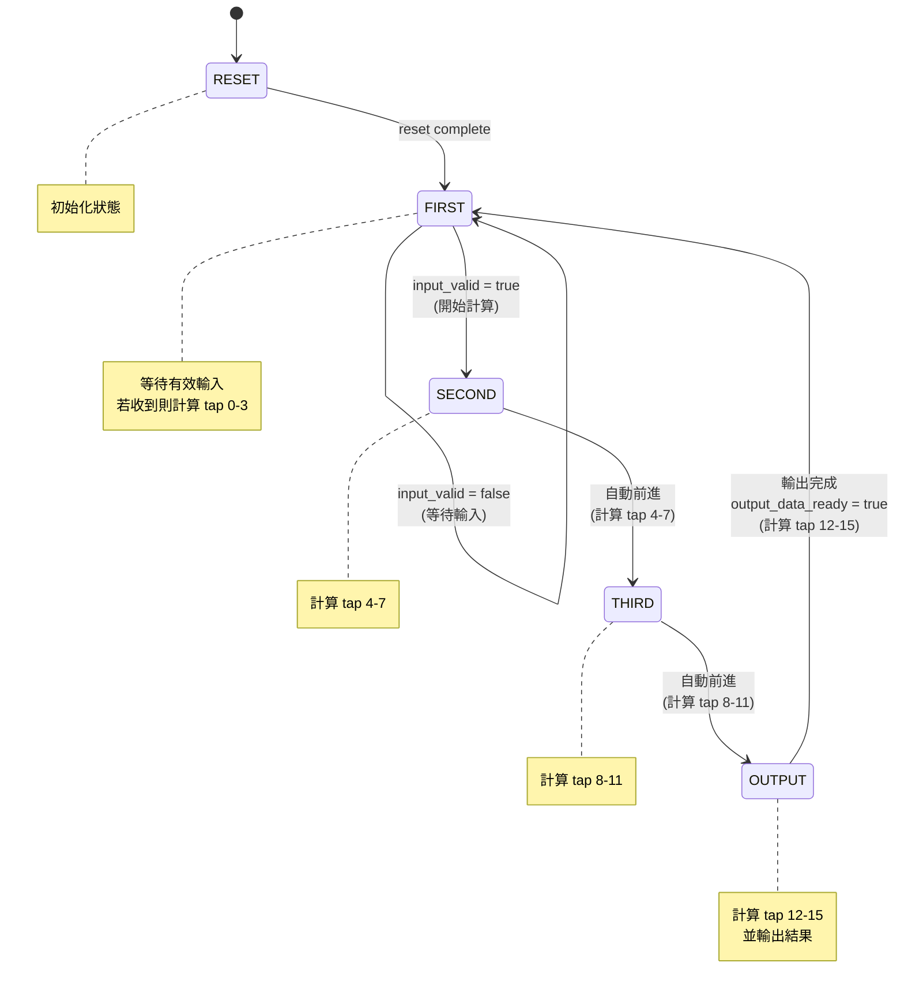
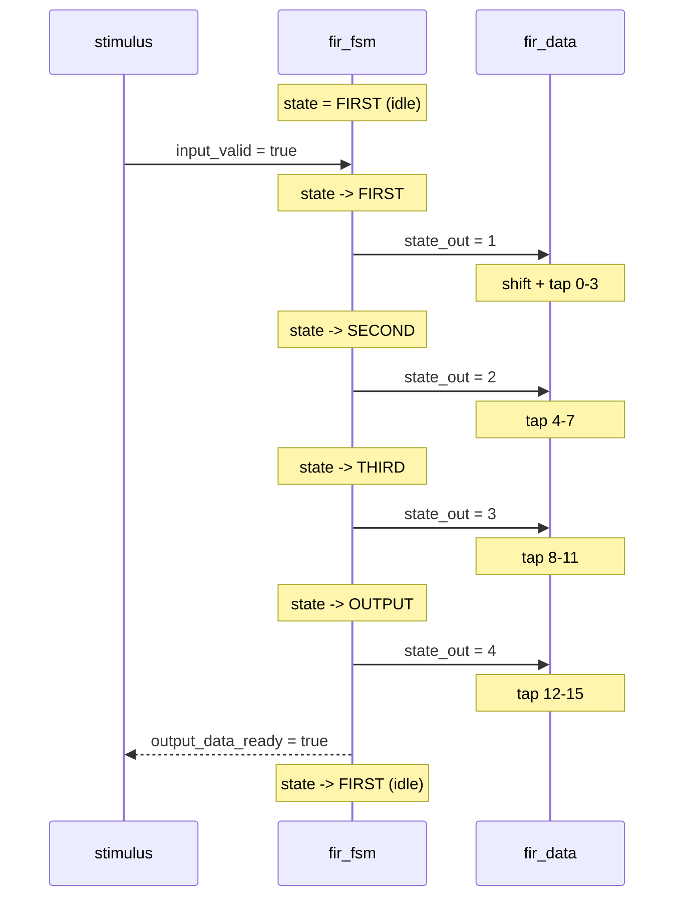

# RTL FSM 控制器

> **檔案**: `fir_fsm.h`, `fir_fsm.cpp`
> **難度**: 中級 | **關鍵概念**: 有限狀態機（FSM）, SC_CTHREAD, 控制與資料分離

---

## 概述

`fir_fsm` 是 RTL 版 FIR 濾波器的 **控制器（Controller）**。它是一個有限狀態機（Finite State Machine），負責告訴 datapath「現在該做什麼」。

自己不做任何計算，只管理流程 -- 就像一個指揮官，決定什麼時候開始、什麼時候結束。

---

## 軟體類比：State Machine Pattern

如果你用過 state machine pattern，`fir_fsm` 就像一個 **state machine pattern (like Python enum + match)**：

```python
# 概念上等同的 state machine pattern (Python enum + match)
from enum import Enum

class State(Enum):
    RESET = 0
    FIRST = 1
    SECOND = 2
    THIRD = 3
    OUTPUT = 4

def fir_next_state(state: State, input_valid: bool) -> State:
    match state:
        case State.RESET:
            return State.FIRST
        case State.FIRST:
            if input_valid:
                return State.SECOND  # start processing
            return State.FIRST       # keep waiting
        case State.SECOND:
            return State.THIRD
        case State.THIRD:
            return State.OUTPUT
        case State.OUTPUT:
            return State.FIRST       # done, go back to waiting
```

每個狀態對應一個「步驟」，每個 clock cycle 前進一步。

---

## 狀態圖



---

## 狀態說明

| 狀態 | 編號 | 做什麼 | Datapath 動作 |
|------|------|--------|-------------|
| **RESET** | 0 | 初始化 | 清除所有暫存器 |
| **FIRST** | 1 | 等待 `input_valid`，收到就開始 | 移位暫存器 + 計算 tap 0-3 |
| **SECOND** | 2 | 自動前進 | 累加 tap 4-7 |
| **THIRD** | 3 | 自動前進 | 累加 tap 8-11 |
| **OUTPUT** | 4 | 設定 `output_data_ready = true` | 累加 tap 12-15，輸出結果 |

---

## 時序圖



---

## 模組介面

| Port | 方向 | 型別 | 說明 |
|------|------|------|------|
| `clk` | in | `bool` | 時脈 |
| `reset` | in | `bool` | 重置 |
| `input_valid` | in | `bool` | 輸入有效旗標 |
| `state_out` | out | `unsigned` | 目前狀態編號（給 datapath 看） |
| `output_data_ready` | out | `bool` | 輸出就緒旗標 |

---

## 為什麼要把 FSM 和 Datapath 分開？

這是硬體設計中非常經典的架構模式，叫做 **FSM + Datapath decomposition**。

### 軟體類比

| 硬體概念 | 軟體概念 |
|---------|---------|
| FSM（控制器） | Controller / State machine / state machine pattern (like Python enum + match) |
| Datapath（資料路徑） | Model / Service / 業務邏輯 |
| FSM + Datapath | MVC 架構中的 C + M |

### 分離的好處

1. **關注點分離（Separation of Concerns）**
   - FSM 只管「什麼時候做什麼」
   - Datapath 只管「怎麼算」
   - 兩者可以獨立測試和修改

2. **可組合性**
   - 同一個 datapath 可以配不同的 FSM（例如改變計算排程）
   - 同一個 FSM 可以控制不同的 datapath（例如換不同的濾波器）

3. **合成友善**
   - EDA 工具對這種結構的最佳化效果最好
   - 時序分析更容易

---

## SC_CTHREAD 在 FSM 中的用法

```cpp
SC_CTHREAD(entry, clk.pos());  // 每個 clock 正緣觸發
reset_signal_is(reset, true);   // reset 為 high 時觸發重置
```

FSM 使用 `SC_CTHREAD` 的原因：

- 狀態轉換必須與 clock 同步（每個 clock edge 最多轉換一次）
- 需要 reset 支援（初始化到已知狀態）
- 可以用 `while(true) { ... wait(); }` 的迴圈模式，直覺地描述狀態轉換

這和 behavioral 模型的 `fir.cpp` 使用相同的機制（`SC_CTHREAD`），但行為完全不同：behavioral 在一個 `wait()` 之間做完所有計算，FSM 則是每個 `wait()` 只做一次狀態轉換。
