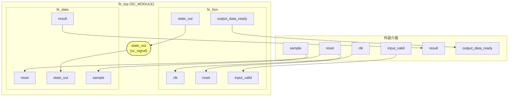
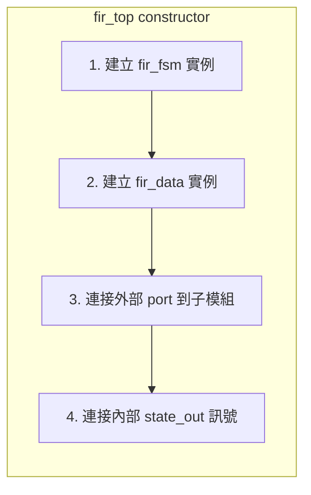

# RTL 頂層模組

> **檔案**: `fir_top.h`
> **難度**: 初級 | **關鍵概念**: 模組組合, 內部訊號連接

---

## 概述

`fir_top` 是 RTL 版 FIR 濾波器的 **頂層模組（Top-level Module）**。它本身不做任何計算，只負責把 `fir_fsm`（控制器）和 `fir_data`（資料路徑）連接在一起。

軟體類比：這就像一個 **facade class**，把兩個內部元件包裝成一個統一的介面。

---

## 內部連接圖

黃色的 `state_out` 是 **內部訊號（internal signal）**，外部看不到。它是 FSM 和 Datapath 之間的唯一溝通管道。

---

## 外部介面

`fir_top` 對外的介面和 behavioral 版的 `fir` 完全一樣：

| Port | 方向 | 型別 | 說明 |
|------|------|------|------|
| `clk` | in | `bool` | 時脈 |
| `reset` | in | `bool` | 重置 |
| `input_valid` | in | `bool` | 輸入有效 |
| `sample` | in | `sc_int<16>` | 輸入取樣值 |
| `output_data_ready` | out | `bool` | 輸出就緒 |
| `result` | out | `sc_int<16>` | 計算結果 |

這意味著 **testbench 可以不做任何修改**，就把 behavioral 版換成 RTL 版（只是輸出的時序會不同）。

---

## 內部訊號

`fir_top` 只有一個內部訊號：

| 訊號 | 型別 | 連接 |
|------|------|------|
| `state_out` | `sc_signal<unsigned>` | FSM 輸出 -> Datapath 輸入 |

這個訊號承載 FSM 的狀態編號（0~4），告訴 Datapath 目前該做什麼計算。

---

## 模組實例化

在 `fir_top` 的 constructor 中，會建立兩個子模組並連接 port：

### Port 連接邏輯

- **clk** -> 只接到 `fir_fsm`（因為 `fir_data` 用 SC_METHOD，不需要 clk）
- **reset** -> 接到 `fir_fsm` 和 `fir_data`（兩者都需要重置）
- **input_valid** -> 只接到 `fir_fsm`（只有控制器需要知道輸入狀態）
- **sample** -> 只接到 `fir_data`（只有資料路徑需要實際的數值）
- **state_out** -> 內部訊號，從 `fir_fsm` 輸出到 `fir_data` 輸入
- **result** -> 從 `fir_data` 輸出到外部
- **output_data_ready** -> 從 `fir_fsm` 輸出到外部

---

## 設計觀察

### 介面一致性

`fir_top` 和 `fir`（behavioral）有相同的外部介面。這是一個重要的設計原則：

> 不同抽象層級的實作應該有相同的介面，方便替換和驗證。

這就像軟體中的 **interface / protocol**：不管內部怎麼實作，對外的 API 保持一致。

### 最小化的內部通訊

FSM 和 Datapath 之間只透過一個 `state_out` 訊號溝通。這種最小化的介面讓兩個模組高度解耦，各自可以獨立修改和測試。
