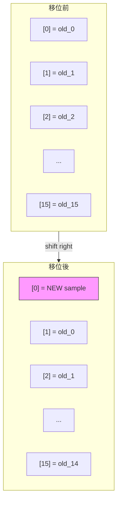
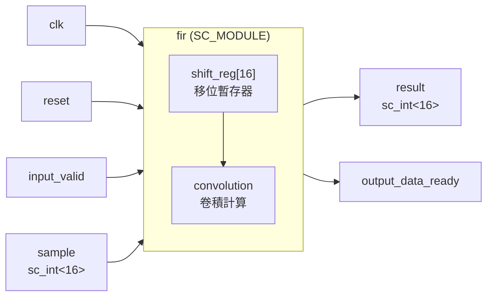
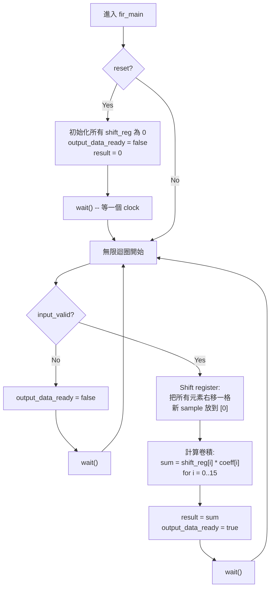

# Behavioral FIR 濾波器實作

> **檔案**: `fir.h`, `fir.cpp`
> **難度**: 初級 | **關鍵概念**: SC_CTHREAD, shift register, convolution

---

## 概述

`fir` 模組是 FIR 濾波器的 **行為級（Behavioral）** 實作。它在每個 clock cycle 完成全部 16-tap 的卷積運算，就像直接呼叫一個函式一樣簡單。

---

## 軟體類比：加權滑動視窗

想像你有一個長度為 16 的陣列（shift register），每次收到新資料時：

```
步驟 1: 把所有元素往後移一格（最舊的資料被丟棄）
步驟 2: 把新資料放到第一格
步驟 3: 把每一格的值乘以對應的權重，全部加起來
```

這就是 FIR 濾波器做的事。用 Python 來表達：

```python
def fir_filter(new_sample, shift_reg, coefficients):
    # Step 1 & 2: shift and insert
    shift_reg = [new_sample] + shift_reg[:-1]

    # Step 3: dot product (convolution)
    result = sum(s * c for s, c in zip(shift_reg, coefficients))

    return result, shift_reg
```

---

## Shift Register 操作圖解

每次收到新 sample 時，shift register 的變化如下：



注意：`old_15`（最舊的資料）被丟棄了，這就是「滑動視窗」的概念。

---

## 卷積運算

移位完成後，計算所有 tap 的加權總和：

```
result = shift_reg[0] * coeff[0]
       + shift_reg[1] * coeff[1]
       + shift_reg[2] * coeff[2]
       + ...
       + shift_reg[15] * coeff[15]
```

這就是數學上的 **卷積（convolution）** 或 **內積（dot product）**。

---

## 模組介面



### Port 說明

| Port | 方向 | 型別 | 說明 |
|------|------|------|------|
| `clk` | in | `bool` | 時脈訊號 |
| `reset` | in | `bool` | 重置訊號 |
| `input_valid` | in | `bool` | 輸入資料有效旗標 |
| `sample` | in | `sc_int<16>` | 16-bit 有號輸入取樣值 |
| `output_data_ready` | out | `bool` | 輸出資料已就緒旗標 |
| `result` | out | `sc_int<16>` | 16-bit 有號輸出結果 |

---

## 執行流程



---

## 關鍵設計觀察

### 為什麼用 SC_CTHREAD？

`SC_CTHREAD` 是「clocked thread」，它有兩個重要特性：

1. **與 clock 同步**：每次呼叫 `wait()` 就等一個 clock edge
2. **支援 reset**：可以用 `reset_signal_is()` 指定 reset 訊號

這很適合描述「每個 clock cycle 做一件事」的行為。

### Behavioral 的特點：一切都在一個 cycle

在 Behavioral 模型中，整個 16-tap 的卷積在**一個 clock cycle** 內完成。這在軟體看來很自然（就是一個 for 迴圈），但在真實硬體中意味著：

- 需要 **16 個乘法器**同時工作（平行運算）
- 需要一個加法樹把 16 個乘積加起來
- 電路面積大，但速度快

相比之下，RTL 版本（見 [fir-fsm.md](fir-fsm.md) 和 [fir-data.md](fir-data.md)）把計算分成 4 個 cycle，每個 cycle 只算 4 個 tap，可以共用乘法器，省面積但慢 4 倍。

### 類比總結

| 概念 | Behavioral FIR | 軟體類比 |
|------|---------------|---------|
| Shift register | 固定大小的陣列 | `collections.deque(maxlen=16)` |
| Convolution | for 迴圈做內積 | `numpy.dot(a, b)` |
| 一個 cycle 完成 | 一次函式呼叫 | 同步函式 `calculate()` |
| `wait()` | 等下一個 clock | `await next_tick()` |
