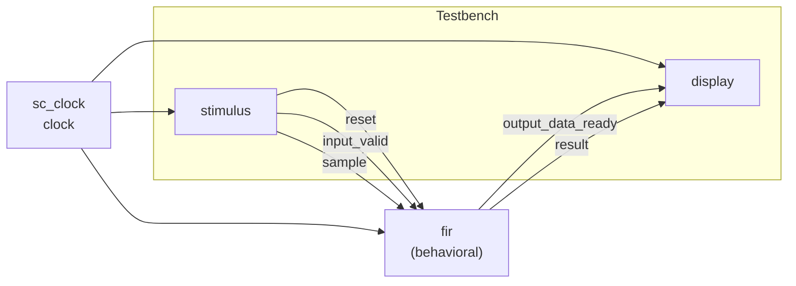
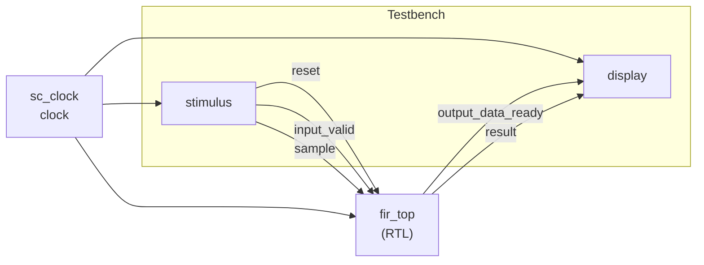
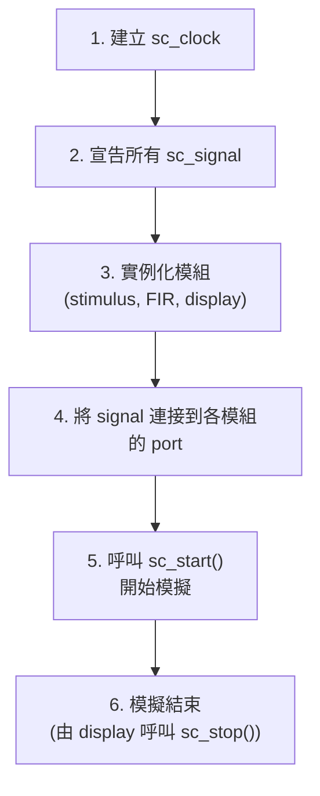

# 測試平台（Testbench）

> **檔案**: `main.cpp`（Behavioral）, `main_rtl.cpp`（RTL）
> **難度**: 初級 | **關鍵概念**: sc_clock, sc_signal, 模組互連

---

## 概述

本範例有兩個 `main` 檔案，分別建立 Behavioral 和 RTL 版本的完整測試平台。兩者的結構幾乎相同，唯一差別在於中間的 FIR 濾波器模組。

---

## 測試平台架構比較

### main.cpp -- Behavioral 版



### main_rtl.cpp -- RTL 版



---

## 兩者的差異

| 項目 | `main.cpp` | `main_rtl.cpp` |
|------|-----------|---------------|
| DUT 模組 | `fir` | `fir_top` |
| DUT 內部 | 單一 SC_CTHREAD | FSM + Datapath |
| 處理延遲 | 1 clock cycle | 4 clock cycles |
| stimulus / display | 完全相同 | 完全相同 |
| 訊號宣告 | 完全相同 | 完全相同 |

重點：**因為 `fir` 和 `fir_top` 有相同的外部介面**，所以 testbench 的其他部分完全不需要修改。只需要替換 DUT（Device Under Test）的實例化即可。

---

## 測試平台的建構步驟

兩個 main 檔案都遵循相同的步驟：



### 訊號宣告

所有模組之間透過 `sc_signal` 連接：

| Signal | 型別 | 連接 |
|--------|------|------|
| `clock` | `sc_clock` | 所有模組的 `clk` |
| `reset` | `sc_signal<bool>` | stimulus -> FIR |
| `input_valid` | `sc_signal<bool>` | stimulus -> FIR |
| `sample` | `sc_signal<sc_int<16>>` | stimulus -> FIR |
| `output_data_ready` | `sc_signal<bool>` | FIR -> display |
| `result` | `sc_signal<sc_int<16>>` | FIR -> display |

---

## sc_clock

`sc_clock` 是 SystemC 提供的時脈產生器，自動產生週期性的方波訊號。

```cpp
sc_clock clock("clock", 100, SC_NS);  // 100ns period
```

- 週期 = 100 ns
- 前半週期 high，後半週期 low
- 自動運行，不需要手動控制

### 軟體類比

`sc_clock` 就像 JavaScript 的 `setInterval()`，但更精確：

```javascript
// 概念等價
setInterval(() => {
    clock = !clock;  // toggle
    notifyAll();     // wake up all modules
}, 50);  // half period
```

---

## sc_start() 和模擬生命週期

```cpp
sc_start();  // run until sc_stop() is called
```

`sc_start()` 啟動 SystemC 的模擬引擎（scheduler），它會：

1. 驅動 clock 產生方波
2. 在每個 clock edge 喚醒相關的 SC_CTHREAD 和 SC_METHOD
3. 處理所有訊號更新
4. 重複以上步驟，直到 `sc_stop()` 被呼叫

### 軟體類比

```python
# sc_start() 等同於
async def sc_start():
    while not stopped:
        clock.toggle()
        await run_all_triggered_processes()
        update_all_signals()
```

---

## 設計觀察

### 介面一致的好處

這個範例完美展示了為什麼「相同介面」如此重要：

1. 設計者可以先寫 behavioral 模型快速驗證演算法
2. 再寫 RTL 模型做硬體實作
3. 用完全相同的 testbench 驗證兩者行為一致

這就像軟體中用 interface 做 dependency injection -- 可以輕鬆替換實作而不影響測試程式。
