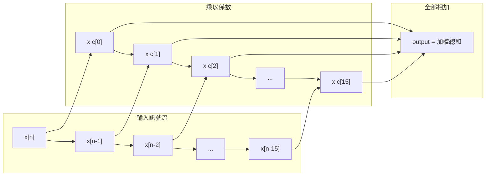
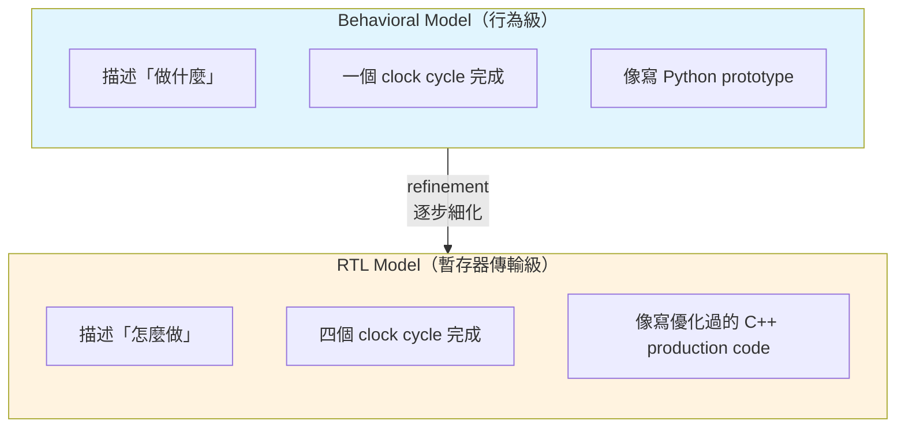
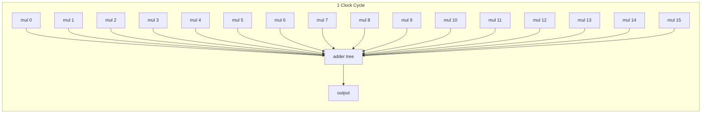
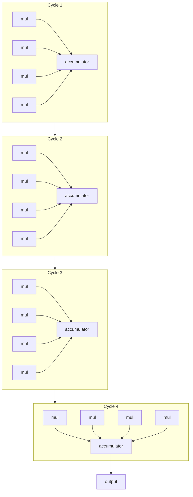
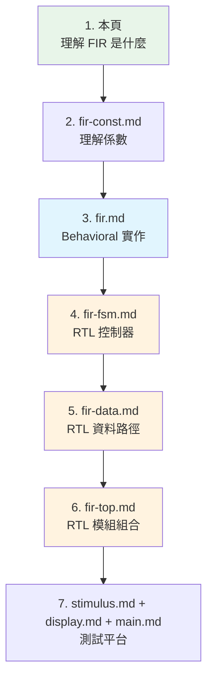

# FIR 濾波器硬體規格 -- 軟體工程師指南

> **難度**: 入門 | **目的**: 理解 FIR 濾波器的原理與硬體設計方法論

---

## 什麼是 FIR 濾波器？

### 一句話解釋

FIR 濾波器是一個 **訊號的噪音過濾器**，就像影像的模糊濾鏡（blur filter）一樣，它把不要的高頻雜訊「模糊掉」，保留你關心的低頻訊號。

### 日常生活類比

| 場景 | 原始訊號 | 噪音 | FIR 的效果 |
|------|---------|------|-----------|
| 通話 | 人聲 | 背景風聲 | 只保留人聲 |
| 體溫計 | 實際體溫 | 感測器跳動 | 平滑的溫度讀數 |
| 股票 | 長期趨勢 | 日間波動 | 移動平均線 |
| 照片 | 主體輪廓 | 噪點 | 去噪後的清晰影像 |

### 數學本質

FIR 就是一個 **加權滑動視窗平均（weighted moving average）**：

```
output[n] = coeff[0] * input[n]
          + coeff[1] * input[n-1]
          + coeff[2] * input[n-2]
          + ...
          + coeff[15] * input[n-15]
```



---

## 為什麼硬體需要 FIR 濾波器？

FIR 濾波器是數位訊號處理（DSP）中最基礎的元件，幾乎所有處理真實世界訊號的硬體都會用到：

| 應用領域 | 實際產品 | FIR 的角色 |
|---------|---------|-----------|
| **音訊** | DAC 晶片、藍牙耳機 | 消除量化噪音、等化器（EQ） |
| **通訊** | WiFi 基頻晶片 | 訊號整形、通道等化 |
| **雷達** | 車用雷達、氣象雷達 | 雜訊濾除、目標偵測 |
| **影像** | 相機 ISP、醫療影像 | 去噪、邊緣強化 |
| **儀器** | 示波器、頻譜分析儀 | 量測訊號前處理 |

硬體 FIR 的優勢：**即時處理**。軟體可以慢慢算，但音訊和通訊需要在微秒（甚至奈秒）內完成濾波。

---

## Behavioral vs RTL：設計方法論

### 兩種抽象層級

本範例的核心教學目標是展示 **同一個演算法在不同抽象層級的實作**。



### 軟體類比

| 階段 | 硬體設計 | 軟體開發 |
|------|---------|---------|
| 需求確認 | 演算法規格 | PRD / User Story |
| 快速原型 | **Behavioral model** | Python prototype |
| 功能驗證 | 行為級模擬 | Unit test |
| 詳細設計 | **RTL model** | Optimized C++ implementation |
| 硬體驗證 | RTL 模擬 + 波形分析 | Integration test + profiling |
| 生產 | ASIC / FPGA 合成 | Build & deploy |

### Behavioral = 快速驗證想法

```
優點：
- 寫起來像一般程式，快速
- 容易理解和修改
- 專注在演算法正確性

缺點：
- 不反映真實硬體的時序
- 無法直接合成成電路
- 忽略了資源限制
```

### RTL = 精確描述硬體行為

```
優點：
- 精確到每個 clock cycle
- 可以直接合成成 FPGA / ASIC
- 反映真實的資源使用

缺點：
- 寫起來較複雜
- 需要考慮時序、面積、功耗
- 除錯較困難
```

---

## 資源取捨：速度 vs 面積

這是硬體設計最核心的取捨之一。

### Behavioral 版：1 cycle，16 個乘法器



- **需要 16 個乘法器**（平行運算）
- 每個 cycle 產出一個結果
- 面積大，速度快
- **throughput**: 1 sample / cycle

### RTL 版：4 cycles，4 個乘法器



- **只需要 4 個乘法器**（分時共用）
- 4 個 cycle 才產出一個結果
- 面積小 4 倍，速度慢 4 倍
- **throughput**: 1 sample / 4 cycles

### 比較表

| 面向 | Behavioral (1-cycle) | RTL (4-cycle) |
|------|---------------------|---------------|
| 乘法器數量 | 16 | 4 |
| 加法器數量 | 15 (adder tree) | 4 + 1 accumulator |
| Latency | 1 cycle | 4 cycles |
| Throughput | 1 sample/cycle | 1 sample/4 cycles |
| 面積 | 大 | 小 (約 1/4) |
| 功耗 | 高 | 低 |
| 適用場景 | 高速需求 | 面積受限 |

### 軟體類比

這就像選擇演算法的 **時間-空間取捨（time-space tradeoff）**：

- **Behavioral** = 用更多記憶體（乘法器）換更快的速度
- **RTL** = 用更少記憶體（乘法器）但需要更多時間

---

## 真實世界應用

### 音訊 DAC（數位類比轉換器）

你的手機播放音樂時，音訊 DAC 內部就有 FIR 濾波器。它的作用是把數位音訊（44.1kHz 取樣）轉成類比訊號時，濾除超過人耳聽覺範圍（20kHz 以上）的頻率成分。

### WiFi 基頻處理

WiFi 晶片的基頻處理器使用多個 FIR 濾波器來：
- 匹配接收濾波（matched filtering）
- 通道等化（channel equalization）
- 脈衝成形（pulse shaping）

這些 FIR 通常有 32~256 個 tap，需要在每個 OFDM symbol（3.2 microseconds）內完成計算。

### 影像處理

相機 ISP（Image Signal Processor）中的 2D FIR 濾波器就是你熟悉的卷積核（convolution kernel）：

```
模糊核（Blur） = [1 1 1]    邊緣偵測 = [-1 -1 -1]
                  [1 1 1]               [-1  8 -1]
                  [1 1 1]               [-1 -1 -1]
```

本範例的 1D FIR 是 2D 卷積的簡化版本。如果你理解了 1D FIR，2D 卷積就只是多套一層迴圈。

---

## 本範例的學習路線圖



- 綠色 = 背景知識
- 藍色 = Behavioral（較簡單）
- 橙色 = RTL（較進階）
