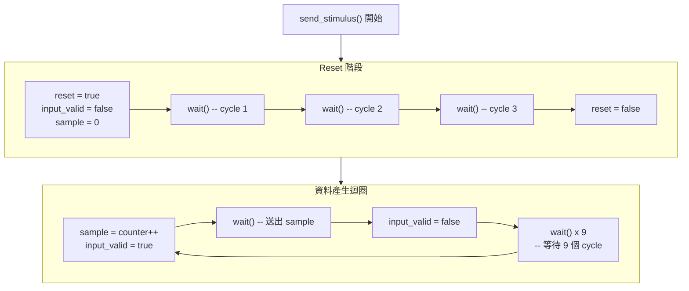

# 測試激勵產生器

> **檔案**: `stimulus.h`, `stimulus.cpp`
> **難度**: 初級 | **關鍵概念**: 測試激勵, reset 序列, SC_CTHREAD

---

## 概述

`stimulus` 模組負責產生測試用的輸入資料，送進 FIR 濾波器。它模擬一個「資料來源」，例如 ADC（類比數位轉換器）將類比訊號轉成數位 sample。

---

## 模組介面

| Port | 方向 | 型別 | 說明 |
|------|------|------|------|
| `clk` | in | `bool` | 時脈 |
| `reset` | out | `bool` | 送出 reset 訊號 |
| `input_valid` | out | `bool` | 輸入有效旗標 |
| `sample` | out | `sc_int<16>` | 輸出取樣值 |

注意：`reset` 是 **output** -- stimulus 是產生 reset 訊號的來源。

---

## 執行流程



---

## Reset 序列

FIR 濾波器在開始工作前需要被正確地初始化。stimulus 送出 **3 個 clock cycle** 的 reset 訊號：

```
Clock:        1    2    3    4    5    ...
reset:        H    H    H    L    L    ...
input_valid:  L    L    L    L    ...
```

- `H` = high (true), `L` = low (false)

3 個 cycle 的 reset 確保所有暫存器都被清零。這是硬體測試的標準做法 -- 永遠比你認為需要的多等幾個 cycle。

---

## 輸入資料模式

Reset 結束後，stimulus 產生遞增的整數作為 sample：

```
sample:       0    1    2    3    4    ...
input_valid:  H    L    L... H    L    L...
              |<- 10 cycles ->|<- 10 cycles ->|
```

每個 sample 之間間隔 **10 個 clock cycle**。為什麼？

1. **RTL 版本需要 4 個 cycle** 來處理一個 sample（4 states）
2. 10 cycle 的間隔確保 RTL 版本有足夠時間完成計算
3. 額外的空閒時間也方便觀察波形

### 軟體類比

這就像一個 producer 以固定速率產生 message：

```python
async def stimulus():
    # Reset phase
    await reset(duration=3)

    # Data generation
    counter = 0
    while True:
        send(sample=counter, valid=True)
        await tick()
        send(valid=False)
        for _ in range(9):
            await tick()  # cooldown
        counter += 1
```

---

## 設計觀察

### 為什麼 stimulus 控制 reset？

在硬體測試中，testbench（測試平台）負責產生所有控制訊號，包括 clock 和 reset。`stimulus` 作為 testbench 的一部分，自然負責產生 reset 訊號。

### 為什麼 input_valid 只維持一個 cycle？

這是一種常見的硬體通訊協議（handshaking protocol）：

1. Producer 將 `data` 設好，同時將 `valid` 拉高一個 cycle
2. Consumer 在看到 `valid = true` 時讀取 `data`
3. 下一個 cycle `valid` 就回到 false

這確保每筆資料只被處理一次。
