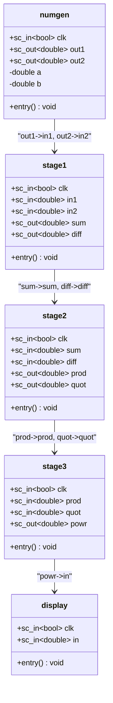

# pipe -- 三級算術管線範例

> **難度**: 入門 | **軟體類比**: Unix pipe (`cmd1 | cmd2 | cmd3`)、ETL 資料處理管線 | **原始碼**: `ref/systemc/examples/sysc/pipe/`

## 概述

`pipe` 範例展示了一個**三級算術管線（3-stage arithmetic pipeline）**。數值產生器每個 clock 產生兩個 `double`，經過三個運算階段，最終由顯示模組印出結果。

如果你寫過 Unix shell，這就是：

```bash
numgen | stage1_add_sub | stage2_mul_div | stage3_pow | display
```

如果你做過 ETL（Extract-Transform-Load），這就是：

```
資料來源 -> 轉換 A -> 轉換 B -> 轉換 C -> 輸出
```

每一級模組只做一件事，透過 `sc_signal` 把結果傳給下一級。就像工廠的**組裝線（assembly line）**：每個工作站做一步加工，成品沿著輸送帶往前移動。

## 資料流程圖

```mermaid
flowchart LR
    subgraph numgen["numgen (資料產生器)"]
        direction TB
        A1["a: 134.56, 133.06, ..."]
        A2["b: 98.24, 95.44, ..."]
    end

    subgraph stage1["stage1 (加減法)"]
        direction TB
        S1["sum = a + b"]
        S2["diff = a - b"]
    end

    subgraph stage2["stage2 (乘除法)"]
        direction TB
        S3["prod = sum * diff"]
        S4["quot = sum / diff"]
    end

    subgraph stage3["stage3 (次方)"]
        direction TB
        S5["powr = prod ^ quot"]
    end

    subgraph display["display (輸出)"]
        direction TB
        S6["printf result"]
    end

    numgen -->|"in1, in2"| stage1
    stage1 -->|"sum, diff"| stage2
    stage2 -->|"prod, quot"| stage3
    stage3 -->|"powr"| display
```



## 類別圖



## 檔案列表

| 檔案 | 說明 | 文件 |
|---|---|---|
| `numgen.h` / `numgen.cpp` | 數值產生器，每個 clock 輸出兩個遞減的 `double` | [numgen.md](numgen.md) |
| `stage1.h` / `stage1.cpp` | 第一級：計算 sum 和 diff | [stage1.md](stage1.md) |
| `stage2.h` / `stage2.cpp` | 第二級：計算 product 和 quotient（含除零防護） | [stage2.md](stage2.md) |
| `stage3.h` / `stage3.cpp` | 第三級：計算 power（含負值防護） | [stage3.md](stage3.md) |
| `display.h` / `display.cpp` | 結果顯示模組 | [display.md](display.md) |
| `main.cpp` | 頂層連接、clock 產生、模擬控制 | [main.md](main.md) |

## 核心概念

### SC_METHOD vs SC_THREAD

本範例所有模組都使用 **SC_METHOD**，這是 SystemC 兩大 process 類型之一：

| 特性 | SC_METHOD | SC_THREAD |
|---|---|---|
| **軟體類比** | callback function | coroutine / Python coroutine (asyncio) |
| **執行方式** | 每次觸發時從頭執行到尾 | 可在中途 `wait()` 暫停 |
| **狀態保持** | 靠成員變數 | 靠 local 變數 + `wait()` |
| **效能** | 較快（無 context switch） | 較慢（需要保存 stack） |
| **適用場景** | 組合邏輯、簡單時序邏輯 | 複雜控制流程 |

SC_METHOD 就像 Python 的 callback function：每次事件觸發時呼叫你的函式，函式必須立刻返回，不能阻塞。

### sc_signal 連接

模組之間透過 `sc_signal<double>` 連接，就像 Unix pipe 中的管道。每個 signal 在同一個 delta cycle 內只能被寫入一次，讀取者在**下一個** delta cycle 才看到新值。

### Positional vs Named Port Binding

`main.cpp` 示範了兩種連接方式：

```cpp
// Positional（位置綁定）-- 像函式呼叫的位置引數
stage1_inst("Stage1", clk, in1, in2, sum, diff);

// Named（具名綁定）-- 像 Python 的 keyword argument
stage2_inst.clk(clk);
stage2_inst.sum(sum);
```

### 為什麼要用管線？吞吐量 vs 延遲的取捨

**不用管線**：一筆資料從頭到尾跑完才處理下一筆。延遲 = 3 個 clock，吞吐量 = 每 3 個 clock 一筆。

**用管線**：每一級同時處理不同的資料。延遲 = 3 個 clock（第一筆結果要等 3 級走完），但吞吐量 = 每 1 個 clock 一筆。

這跟 HTTP request pipelining 一樣：不用等上一個 response 回來就送出下一個 request，整體吞吐量提升 3 倍，但單一 request 的延遲不變。

## 延伸閱讀

- [管線概念說明](spec.md) -- 硬體管線的原理與軟體類比
- [main.cpp 詳解](main.md) -- 模組連接與 clock 產生
