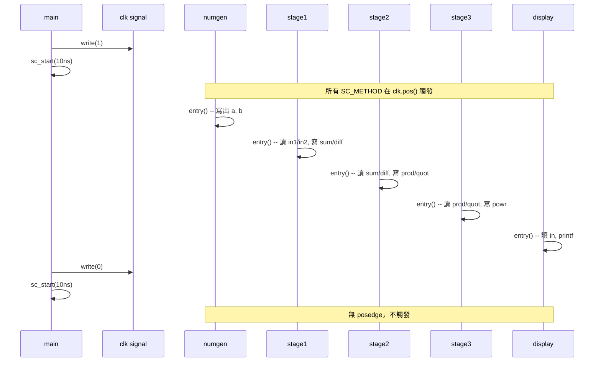

# main.cpp -- 頂層連接與模擬控制

> **檔案**: `main.cpp` | **角色**: 頂層模組（top-level）、測試平台（testbench）

## 軟體類比

`main.cpp` 的角色就像是：

- **Docker Compose**：定義所有服務（模組），並指定它們之間的連接（網路）
- **Python dependency injection**：建立所有元件（模組），注入 dependency（port binding）
- **Makefile**：定義所有元件和它們的依賴關係

```yaml
# Docker Compose 類比
services:
  numgen:
    output: [signal_in1, signal_in2]
  stage1:
    input: [signal_in1, signal_in2]
    output: [signal_sum, signal_diff]
  stage2:
    input: [signal_sum, signal_diff]
    output: [signal_prod, signal_quot]
  # ...
```

## 程式結構

### sc_main -- SystemC 的進入點

```cpp
int sc_main(int argc, char* argv[]) {
    // 1. 宣告 signal（連接線）
    // 2. 建立模組實例
    // 3. 綁定 port 到 signal
    // 4. 產生 clock 並執行模擬
}
```

`sc_main` 是 SystemC 的進入點，取代了標準 C++ 的 `main()`。SystemC 的 runtime 會在初始化完成後呼叫 `sc_main`。

這就像 `unittest.main()` 或 `pytest.main()` -- 框架提供了自己的進入點，你在裡面設定測試環境。

### Signal 宣告

```cpp
sc_signal<bool>   clk;     // clock 信號
sc_signal<double> in1;     // numgen -> stage1
sc_signal<double> in2;     // numgen -> stage1
sc_signal<double> sum;     // stage1 -> stage2
sc_signal<double> diff;    // stage1 -> stage2
sc_signal<double> prod;    // stage2 -> stage3
sc_signal<double> quot;    // stage2 -> stage3
sc_signal<double> powr;    // stage3 -> display
```

每個 `sc_signal` 就像一條**導線**，連接兩個模組。在軟體中，這類似於 message queue 或 shared variable（但有同步保障）。

### 模組實例化

```cpp
numgen  numgen_inst("numgen", clk, in1, in2);          // positional binding
stage1  stage1_inst("Stage1", clk, in1, in2, sum, diff); // positional binding
```

## 關鍵概念

### Positional vs Named Port Binding

本範例展示了 SystemC 的兩種 port 綁定方式：

#### Positional Binding（位置綁定）

```cpp
// signal 按照 port 在 SC_MODULE 中宣告的順序綁定
stage1 stage1_inst("Stage1", clk, in1, in2, sum, diff);
//                           ^    ^    ^    ^    ^
//                           |    |    |    |    +-- 第5個 port: diff
//                           |    |    |    +------- 第4個 port: sum
//                           |    |    +------------ 第3個 port: in2
//                           |    +----------------- 第2個 port: in1
//                           +---------------------- 第1個 port: clk
```

就像呼叫函式時用位置引數：`f(1, 2, 3)`

**優點**：程式碼簡短。
**缺點**：順序錯了就會接錯線，而且編譯器不會報錯（型別都是 `double`），只會在模擬結果中出現詭異的 bug。

#### Named Binding（具名綁定）

```cpp
stage2 stage2_inst("Stage2");
stage2_inst.clk(clk);
stage2_inst.sum(sum);
stage2_inst.diff(diff);
stage2_inst.prod(prod);
stage2_inst.quot(quot);
```

就像 Python 的 keyword argument：`f(x=1, y=2, z=3)`

**優點**：清楚明確，不怕順序錯。
**缺點**：程式碼較長。

**實務建議**：在大型專案中，**永遠使用 named binding**。幾行多打的程式碼換來的是大幅降低接線錯誤的風險。

### 手動 Clock 產生

```cpp
for (int i = 0; i < 50; i++) {
    clk.write(1);              // clock 拉高
    sc_start(10, SC_NS);       // 模擬 10 ns
    clk.write(0);              // clock 拉低
    sc_start(10, SC_NS);       // 模擬 10 ns
}
```

這段程式碼手動產生一個 **20 ns 週期**（50 MHz）的 clock，共 50 個 cycle。

#### 為什麼手動產生 clock，而不用 sc_clock？

SystemC 提供了 `sc_clock` 類別可以自動產生 clock：

```cpp
sc_clock clk("clk", 20, SC_NS);  // 自動產生 20ns 週期的 clock
```

手動產生 clock 的好處是：

1. **完全控制**：可以在任意時刻停止、改變頻率、或插入不規則的 clock pattern
2. **教學目的**：讓學習者理解 clock 的本質就是一個在 0 和 1 之間切換的信號
3. **Debug 方便**：可以在迴圈中加入條件斷點或 log

在實際專案中，大多數人會使用 `sc_clock`，因為更簡潔且不容易出錯。

### sc_start 的作用

`sc_start(10, SC_NS)` 讓 SystemC 模擬引擎**推進 10 奈秒的模擬時間**。在這段時間內：

1. 所有被觸發的 process 會被執行
2. Signal 的值會更新
3. Delta cycle 會被處理

這類似於遊戲引擎的 `tick()` 或事件迴圈的 `processEvents()`：

```python
# Python 類比
for i in range(50):
    clock = 1
    event_loop.run_for(10)  # 處理所有 pending events
    clock = 0
    event_loop.run_for(10)
```

## 完整的模擬流程


